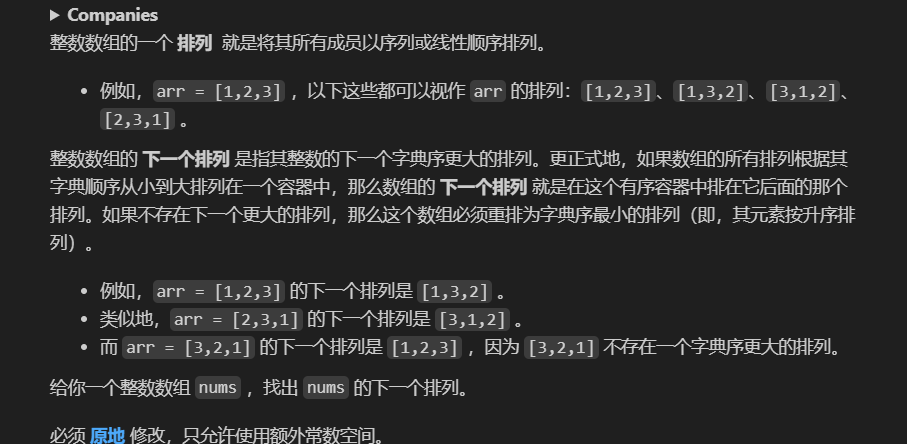

<!-- @format -->

# [22]下一个排列

<!--more-->



## 题目理解

读了三遍才读懂，很难蚌  
最终把要求捋为下面几条：

1. 全数升序排列是最小的，全数逆序排列是最大的
2. 第一个数字越大其字典序越大
3. 后面的数字升序排列比逆序排列小
4. 保证其变大的幅度尽可能最小

因此需要：

1、从后往前找，找到第一个升序序列（i，j），此时（j,end）一定是降序的。
2、从（j,end）中从后往前走，找到第一个大于 nums[i]的数字 nums[k]
3、交换 nums[i]和 nums[k] 之间的值
4、将（j,end）升序排列

JS 和 Python 的代码实现如下:

JavaScript
JS 好像没有自己的内置换数的函数，还得自己写

```JavaScript
function swap(nums, i, j) {
  let temp = nums[i]
  nums[i] = nums[j]
  nums[j] = temp
}
var nextPermutation = function(nums) {
  // 1、从后往前找，找到第一个升序序列（i，j），此时（j,end）一定是降序的。
  // 2、从（j,end）中从后往前走，找到第一个大于nums[i]的数字nums[k]
  // 3、交换nums[i]和nums[k] 之间的值
  // 4、将（j,end）升序排列
  let len = nums.length
  if (len <= 1) return
  let i = len - 2
  let j = len - 1
  let k = len - 1
  while (i >= 0 && nums[i] >= nums[j]) {
    i--
    j--
  }
  if (i >= 0) {
    while (k >= j && nums[i] >= nums[k]) {
      k--
    }
    swap(nums, i, k)
  }
  let left = j
  let right = len - 1
  let mid = Math.floor((left + right) / 2)
  while (left <= mid) {
    swap(nums, left, right)
    left++
    right--
  }
};
```

Python

```python
        # 记录从尾到头第一个降序
        i = len(nums) - 1
        # 记录从尾到i最大值
        j = len(nums) - 1
        # 寻找从尾到头第一个降序的位置
        while i > 0 and nums[i - 1] >= nums[i]:
            i -= 1
        ##防止整个数组都是降序排列
        if i != 0:
            # 寻找从尾到i的最大数
            while nums[i - 1] >= nums[j]:
                j -= 1
            nums[i - 1], nums[j] = nums[j], nums[i - 1]
        nums[i:] = sorted(nums[i:])

```
