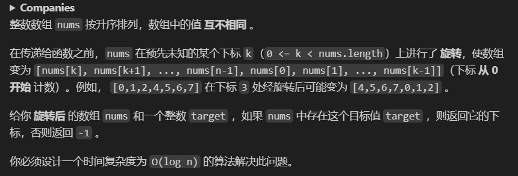

<!-- @format -->

# 最长有效括号&&搜索旋转排序数组

## [32] 最长有效括号

    栈解法、贪心解法

<!--more-->


## 解题思路

一开始想着括号问题 一般直接上栈，但是没想出栈怎么做，做着做着写偏了
失败代码如下，提交的时候发现越往后要分类的情况太多

```python
        ## 失败方法，括号问题应该直接上栈
        max_nums = nums = left = right = 0
        for char in s:
            if char == "(":
                left += 1
            elif char == ")":
                right += 1
            if left == right:
                nums += left + right
                left = right = 0
                max_nums = max(max_nums, nums)
            elif right > left:
                left = right = 0
                nums = 0
        if left > right:
            max_nums = max(max_nums, right * 2)
            # max_nums += right * 2
        return max_nums
```

所以直接换成用栈进行，代码如下（乐，每次 python 和 JavaScript 换着写脑子都会发昏

- Python 实现

```python
        ## 栈解法
        stack = [-1]
        ret = 0
        for i in range(len(s)):
            # 左括号，无脑入栈
            if s[i] == "(":
                stack.append(i)
            else:
                # 右括号，若栈为空，说明右括号多了，更新起始位置
                stack.pop()
                if not stack:
                    # 若栈为空，说明没有匹配的左括号，将当前位置压入栈中作为新的起始位置
                    stack.append(i)
                else:
                    # 若栈不为空，说明有匹配的左括号，计算长度
                    ret = max(ret, i - stack[-1])
        return ret
```

- TypeScript 写法

```TypeScript
  let stack = [-1];
  let max = 0;
  for (let i = 0; i < s.length; i++) {
    if (s[i] == "(") {
      stack.push(i);
    } else {
      stack.pop();
      if (stack.length != 0) {
        max = Math.max(max, i - stack[stack.length - 1]);
      } else {
        stack.push(i);
      }
    }
  }
  return max;

```

总而言之，以后遇到括号匹配的题目还是优先使用栈进行

# [33]搜索旋转排序数组



## 解题思路

一开始想的是和数组最开头(nums[0])比较，大于就从头开始搜索，小于就从尾开始搜索，虽然时间复杂度为 O(n)，不符合题目的要求  
最开始的代码

```TypeScript
  let flag = target > nums[0] ? 1 : -1;
  if (flag === 1) {
    for (let i = 0; i < nums.length; i++) {
      if (nums[i] === target) {
        return i;
      }
    }
    return -1;
  } else {
    for (let i = nums.length - 1; i >= 0; i--) {
      if (nums[i] === target) {
        return i;
      }
    }
    return -1;
  }
```

后面改进为使用二分查找法进行，具体思路如下：

1. 首先，定义两个指针 left 和 right，分别指向数组的开始和结束。
2. 然后，进入一个循环，只要 left 不大于 right，就继续循环。
3. 在循环中，首先计算 mid，它是 left 和 right 的中间值。
4. 然后，检查 nums[mid] 是否等于目标值 target。如果等于，就返回 mid，这表示找到了目标值。
5. 如果 nums[mid] 不等于目标值，就需要判断目标值可能在哪个部分（左半部分还是右半部分）。
6. 如果 nums[0] 小于等于 nums[mid]，说明 mid 在左半部分（即旋转点在 mid 右侧）。此时，如果 target 在 nums[0] 和 nums[mid] 之间，说明 target 在左半部分，所以将 right 移动到 mid - 1。否则，target 在右半部分，将 left 移动到 mid + 1。
7. 如果 nums[0] 大于 nums[mid]，说明 mid 在右半部分（即旋转点在 mid 左侧）。此时，如果 target 在 nums[mid] 和 nums[nums.length - 1] 之间，说明 target 在右半部分，所以将 left 移动到 mid + 1。否则，target 在左半部分，将 right 移动到 mid - 1。
8. 如果循环结束还没有找到目标值，就返回 -1，表示数组中没有目标值。

具体代码如下：

- TypeScript 实现

```TypeScript
  let left = 0,
    right = nums.length - 1;
  while (left <= right) {
    let mid = Math.floor((left + right) / 2);
    if (nums[mid] === target) {
      return mid;
    }
    //在旋转点左边
    if (nums[0] <= nums[mid]) {
      //比nums[0]大，比nums[mid]小 nums[0]—————target——————mid———R
      if (nums[0] <= target && target < nums[mid]) {
        right = mid - 1;
      } else {
        //nums[0]——————mid———————target—————————————R
        left = mid + 1;
      }
    } else {
      //nums[0]—————————R—————————mid———————target—————————nums.length-1
      if (nums[mid] < target && target <= nums[nums.length - 1]) {
        left = mid + 1;
      } else {
        //nums[0]—————————R——————target—————mid————nums.length-1
        right = mid - 1;
      }
    }
```

- Python 实现

```Python
        if not nums:
            return -1
        left, right = 0, len(nums) - 1
        while left <= right:
            mid = (left + right) // 2
            # 判断是否找到目标值
            if nums[mid] == target:
                return mid
            # 第一步，判断在旋转点的左侧还是右侧
            if nums[0] <= nums[mid]:
                # 在旋转点的左侧
                if nums[0] <= target <= nums[mid]:
                    right = mid - 1
                else:
                    left = mid + 1
            else:
                # 在旋转点的右侧
                if nums[mid] <= target <= nums[len(nums) - 1]:
                    left = mid + 1
                else:
                    right = mid - 1
        return -1
```

（画完数轴就捋顺了很多
