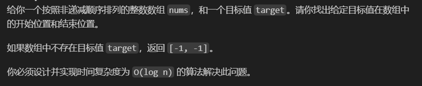

<!-- @format -->

# 在排序数组中查找元素的第一个和最后一个位置

<!--more-->

## 题目详情



## 解题思路

感觉是很常见的二分法问题，因为具体要求了**设计并实现时间复杂度为 O(log n)**  
然后强调了是非递减排序（那就是递增排序）的数组，  
这样只要通过二分查找**target 的第一个元素**和**target+1 的第一个元素**就行

- TypeScript 实现

```TypeScript
function findElement(nums: number[], target: number): number {
  let left = 0;
  let right = nums.length - 1;
  while (left < right) {
    const mid = Math.floor((left + right) / 2);
    if (nums[mid] < target) {
      left = mid + 1;
    } else {
      right = mid;
    }
  }
  return left;
}
function searchRange(nums: number[], target: number): number[] {
  let left = findElement(nums, target);
  let right = findElement(nums, target + 1);
  if (nums[right] !== target) right--;
  return left <= right ? [left, right] : [-1, -1];
}
```

- Python 代码实现如下：

```Python
class Solution:
    def searchRange(self, nums: List[int], target: int) -> List[int]:
        if not nums or target < nums[0] or target > nums[-1]:
            return [-1, -1]
        start = self.search(nums, target)
        end = self.search(nums, target + 1) - 1
        return [start, end] if start <= end else [-1, -1]

    def search(self, nums: List[int], target: int) -> int:
        # 二分查找
        left, right = 0, len(nums) - 1
        while left <= right:
            mid = (left + right) // 2
            if nums[mid] < target:
                left = mid + 1
            else:
                right = mid - 1
        return left
```
