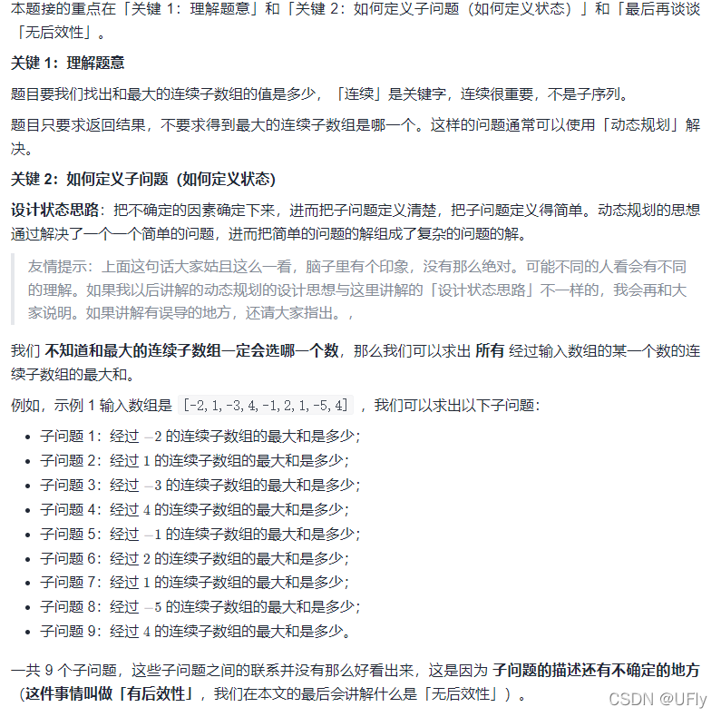
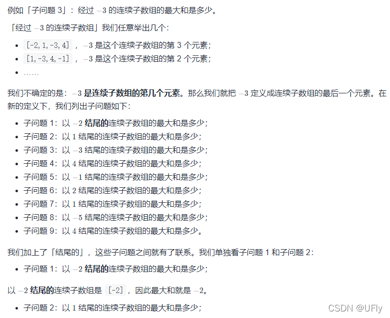
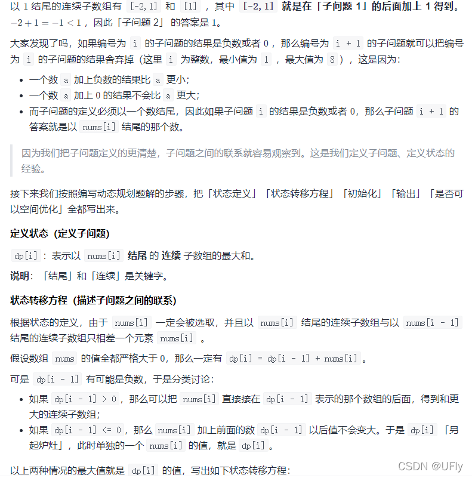

<!-- @format -->

# 最大子数组和

<!--more-->

碎碎念：淦，再往下刷一道就是饿了么的原题，以后算法还是先拿 ts/js 写好了，写的不行又急着套 Python 了妈的

## 题目详情

```
给你一个整数数组 nums ，请你找出一个具有最大和的连续子数组（子数组最少包含一个元素），返回其最大和。
子数组 是数组中的一个连续部分。

```

## 动态规划解法

动态规划思路如下：




代码实现：

```TypeScript
  let res = Number.MIN_SAFE_INTEGER;
  let sum = 0;
  for(let i =0;i<nums.length;i++){
    sum = Math.max(sum+nums[i],nums[i])
    res = Math.max(res,sum)
  }
  return res
```

## 贪心法解法

从另一个角度描述了空间优化后的动态规划解法
在动态规划中子问题的递推关系为：
当前子问题如果小于 0，在计算的时候直接会被取代掉，不会对结果有任何影响。
这就是为什么贪心法代码中，当 sum < 0 的时候，会直接舍弃，从 0 重新开始累加的原因。
代码实现：
TypeScript

```TypeScript
function maxSubArray(nums: number[]): number {
  let max = nums[0];
  let sum = 0;
  for (let i = 0; i < nums.length; i++) {
    sum += nums[i];
    max = Math.max(max, sum);
    if (sum < 0) {
      sum = 0;
    }
  }
  return max;
}
```
