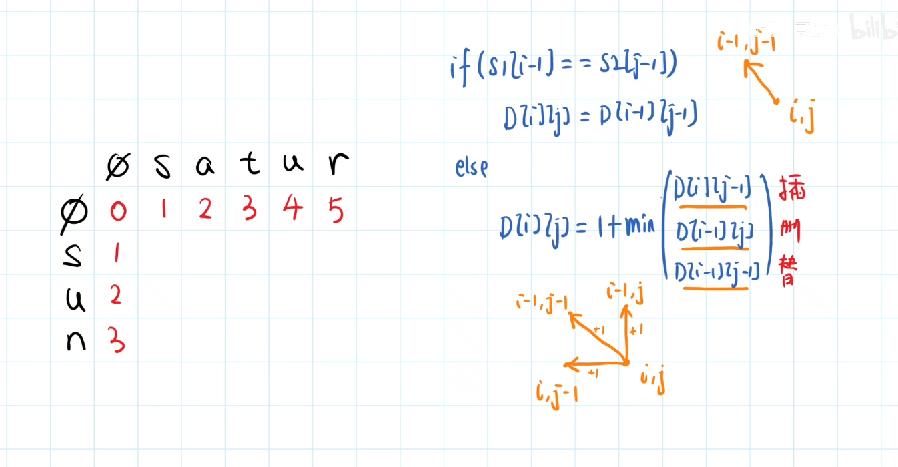

<!-- @format -->

## 编辑距离 && 颜色分类

- [编辑距离 \&\& 颜色分类](#编辑距离--颜色分类)
- [编辑距离](#编辑距离)
  - [题目详情](#题目详情)
  - [解题思路](#解题思路)
  - [代码实现](#代码实现)
- [颜色分类](#颜色分类)
  - [题目详情](#题目详情-1)
  - [解题思路](#解题思路-1)
  - [代码实现](#代码实现-1)

<!--more-->

## 编辑距离

## 题目详情

给你两个单词 word1 和 word2， 请返回将 word1 转换成 word2 所使用的最少操作数 。
你可以对一个单词进行如下三种操作：

- 插入一个字符
- 删除一个字符
- 替换一个字符

## 解题思路

在这个代码中，dp[i][j] 可以通过以下方式得到：

- 如果`word1[i-1]` 等于`word2[j-1]`，那么 `dp[i][j] = dp[i-1][j-1]`，因为我们不需要做任何操作。
- 如果 `word1[i-1]` 不等于 `word2[j-1]`，那么 `dp[i][j]` 是 `dp[i-1][j-1]`（替换操作）、`dp[i][j-1]`（插入操作）和 `dp[i-1][j]`（删除操作）中的最小值加一
  

## 代码实现

```TypeScript
function minDistance(word1: string, word2: string): number {
  const n = word1.length;
  const m = word2.length;
  const dp: number[][] = new Array(n + 1).fill(0).map(() => new Array(m + 1).fill(0));
  for (let i = 0; i < n + 1; i++) {
    dp[i][0] = i;
  }
  for (let i = 0; i < m + 1; i++) {
    dp[0][i] = i;
  }
  for (let i = 0; i < n + 1; i++) {
    for (let j = 0; j < m + 1; j++) {
      if (i * j)
        dp[i][j] = Math.min(
          dp[i - 1][j - 1] + (word1[i - 1] === word2[j - 1] ? 0 : 1),
          dp[i - 1][j] + 1,
          dp[i][j - 1] + 1
        );
    }
  }
  return dp[n][m];
}
```

## 颜色分类

## 题目详情

给定一个包含红色、白色和蓝色、共 n 个元素的数组 nums ，原地对它们进行排序，使得相同颜色的元素相邻，并按照红色、白色、蓝色顺序排列。  
我们使用整数 0、 1 和 2 分别表示红色、白色和蓝色。  
必须在不使用库内置的 sort 函数的情况下解决这个问题。

## 解题思路

一开始想法是将数组中 0 的元素删除从数组头塞进去，将 2 删除从尾塞进去，但测试后发现这样会产生 BUG，会跳过一些元素或者重复处理一些元素

```TypeScript
  //BUG：删除一个元素并添加一个新元素到数组的开始或结束时，
  //可能会跳过一些元素或重复处理一些元素。
  for (let i = 0; i < nums.length; i++) {
    if (nums[i] == 0) {
      nums.splice(i, 1);
      nums.unshift(0);
    } else if (nums[i] == 2) {
      nums.splice(i, 1);
      nums.push(2);
    }
  }
```

后面，改为三指针，具体思路如下：

1. left 代表下一个填入 0 的位置，即（0，left）均为 0
2. right 代表下一个填入 2 的位置，即（right，n-1）均为 2
3. cur 代表正在遍历的数字
   实现一次遍历排序完成

## 代码实现

```TypeScript
  let left = 0,
    cur = 0,
    right = nums.length - 1;
  while (cur <= right) {
    if (nums[cur] === 0) {
      //如果 nums[cur] 是 0，那么交换 nums[cur] 和 nums[left] 的值，
      //然后将 left 和 cur 都向右移动一步。
      //这是因为 0 应该出现在数组的左边
      [nums[cur], nums[left]] = [nums[left], nums[cur]];
      left++;
      cur++;
    } else if (nums[cur] === 2) {
      //如果 nums[cur] 是 2，那么交换 nums[cur] 和 nums[right] 的值，
      [nums[cur], nums[right]] = [nums[right], nums[cur]];
      right--;
    } else {
      //如果 nums[cur] 是 1，那么将 cur 向右移动一步。
      cur++;
    }
  }
```
