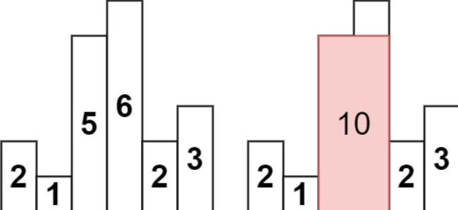
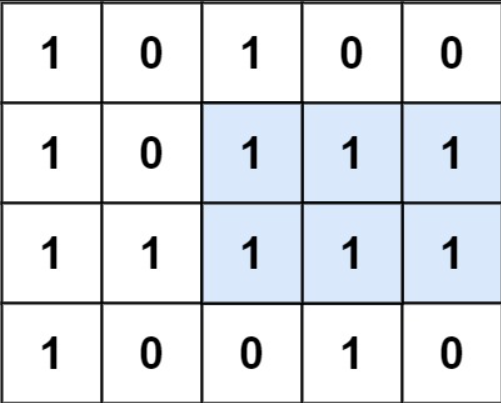
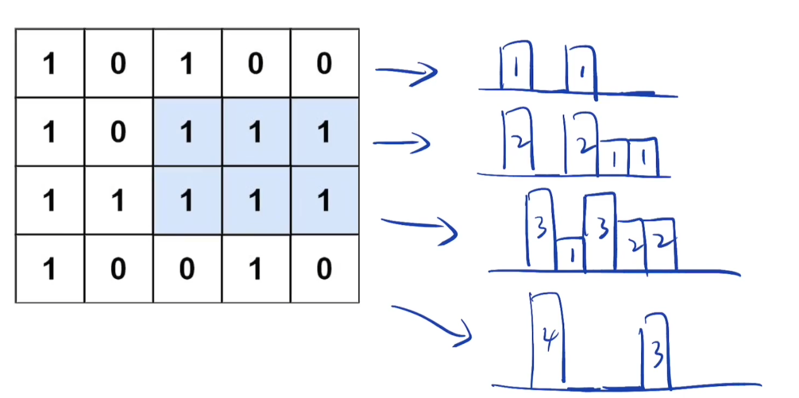

<!-- @format -->

## 柱状图中最大的矩形 && 最大矩形

很相似的两道题

- [柱状图中最大的矩形 \&\& 最大矩形](#柱状图中最大的矩形--最大矩形)
- [柱状图中的最大矩形](#柱状图中的最大矩形)
  - [题目详情](#题目详情)
  - [解题思路](#解题思路)
  - [代码实现](#代码实现)
- [最大矩形](#最大矩形)
  - [题目详情](#题目详情-1)
  - [解题思路](#解题思路-1)
  - [代码实现](#代码实现-1)

<!--more-->

## 柱状图中的最大矩形

## 题目详情

给定 n 个非负整数，用来表示柱状图中各个柱子的高度。每个柱子彼此相邻，且宽度为 1 。  
求在该柱状图中，能够勾勒出来的矩形的最大面积。



## 解题思路

感觉和求雨水的一样，矩形的大小取决于最短边的长度，使用单调栈：

1. 如果当前柱子的高度大于栈顶柱子的高度，或者栈为空，则将当前柱子的索引入栈

2. 如果当前柱子的高度小于或等于栈顶柱子的高度，则说明找到了栈顶柱子右边第一个比它矮的柱子，此时可以计算以栈顶柱子为高的矩形的面积。重复此步骤，直到栈为空或者当前柱子的高度大于栈顶柱子的高度，然后将当前柱子的索引入栈。

## 代码实现

```JS
var largestRectangleArea = function(heights) {
  let stack = []
  let max = 0
  //处理边界
  heights = [0, ...heights, 0]
  for (let i = 0; i < heights.length; i++) {
    while (stack.length && heights[i] < heights[stack[stack.length - 1]]) {
      let height = heights[stack.pop()]
      //矩形高度取决于最短的那个边
      let width = stack.length ? i - stack[stack.length - 1] - 1 : i
      max = Math.max(max, height * width)
    }
    stack.push(i)
  }
  return max
};
```

## 最大矩形

## 题目详情

给定一个仅包含 0 和 1 、大小为 rows x cols 的二维二进制矩阵，找出只包含 1 的最大矩形，并返回其面积。  


## 解题思路

遍历每一行，将其转化为柱状图中的最大矩形  


## 代码实现

```TS
function maximalRectangle(matrix: string[][]): number {
  if (matrix.length === 0) return 0;
  const m = matrix.length;
  const n = matrix[0].length;
  const heights = Array(n).fill(0);
  let maxArea = 0;

  for (let i = 0; i < m; i++) {
    //初始化一个空栈 stack，用于存储列的索引。
    const stack: number[] = [];
    for (let j = 0; j <= n; j++) {
      //如果当前位置的值为 "1"，则将当前列的高度加 1；否则，将当前列的高度设置为 0。
      heights[j] = j < n && matrix[i][j] === "1" ? heights[j] + 1 : 0;
      while (stack.length && heights[j] < heights[stack[stack.length - 1]]) {
        const height = heights[stack.pop() as number];
        const width = stack.length ? j - stack[stack.length - 1] - 1 : j;
        maxArea = Math.max(maxArea, height * width);
      }
      stack.push(j);
    }
  }

  return maxArea;
}
```
