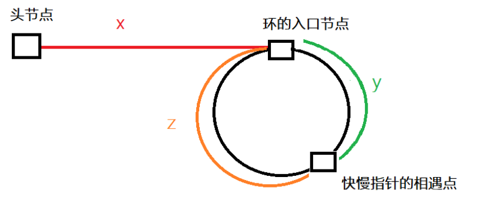

<!-- @format -->

## 环形链表 II && LRU 缓存

- [环形链表 II \&\& LRU 缓存](#环形链表-ii--lru-缓存)
  - [环形链表 II](#环形链表-ii)
    - [题目详情](#题目详情)
    - [解题思路](#解题思路)
    - [代码实现](#代码实现)
  - [LRU 缓存](#lru-缓存)
    - [题目详情](#题目详情-1)
    - [解题思路](#解题思路-1)
    - [代码实现](#代码实现-1)

<!--more-->

## 环形链表 II

### 题目详情

给定一个链表的头节点 `head` ，返回链表开始入环的第一个节点。 如果链表无环，则返回 `null`。
不允许修改链表。

### 解题思路

感觉使用快慢指针找环还是比较容易的，但找到环的起点就有点困难了。
首先 慢指针的步数为 `n`，快指针的步数为 `2n`，根据下图，慢指针走过的步数为 `x + y` , 快指针走过的步数为`x + y + (y+z) * m`，其中`m`为走过的圈数。  
这样 成立公式`2 * (x + y) = x + y + (y+z) * m`，化简后为`x = (n-1)(y+z) + z`，慢指针从相交点走 z 步就可以在环的起点遇上从链表头节点过来的 pre


### 代码实现

```TS
function detectCycle(head: ListNode | null): ListNode | null {
  let slow = head;
  let fast = head;
  while (fast && fast.next) {
    slow = slow.next;
    fast = fast.next.next;
    if (slow === fast) {
      let ptr = head;
      while (ptr !== slow) {
        ptr = ptr.next;
        slow = slow.next;
      }
      return ptr;
    }
  }
  return null;
}
```

## LRU 缓存

### 题目详情

请你设计并实现一个满足 LRU (最近最少使用) 缓存 约束的数据结构。
实现 LRUCache 类：

- `LRUCache(int capacity)` 以 正整数 作为容量 `capacity` 初始化 `LRU` 缓存
- `int get(int key)` 如果关键字 `key` 存在于缓存中，则返回关键字的值，否则返回 -1 。
- `void put(int key, int value)` 如果关键字 `key` 已经存在，则变更其数据值 `value` ；如果不存在，则向缓存中插入该组 `key-value`。如果插入操作导致关键字数量超过 `capacity` ，则应该 逐出 最久未使用的关键字。
  函数 get 和 put 必须以 O(1) 的平均时间复杂度运行。

### 解题思路

淦，开始想用栈的，结果没想到普通的 Map 就可以了，不难，就是结构构造那边没写过有点陌生

### 代码实现

```TS
class LRUCache {
  private cache: Map<number, number>;
  private capacity: number;

  constructor(capacity: number) {
    this.capacity = capacity;
    this.cache = new Map();
  }

  get(key: number): number {
    if (!this.cache.has(key)) {
      return -1;
    }
    const value = this.cache.get(key);
    this.cache.delete(key);
    this.cache.set(key, value);
    return value;
  }

  put(key: number, value: number): void {
    if (this.cache.has(key)) {
      this.cache.delete(key);
    } else if (this.cache.size >= this.capacity) {
      this.cache.delete(this.cache.keys().next().value);
    }
    this.cache.set(key, value);
  }
}
```
