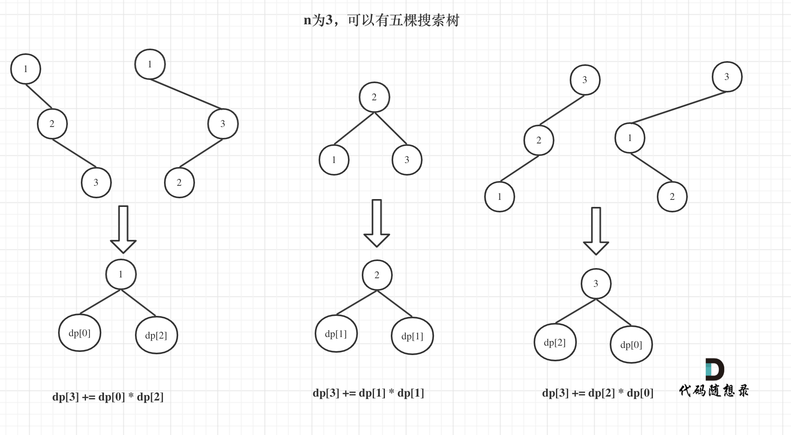

<!-- @format -->

# 不同的二叉搜索树

## 题目详情

给定一个整数 n，求以`1 ... n`为节点组成的二叉搜索树有多少种？

## 解题思路

以`dp[3]`为例，



`dp[3]`，就是 元素`1`为头结点搜索树的数量 + 元素`2`为头结点搜索树的数量 + 元素`3`为头结点搜索树的数量

元素`1`为头结点搜索树的数量 = 右子树有 2 个元素的搜索树数量 \* 左子树有 0 个元素的搜索树数量

元素`2`为头结点搜索树的数量 = 右子树有 1 个元素的搜索树数量 \* 左子树有 1 个元素的搜索树数量

元素`3`为头结点搜索树的数量 = 右子树有 0 个元素的搜索树数量 \* 左子树有 2 个元素的搜索树数量

有`2`个元素的搜索树数量就是`dp[2]`。

有`1`个元素的搜索树数量就是`dp[1]`。

有`0`个元素的搜索树数量就是`dp[0]`。

所以` dp[3] = dp[2] _ dp[0] + dp[1] _ dp[1] + dp[0] * dp[2]`

## 代码实现

```js
var numTrees = function (n) {
  let dp = new Array(n + 1).fill(0);
  dp[0] = 1;
  for (let i = 1; i <= n; i++) {
    for (let j = 1; j <= i; j++) {
      dp[i] += dp[j - 1] * dp[i - j];
    }
  }

  return dp[n];
};
```

<!-- @format -->
