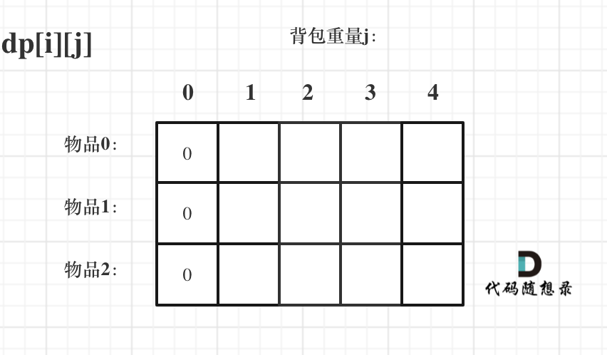
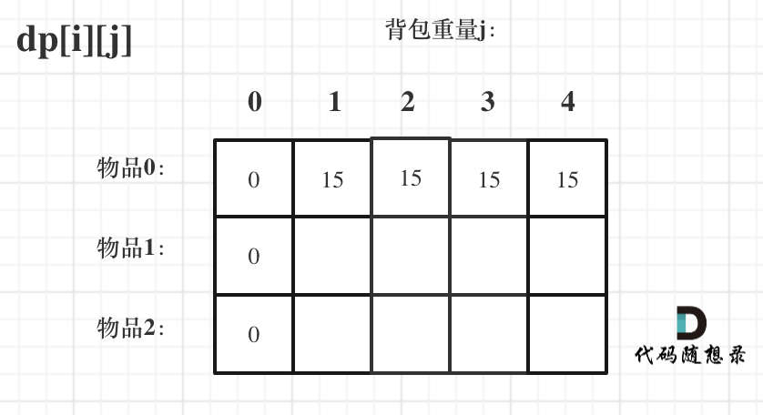
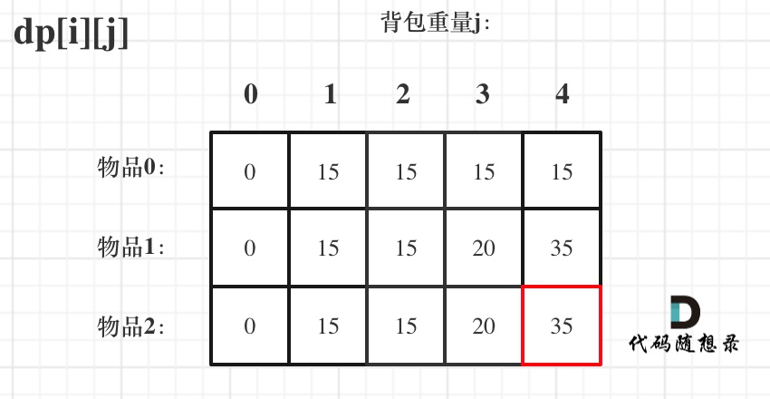

<!-- @format -->

# 01 背包理论

- [代码随想录网址]<https://programmercarl.com/%E8%83%8C%E5%8C%85%E7%90%86%E8%AE%BA%E5%9F%BA%E7%A1%8001%E8%83%8C%E5%8C%85-1.html#%E6%80%9D%E8%B7%AF>

有`n`件物品和一个最多能背重量为`w`的背包。第`i`件物品的重量是`weight[i]`，得到的价值是`value[i]`。每件物品只能用一次，求解将哪些物品装入背包里物品价值总和最大。

## 二维 dp 数组 01 背包

1. `dp`数组及其下标含义

   使用二维数组，其`dp[i][j]`的含义为：从**下标为`[0-i]`的物品里任意取，放进容量为 j 的背包，价值总和最大是多少**

2. 确定递推公式  
    从上述`dp`数组的含义中可以推出，有两个方向可以推出来`dp[i][j]`

   - 不放物品`i`:不放物品 i 的最大价值，此时`dp[i][j]`就是`dp[i - 1][j]`

   - 放入物品`i`：`dp[i - 1]j - weight[i]]` 为背包容量为`j - weight[i]`的时候不放物品` i`的最大价值，那么 dp[i - 1]j - weight[i]] + value[i] （物品 i 的价值），就是背包放物品 i 得到的最大价值

   递归公式：`dp[i][j] = max(dp[i - 1][j], dp[i - 1]j - weight[i]] + value[i])`;

3. dp 数组初始化

   - 从`dp[i][j]`的定义出发，如果背包容量`j`为`0`的话，即`dp[i][0]`，无论是选取哪些物品，背包价值总和一定为`0`。如图：

     

   * 由状态转移方程，可以看出`i`是由`i-1`推导出来，那么`i`为`0`的时候就需要初始化，要注意一点，`j < weight[0]`的时候，`dp[0][j]`应该是`0`，因为背包容量比编号`0`的物品重量还小

     

4. 确定遍历顺序
   其实都可以，但更推荐先遍历物品，然后遍历背包重量
5. 举例推导 dp 数组  
    对应的`dp`数组的数值，如图：
   
   最终结果就是 dp[2][4]

## 题目一：携带研究材料

### 题目详情

小明是一位科学家，他需要参加一场重要的国际科学大会，以展示自己的最新研究成果。他需要带一些研究材料，但是他的行李箱空间有限。这些研究材料包括实验设备、文献资料和实验样本等等，它们各自占据不同的空间，并且具有不同的价值。

小明的行李空间为 N，问小明应该如何抉择，才能携带最大价值的研究材料，每种研究材料只能选择一次，并且只有选与不选两种选择，不能进行切割。

### 代码实现

```js
const readline = require("readline");
const rl = readline.createInterface({
  input: process.stdin,
  output: process.stdout,
});
let lineCount = 0;
let m, n;
let space = [];
let value = [];
rl.on("line", function (line) {
  lineCount++;
  if (lineCount === 1) {
    let input = line.split(" ").map(Number);
    m = input[0];
    n = input[1];
  }
  if (lineCount === 2) {
    space = line.split(" ").map(Number);
  }
  if (lineCount === 3) {
    value = line.split(" ").map(Number);
    const dp = new Array(m).fill(0).map(() => new Array(n + 1).fill(0));
    for (let i = 1; i <= n; i++) {
      if (i < space[0]) continue;
      dp[0][i] = value[0];
    }
    for (let i = 1; i < m; i++) {
      for (let j = 1; j <= n; j++) {
        if (j < space[i]) dp[i][j] = dp[i - 1][j];
        else dp[i][j] = Math.max(dp[i - 1][j], dp[i - 1][j - space[i]] + value[i]);
      }
    }
    console.log(dp[m - 1][n]);
  }
});
```

<!-- @format -->
