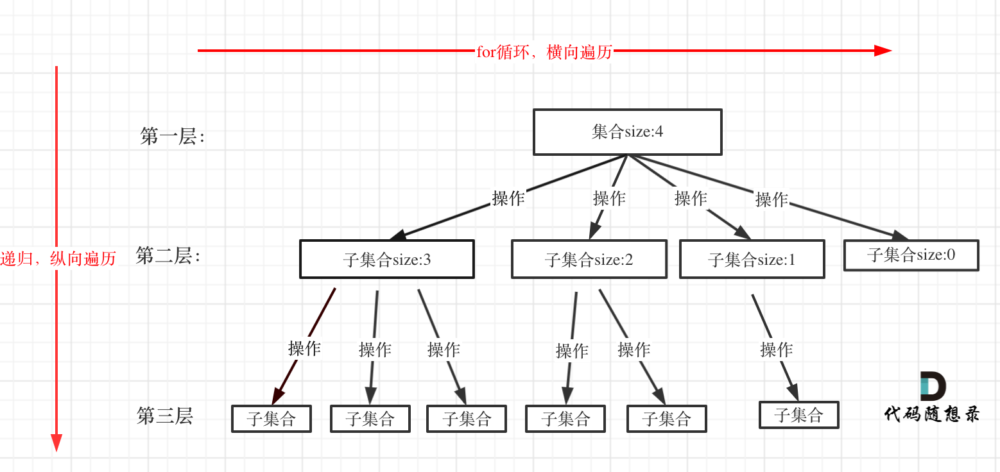

<!-- @format -->

# 回溯算法理论基础

- [回溯算法理论基础](#回溯算法理论基础)
  - [什么是回溯](#什么是回溯)
  - [回溯法解决的问题](#回溯法解决的问题)
  - [如何理解回溯](#如何理解回溯)
  - [回溯三部曲](#回溯三部曲)

## 什么是回溯

回溯法也可以叫做回溯搜索法，它是一种搜索的方式。
**因为回溯的本质是穷举，穷举所有可能，**然后选出我们想要的答案，如果想让回溯法高效一些，可以加一些剪枝的操作，但也改不了回溯法就是穷举的本质。

## 回溯法解决的问题

回溯法，一般可以解决如下几种问题：

- 组合问题：N 个数里面按一定规则找出 k 个数的集合
- 切割问题：一个字符串按一定规则有几种切割方式
- 子集问题：一个 N 个数的集合里有多少符合条件的子集
- 排列问题：N 个数按一定规则全排列，有几种排列方式
- 棋盘问题：N 皇后，解数独等等

## 如何理解回溯

**回溯法解决的问题都可以抽象为树形结构**，所有回溯法的问题都可以抽象为树形结构！
因为回溯法解决的都是在集合中递归查找子集，集合的大小就构成了树的宽度，递归的深度就构成了树的深度。

## 回溯三部曲

- 回溯函数模板返回值以及参数
- 回溯函数终止条件
- 回溯搜索的遍历过程
  

```js
void backtracking(参数) {
    if (终止条件) {
        存放结果;
        return;
    }

    for (选择：本层集合中元素（树中节点孩子的数量就是集合的大小）) {
        处理节点;
        backtracking(路径，选择列表); // 递归
        回溯，撤销处理结果
    }
}

```
