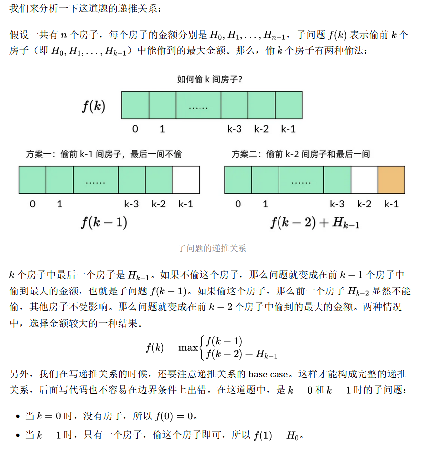

<!-- @format -->

# 什么是动态规划

- [什么是动态规划](#什么是动态规划)
  - [动态规划适用情况与场景](#动态规划适用情况与场景)
  - [动态规划解题步骤](#动态规划解题步骤)
  - [步骤一、定义子问题](#步骤一定义子问题)
  - [步骤二、写出子问题的递推关系](#步骤二写出子问题的递推关系)
  - [步骤三、确定 DP 数组的计算顺序](#步骤三确定-dp-数组的计算顺序)
  - [步骤四、空间优化](#步骤四空间优化)

* 分治方法将问题划分为互不相交的子问题，递归的求解子问题，再将它们的解组合起来，求出原问题的解。
* 动态规划将复杂的问题分解为若干子问题，通过综合子问题的最优解来得到原问题的最优解,并将每个求解过的子问题记录下来，这样下次碰到相同的子问题，就可以直接使用之前记录的结果，而不重复计算。

## 动态规划适用情况与场景

- **适用情况:** 一个问题必须拥有重叠子问题和最优子结构，才能使用动态规划去解决
- **适用场景:** 最大值/最小值, 可不可行, 是不是，方案个数

## 动态规划解题步骤

1. 定义子问题
2. 写出子问题的递推关系
3. 确定 DP 数组的计算顺序
4. 空间优化（可选）

## 步骤一、定义子问题

子问题是和原问题相似，但规模较小的问题。

```
例：
  原问题「从全部房子中能偷到的最大金额」→ 子问题「从k个房子中能偷到的最大金额」
```

子问题需要具备以下两个性质：

- 原问题要能由子问题表示
- 一个子问题的解要能通过其他子问题的解求出

## 步骤二、写出子问题的递推关系



## 步骤三、确定 DP 数组的计算顺序

动态规划有两种计算顺序：

- 一种是自顶向下的、使用备忘录的递归方法
- 一种是自底向上的、使用 DP 数组的循环方法

不过在普通的动态规划题目中，99% 的情况我们用循环方法就很好解决，**所以我们最好在一开始就坚持自底向上方法**，使用 DP 数组，这样才有助于领悟动态规划的真正精髓。

## 步骤四、空间优化

空间优化的基本原理是，**很多时候我们并不需要始终持有全部的 DP 数组。**
