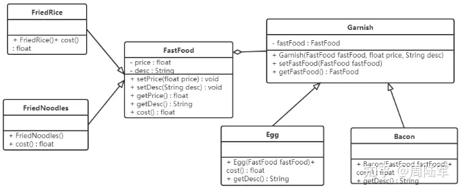
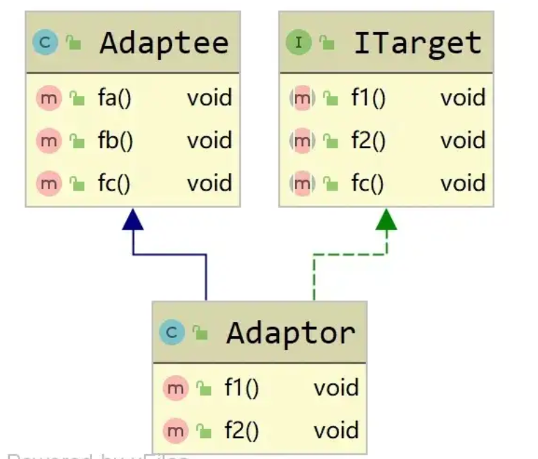
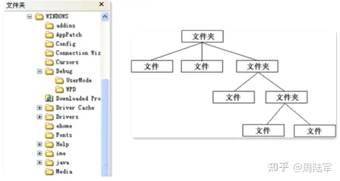
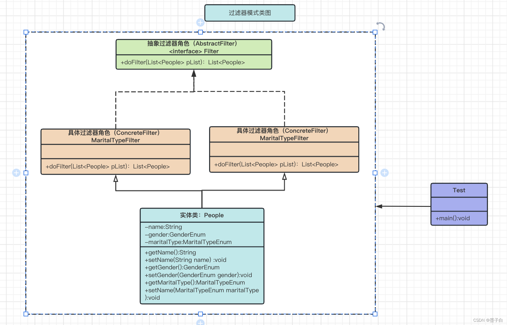

<!-- @format -->

# 结构型模式

## 代理模式（Proxy）

代理模式用于为另一个对象提供一个替身或占位符，以控制对这个对象的访问。

由于某些原因需要给某对象（目标对象）提供一个代理以控制对该对象的访问。这时，访问对象不适合或者不能直接引用目标对象，代理对象作为访问对象和目标对象之间的中介，它通常用于以下几种情况：

1. 远程代理：为一个对象在不同地址空间提供局部代表。这样可以隐藏一个对象存在于不同地址空间的事实。
2. 虚拟代理：根据需要创建开销很大的对象。通过使用虚拟代理，可以在真正需要对象时才创建它。
3. 保护代理：控制对原始对象的访问。保护代理用于对象应该有不同的访问权限时。
4. 智能引用代理：在访问对象时执行一些附加操作。例如，记录对象的访问历史、统计访问次数等。

:::tip 前端使用

在前端中，代理模式可以用于懒加载、事件代理、数据绑定、缓存等应用。

- Vue.js 的 vue-router 库使用代理模式来控制路由跳转时的导航守卫。
- 通过创建一个代理服务器，实现跨域请求，避免浏览器的同源策略限制。
- 使用代理对象管理对象的访问，如 ES6 的 Proxy 可以实现对象属性的监控。
- 实现图片懒加载，通过代理控制图片的加载时机，提高页面加载性能。

:::

- 示例代码：

```java
// 接口
interface Subject {
  request(): void;
}

// 真实对象
class RealSubject implements Subject {
  request(): void {
    console.log('RealSubject: Handling request.');
  }
}

// 代理对象
class ProxySubject implements Subject {
  private realSubject: RealSubject;

  constructor(realSubject: RealSubject) {
    this.realSubject = realSubject;
  }

  request(): void {
    if (this.checkAccess()) {
      this.realSubject.request();
      this.logAccess();
    }
  }

  private checkAccess(): boolean {
    console.log('Proxy: Checking access prior to firing a real request.');
    // 这里可以添加一些访问控制逻辑
    return true;
  }

  private logAccess(): void {
    console.log('Proxy: Logging the time of request.');
    // 这里可以添加一些日志记录逻辑
  }
}

// 客户端代码
const realSubject = new RealSubject();
const proxy = new ProxySubject(realSubject);

proxy.request();
```

## 装饰器模式（Decorator）

装饰者模式的主要目的是动态地给对象添加额外的职责（功能）。装饰者模式通过包装对象来扩展其功能，而不是通过继承。

我们使用装饰者模式对快餐店案例进行改进，体会装饰者模式的精髓。



```java
// 组件接口
interface Component {
    String operation();
}

// 具体组件
class ConcreteComponent implements Component {
    @Override
    public String operation() {
        return "ConcreteComponent";
    }
}

// 装饰器
abstract class Decorator implements Component {
    protected Component component;

    public Decorator(Component component) {
        this.component = component;
    }

    @Override
    public String operation() {
        return component.operation();
    }
}

// 具体装饰器A
class ConcreteDecoratorA extends Decorator {
    public ConcreteDecoratorA(Component component) {
        super(component);
    }

    @Override
    public String operation() {
        return "ConcreteDecoratorA(" + super.operation() + ")";
    }
}

// 具体装饰器B
class ConcreteDecoratorB extends Decorator {
    public ConcreteDecoratorB(Component component) {
        super(component);
    }

    @Override
    public String operation() {
        return "ConcreteDecoratorB(" + super.operation() + ")";
    }
}

// 客户端代码
public class Main {
    public static void main(String[] args) {
        Component simple = new ConcreteComponent();
        System.out.println("Client: I've got a simple component:");
        System.out.println("RESULT: " + simple.operation());

        Component decorator1 = new ConcreteDecoratorA(simple);
        System.out.println("Client: Now I've got a decorated component:");
        System.out.println("RESULT: " + decorator1.operation());

        Component decorator2 = new ConcreteDecoratorB(decorator1);
        System.out.println("Client: Now I've got a decorated component:");
        System.out.println("RESULT: " + decorator2.operation());
    }
}
```

## 适配器模式（Adapter）

适配器模式（Adapter Pattern）是一种结构型设计模式，它允许将一个类的接口转换成客户希望的另一个接口。适配器模式使得原本由于接口不兼容而不能一起工作的那些类可以一起工作。适配器模式主要用于解决接口不兼容的问题。


- 示例代码：

```java
// 目标接口
interface Target {
    void request();
}

// 需要适配的类
class Adaptee {
    public void specificRequest() {
        System.out.println("Adaptee: Specific request.");
    }
}

// 适配器
class Adapter implements Target {
    private Adaptee adaptee;

    public Adapter(Adaptee adaptee) {
        this.adaptee = adaptee;
    }

    @Override
    public void request() {
        adaptee.specificRequest();
    }
}

// 客户端代码
public class Main {
    public static void main(String[] args) {
        Adaptee adaptee = new Adaptee();
        Target target = new Adapter(adaptee);

        target.request(); // 输出: Adaptee: Specific request.
    }
}
```

## 桥接模式（Bridge）

桥接模式（Bridge Pattern）是一种结构型设计模式，它通过将抽象部分与实现部分分离，使它们可以独立地变化。  
桥接模式的主要目的是将抽象与实现解耦，从而使两者可以独立地变化。这种模式涉及到一个接口（抽象部分）和一个或多个实现类（实现部分），通过组合的方式将它们连接起来。

- 示例代码：

```java
// 实现类接口
interface Implementor {
    void operationImpl();
}

// 具体实现类A
class ConcreteImplementorA implements Implementor {
    @Override
    public void operationImpl() {
        System.out.println("ConcreteImplementorA: operationImpl");
    }
}

// 具体实现类B
class ConcreteImplementorB implements Implementor {
    @Override
    public void operationImpl() {
        System.out.println("ConcreteImplementorB: operationImpl");
    }
}

// 抽象类
abstract class Abstraction {
    protected Implementor implementor;

    protected Abstraction(Implementor implementor) {
        this.implementor = implementor;
    }

    public abstract void operation();
}

// 扩展抽象类
class RefinedAbstraction extends Abstraction {
    protected RefinedAbstraction(Implementor implementor) {
        super(implementor);
    }

    @Override
    public void operation() {
        System.out.println("RefinedAbstraction: operation");
        implementor.operationImpl();
    }
}

// 客户端代码
public class Main {
    public static void main(String[] args) {
        Implementor implementorA = new ConcreteImplementorA();
        Abstraction abstractionA = new RefinedAbstraction(implementorA);
        abstractionA.operation();

        Implementor implementorB = new ConcreteImplementorB();
        Abstraction abstractionB = new RefinedAbstraction(implementorB);
        abstractionB.operation();
    }
}
```

## 外观模式（Facade）

为子系统中的一组接口提供一个一致的界面。外观模式定义了一个高层接口，这个接口使得这一子系统更加容易使用。外观模式的主要目的是简化客户端与复杂系统之间的交互。

- 示例代码：

```java
// 子系统类A
class SubsystemA {
    public void operationA() {
        System.out.println("SubsystemA: operationA");
    }
}

// 子系统类B
class SubsystemB {
    public void operationB() {
        System.out.println("SubsystemB: operationB");
    }
}

// 子系统类C
class SubsystemC {
    public void operationC() {
        System.out.println("SubsystemC: operationC");
    }
}

// 外观类
class Facade {
    private SubsystemA subsystemA;
    private SubsystemB subsystemB;
    private SubsystemC subsystemC;

    public Facade() {
        this.subsystemA = new SubsystemA();
        this.subsystemB = new SubsystemB();
        this.subsystemC = new SubsystemC();
    }

    public void operation1() {
        System.out.println("Facade: operation1");
        subsystemA.operationA();
        subsystemB.operationB();
    }

    public void operation2() {
        System.out.println("Facade: operation2");
        subsystemB.operationB();
        subsystemC.operationC();
    }
}

// 客户端代码
public class Main {
    public static void main(String[] args) {
        Facade facade = new Facade();
        facade.operation1();
        facade.operation2();
    }
}
```

## 享元模式（Flyweight）

通过共享技术来有效地支持大量细粒度对象的复用。享元模式的主要目的是减少创建对象的数量，以减少内存占用和提高性能。享元模式适用于具有大量相似对象的场景，这些对象可以共享部分状态。

- 示例代码：

```java
import java.util.HashMap;
import java.util.Map;

// 享元接口
interface Flyweight {
    void operation(String extrinsicState);
}

// 具体享元类
class ConcreteFlyweight implements Flyweight {
    private String intrinsicState;

    public ConcreteFlyweight(String intrinsicState) {
        this.intrinsicState = intrinsicState;
    }

    @Override
    public void operation(String extrinsicState) {
        System.out.println("ConcreteFlyweight: IntrinsicState = " + intrinsicState + ", ExtrinsicState = " + extrinsicState);
    }
}

// 享元工厂
class FlyweightFactory {
    private Map<String, Flyweight> flyweights = new HashMap<>();

    public Flyweight getFlyweight(String key) {
        if (!flyweights.containsKey(key)) {
            flyweights.put(key, new ConcreteFlyweight(key));
        }
        return flyweights.get(key);
    }

    public int getFlyweightCount() {
        return flyweights.size();
    }
}

// 客户端代码
public class Main {
    public static void main(String[] args) {
        FlyweightFactory factory = new FlyweightFactory();

        Flyweight flyweight1 = factory.getFlyweight("A");
        flyweight1.operation("First Call");

        Flyweight flyweight2 = factory.getFlyweight("B");
        flyweight2.operation("Second Call");

        Flyweight flyweight3 = factory.getFlyweight("A");
        flyweight3.operation("Third Call");

        System.out.println("Total Flyweights created: " + factory.getFlyweightCount());
    }
}
```

## 组合模式(Composite Pattern)

把一组相似的对象当作一个单一的对象。组合模式依据树形结构来组合对象，用来表示部分以及整体层次。这种类型的设计模式属于结构型模式，它创建了对象组的树形结构。


- 示例代码：

```java
import java.util.ArrayList;
import java.util.List;

// 组件接口
interface Component {
    void operation();
}

// 叶子节点
class Leaf implements Component {
    private String name;

    public Leaf(String name) {
        this.name = name;
    }

    @Override
    public void operation() {
        System.out.println("Leaf " + name + " is visited.");
    }
}

// 组合节点
class Composite implements Component {
    private List<Component> children = new ArrayList<>();

    public void add(Component component) {
        children.add(component);
    }

    public void remove(Component component) {
        children.remove(component);
    }

    public Component getChild(int index) {
        return children.get(index);
    }

    @Override
    public void operation() {
        System.out.println("Composite is visited.");
        for (Component child : children) {
            child.operation();
        }
    }
}

// 客户端代码
public class Main {
    public static void main(String[] args) {
        Component leaf1 = new Leaf("1");
        Component leaf2 = new Leaf("2");
        Component leaf3 = new Leaf("3");

        Composite composite1 = new Composite();
        composite1.add(leaf1);
        composite1.add(leaf2);

        Composite composite2 = new Composite();
        composite2.add(leaf3);
        composite2.add(composite1);

        composite2.operation();
    }
}
```

## 过滤器模式（Filter、Criteria Pattern）

允许通过不同的标准来过滤一组对象，并且可以将这些标准组合起来。过滤器模式通常用于对对象集合进行过滤和筛选。


```java
import java.util.ArrayList;
import java.util.List;
import java.util.stream.Collectors;

// 人类
class Person {
    private String name;
    private String gender;
    private String maritalStatus;

    public Person(String name, String gender, String maritalStatus) {
        this.name = name;
        this.gender = gender;
        this.maritalStatus = maritalStatus;
    }

    public String getName() {
        return name;
    }

    public String getGender() {
        return gender;
    }

    public String getMaritalStatus() {
        return maritalStatus;
    }

    @Override
    public String toString() {
        return "Person [name=" + name + ", gender=" + gender + ", maritalStatus=" + maritalStatus + "]";
    }
}

// 标准接口
interface Criteria {
    List<Person> meetCriteria(List<Person> persons);
}

// 具体标准类：男性
class CriteriaMale implements Criteria {
    @Override
    public List<Person> meetCriteria(List<Person> persons) {
        return persons.stream()
                .filter(person -> person.getGender().equalsIgnoreCase("MALE"))
                .collect(Collectors.toList());
    }
}

// 具体标准类：女性
class CriteriaFemale implements Criteria {
    @Override
    public List<Person> meetCriteria(List<Person> persons) {
        return persons.stream()
                .filter(person -> person.getGender().equalsIgnoreCase("FEMALE"))
                .collect(Collectors.toList());
    }
}

// 具体标准类：单身
class CriteriaSingle implements Criteria {
    @Override
    public List<Person> meetCriteria(List<Person> persons) {
        return persons.stream()
                .filter(person -> person.getMaritalStatus().equalsIgnoreCase("SINGLE"))
                .collect(Collectors.toList());
    }
}

// 组合标准类：与
class AndCriteria implements Criteria {
    private Criteria criteria;
    private Criteria otherCriteria;

    public AndCriteria(Criteria criteria, Criteria otherCriteria) {
        this.criteria = criteria;
        this.otherCriteria = otherCriteria;
    }

    @Override
    public List<Person> meetCriteria(List<Person> persons) {
        List<Person> firstCriteriaPersons = criteria.meetCriteria(persons);
        return otherCriteria.meetCriteria(firstCriteriaPersons);
    }
}

// 组合标准类：或
class OrCriteria implements Criteria {
    private Criteria criteria;
    private Criteria otherCriteria;

    public OrCriteria(Criteria criteria, Criteria otherCriteria) {
        this.criteria = criteria;
        this.otherCriteria = otherCriteria;
    }

    @Override
    public List<Person> meetCriteria(List<Person> persons) {
        List<Person> firstCriteriaItems = criteria.meetCriteria(persons);
        List<Person> otherCriteriaItems = otherCriteria.meetCriteria(persons);
        firstCriteriaItems.addAll(otherCriteriaItems);
        return firstCriteriaItems.stream().distinct().collect(Collectors.toList());
    }
}

// 客户端代码
public class Main {
    public static void main(String[] args) {
        List<Person> persons = new ArrayList<>();
        persons.add(new Person("Robert", "Male", "Single"));
        persons.add(new Person("John", "Male", "Married"));
        persons.add(new Person("Laura", "Female", "Married"));
        persons.add(new Person("Diana", "Female", "Single"));
        persons.add(new Person("Mike", "Male", "Single"));
        persons.add(new Person("Bobby", "Male", "Single"));

        Criteria male = new CriteriaMale();
        Criteria female = new CriteriaFemale();
        Criteria single = new CriteriaSingle();
        Criteria singleMale = new AndCriteria(single, male);
        Criteria singleOrFemale = new OrCriteria(single, female);

        System.out.println("Males: ");
        printPersons(male.meetCriteria(persons));

        System.out.println("\nFemales: ");
        printPersons(female.meetCriteria(persons));

        System.out.println("\nSingle Males: ");
        printPersons(singleMale.meetCriteria(persons));

        System.out.println("\nSingle Or Females: ");
        printPersons(singleOrFemale.meetCriteria(persons));
    }

    public static void printPersons(List<Person> persons) {
        for (Person person : persons) {
            System.out.println(person);
        }
    }
}
```

<!-- @format -->
