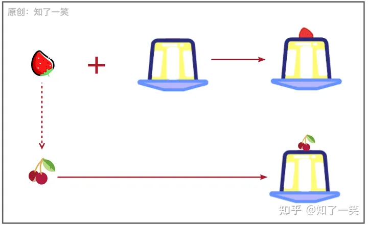
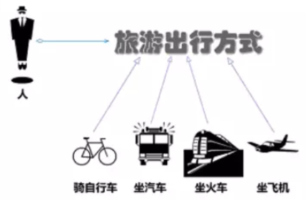
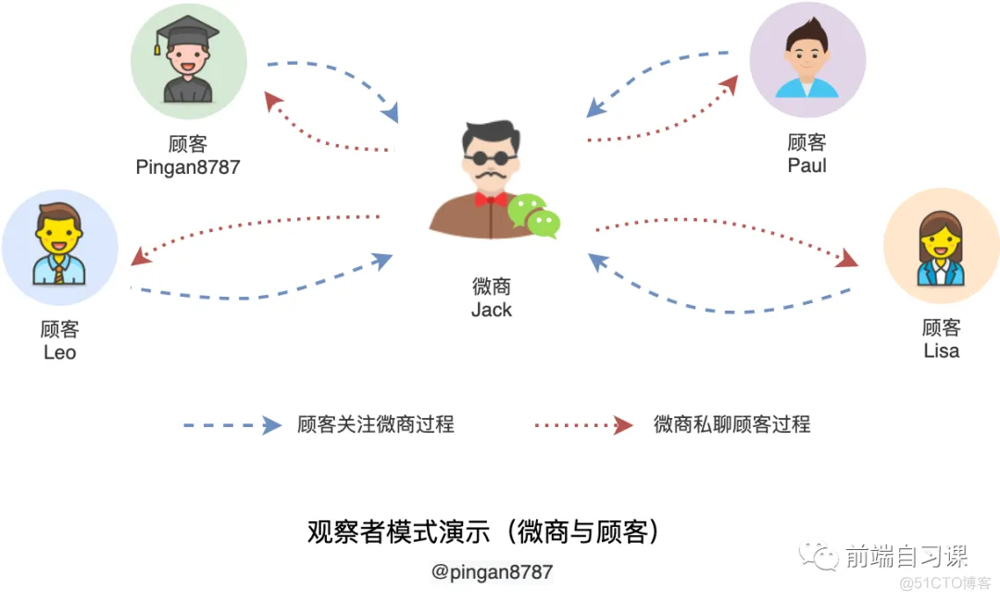
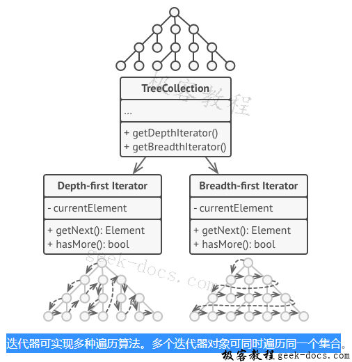
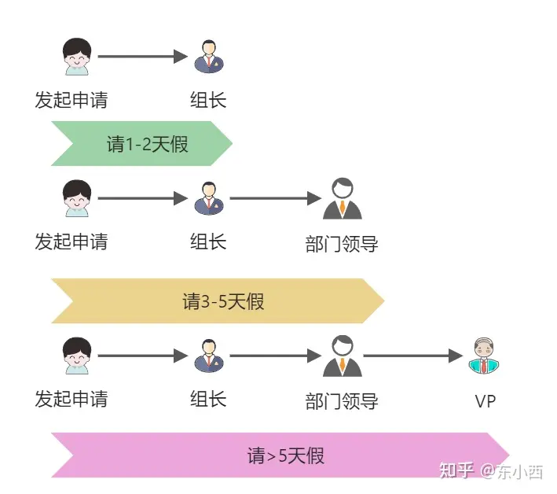
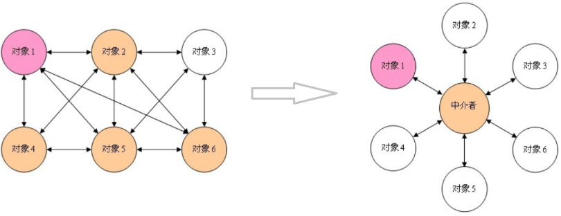
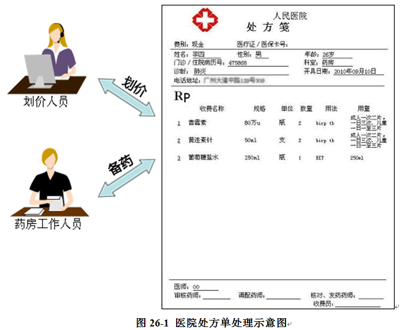
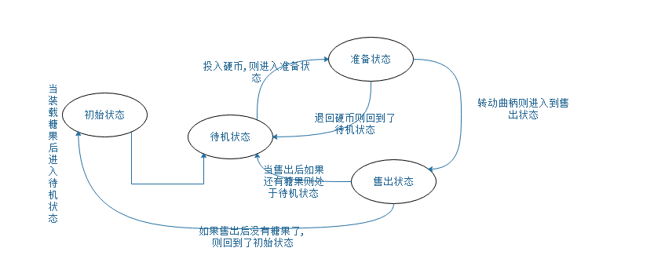
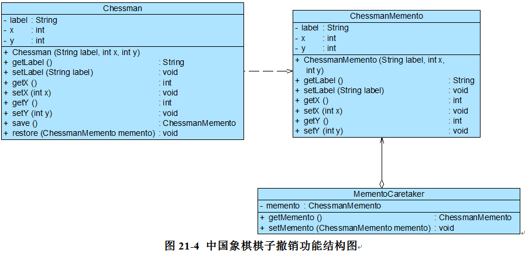
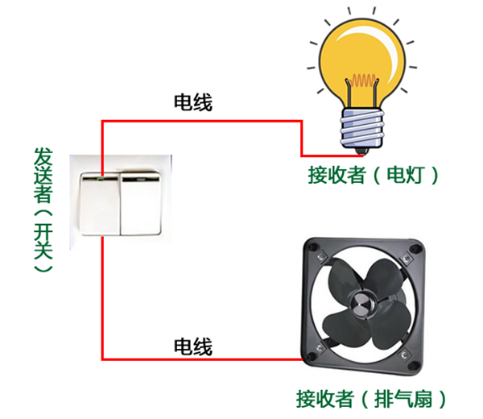

<!-- @format -->

# 行为型模式

## 模板模式 (Template Method Pattern)

**它定义了一个操作中的算法的骨架，并将一些步骤延迟到子类中实现。**这样，算法的结构可以在不改变算法的情况下重新定义算法的某些特定步骤。
模板方法模式在一个方法中定义了一个算法的步骤，并允许子类为一个或多个步骤提供实现。这样，子类可以在不改变算法结构的前提下，重新定义算法的某些特定步骤。

无论造型如何变化，不变的有两种东西：“奶油”和“面包”。其余的材料随意搭配，就凑成了各式各样的蛋糕。


特点如下：

1. 封装不变的逻辑，扩展差异化的逻辑；

2. 抽取公共代码，提高代码的复用性；

3. 父类控制行为，子类实现细节。

- 示例代码：

```java
// 抽象类
abstract class Game {
    // 模板方法
    public final void play() {
        initialize();
        startPlay();
        endPlay();
    }

    // 基本方法（抽象方法）
    abstract void initialize();
    abstract void startPlay();
    abstract void endPlay();
}

// 具体类1
class Cricket extends Game {
    @Override
    void initialize() {
        System.out.println("Cricket Game Initialized! Start playing.");
    }

    @Override
    void startPlay() {
        System.out.println("Cricket Game Started. Enjoy the game!");
    }

    @Override
    void endPlay() {
        System.out.println("Cricket Game Finished!");
    }
}

// 具体类2
class Football extends Game {
    @Override
    void initialize() {
        System.out.println("Football Game Initialized! Start playing.");
    }

    @Override
    void startPlay() {
        System.out.println("Football Game Started. Enjoy the game!");
    }

    @Override
    void endPlay() {
        System.out.println("Football Game Finished!");
    }
}

// 客户端代码
public class TemplatePatternDemo {
    public static void main(String[] args) {
        Game game = new Cricket();
        game.play();
        System.out.println();
        game = new Football();
        game.play();
    }
}
```

## 策略模式 (Strategy Pattern)

定义一系列算法，并使它们可以互换——该模式定义了一系列算法，并将每个算法封装起来，使它们可以相互替换，且算法的变化不会影响使用算法的客户，即：策略模式允许算法独立于使用它们的客户端而变化。



- 示例代码：

```java
// 策略接口
interface Strategy {
    int doOperation(int num1, int num2);
}

// 具体策略类：加法
class OperationAdd implements Strategy {
    @Override
    public int doOperation(int num1, int num2) {
        return num1 + num2;
    }
}

// 具体策略类：减法
class OperationSubtract implements Strategy {
    @Override
    public int doOperation(int num1, int num2) {
        return num1 - num2;
    }
}

// 具体策略类：乘法
class OperationMultiply implements Strategy {
    @Override
    public int doOperation(int num1, int num2) {
        return num1 * num2;
    }
}

// 上下文类
class Context {
    private Strategy strategy;

    public Context(Strategy strategy) {
        this.strategy = strategy;
    }

    public int executeStrategy(int num1, int num2) {
        return strategy.doOperation(num1, num2);
    }
}

// 客户端代码
public class StrategyPatternDemo {
    public static void main(String[] args) {
        Context context = new Context(new OperationAdd());
        System.out.println("10 + 5 = " + context.executeStrategy(10, 5));

        context = new Context(new OperationSubtract());
        System.out.println("10 - 5 = " + context.executeStrategy(10, 5));

        context = new Context(new OperationMultiply());
        System.out.println("10 * 5 = " + context.executeStrategy(10, 5));
    }
}
```

## 观察者模式 (Observer Pattern)

定义了一种一对多的依赖关系，让多个观察者对象同时监听某一个主题对象。当主题对象的状态发生变化时，它会通知所有观察者对象，使它们能够自动更新。观察者模式通常用于实现事件处理系统。



```java
import java.util.ArrayList;
import java.util.List;

// 观察者接口
interface Observer {
    void update(String message);
}

// 具体观察者类
class ConcreteObserver implements Observer {
    private String name;

    public ConcreteObserver(String name) {
        this.name = name;
    }

    @Override
    public void update(String message) {
        System.out.println(name + " received message: " + message);
    }
}

// 主题接口
interface Subject {
    void attach(Observer observer);
    void detach(Observer observer);
    void notifyObservers();
}

// 具体主题类
class ConcreteSubject implements Subject {
    private List<Observer> observers = new ArrayList<>();
    private String state;

    @Override
    public void attach(Observer observer) {
        observers.add(observer);
    }

    @Override
    public void detach(Observer observer) {
        observers.remove(observer);
    }

    @Override
    public void notifyObservers() {
        for (Observer observer : observers) {
            observer.update(state);
        }
    }

    public void setState(String state) {
        this.state = state;
        notifyObservers();
    }
}

// 客户端代码
public class ObserverPatternDemo {
    public static void main(String[] args) {
        ConcreteSubject subject = new ConcreteSubject();

        Observer observer1 = new ConcreteObserver("Observer 1");
        Observer observer2 = new ConcreteObserver("Observer 2");

        subject.attach(observer1);
        subject.attach(observer2);

        subject.setState("New State");
    }
}
```

## 迭代器模式 (Iterator Pattern)

它提供了一种方法顺序访问一个聚合对象中的各个元素，而又不需要暴露该对象的内部表示。迭代器模式将遍历聚合对象的职责分离出来，封装到迭代器对象中，从而使得不同的聚合对象可以有不同的遍历方式。



```java
import java.util.ArrayList;
import java.util.List;

// 迭代器接口
interface Iterator {
    boolean hasNext();
    Object next();
}

// 聚合接口
interface Container {
    Iterator getIterator();
}

// 具体聚合类
class NameRepository implements Container {
    private List<String> names = new ArrayList<>();

    public NameRepository() {
        names.add("Robert");
        names.add("John");
        names.add("Julie");
        names.add("Lora");
    }

    @Override
    public Iterator getIterator() {
        return new NameIterator();
    }

    private class NameIterator implements Iterator {
        int index;

        @Override
        public boolean hasNext() {
            return index < names.size();
        }

        @Override
        public Object next() {
            if (this.hasNext()) {
                return names.get(index++);
            }
            return null;
        }
    }
}

// 客户端代码
public class IteratorPatternDemo {
    public static void main(String[] args) {
        NameRepository namesRepository = new NameRepository();

        for (Iterator iter = namesRepository.getIterator(); iter.hasNext(); ) {
            String name = (String) iter.next();
            System.out.println("Name : " + name);
        }
    }
}
```

## 责任链模式 (Chain of Responsibility Pattern)

它允许多个对象都有机会处理请求，从而避免请求的发送者和接收者之间的耦合关系。将这些对象连成一条链，并沿着这条链传递请求，直到有一个对象处理它为止。


```java
// 抽象处理者类
abstract class Handler {
    protected Handler nextHandler;

    public void setNextHandler(Handler nextHandler) {
        this.nextHandler = nextHandler;
    }

    public abstract void handleRequest(String request);
}

// 具体处理者类1
class ConcreteHandler1 extends Handler {
    @Override
    public void handleRequest(String request) {
        if (request.equals("Request1")) {
            System.out.println("ConcreteHandler1 handled the request.");
        } else if (nextHandler != null) {
            nextHandler.handleRequest(request);
        }
    }
}

// 具体处理者类2
class ConcreteHandler2 extends Handler {
    @Override
    public void handleRequest(String request) {
        if (request.equals("Request2")) {
            System.out.println("ConcreteHandler2 handled the request.");
        } else if (nextHandler != null) {
            nextHandler.handleRequest(request);
        }
    }
}

// 客户端代码
public class ChainOfResponsibilityPatternDemo {
    public static void main(String[] args) {
        Handler handler1 = new ConcreteHandler1();
        Handler handler2 = new ConcreteHandler2();

        handler1.setNextHandler(handler2);

        handler1.handleRequest("Request1");
        handler1.handleRequest("Request2");
        handler1.handleRequest("Request3");
    }
}
```

## 中介者模式 (Mediator Pattern)

定义了一个中介者对象来封装一组对象之间的交互。中介者使各对象不需要显式地相互引用，从而使其耦合松散，而且可以独立地改变它们之间的交互。



```java
// 中介者接口
interface Mediator {
    void sendMessage(String message, Colleague colleague);
}

// 具体中介者类
class ConcreteMediator implements Mediator {
    private Colleague1 colleague1;
    private Colleague2 colleague2;

    public void setColleague1(Colleague1 colleague1) {
        this.colleague1 = colleague1;
    }

    public void setColleague2(Colleague2 colleague2) {
        this.colleague2 = colleague2;
    }

    @Override
    public void sendMessage(String message, Colleague colleague) {
        if (colleague == colleague1) {
            colleague2.receiveMessage(message);
        } else {
            colleague1.receiveMessage(message);
        }
    }
}

// 同事类
abstract class Colleague {
    protected Mediator mediator;

    public Colleague(Mediator mediator) {
        this.mediator = mediator;
    }

    public abstract void sendMessage(String message);
    public abstract void receiveMessage(String message);
}

// 具体同事类1
class Colleague1 extends Colleague {
    public Colleague1(Mediator mediator) {
        super(mediator);
    }

    @Override
    public void sendMessage(String message) {
        System.out.println("Colleague1 sends message: " + message);
        mediator.sendMessage(message, this);
    }

    @Override
    public void receiveMessage(String message) {
        System.out.println("Colleague1 receives message: " + message);
    }
}

// 具体同事类2
class Colleague2 extends Colleague {
    public Colleague2(Mediator mediator) {
        super(mediator);
    }

    @Override
    public void sendMessage(String message) {
        System.out.println("Colleague2 sends message: " + message);
        mediator.sendMessage(message, this);
    }

    @Override
    public void receiveMessage(String message) {
        System.out.println("Colleague2 receives message: " + message);
    }
}

// 客户端代码
public class MediatorPatternDemo {
    public static void main(String[] args) {
        ConcreteMediator mediator = new ConcreteMediator();

        Colleague1 colleague1 = new Colleague1(mediator);
        Colleague2 colleague2 = new Colleague2(mediator);

        mediator.setColleague1(colleague1);
        mediator.setColleague2(colleague2);

        colleague1.sendMessage("Hello, Colleague2!");
        colleague2.sendMessage("Hi, Colleague1!");
    }
}
```

## 访问者模式 (Visitor Pattern)

允许在不改变对象结构的情况下，定义作用于这些对象的新操作。访问者模式将操作的定义与对象结构分离，使得你可以在不修改对象类的情况下添加新的操作。


- 示例代码

```java
// 访问者接口
interface Visitor {
    void visit(ConcreteElementA elementA);
    void visit(ConcreteElementB elementB);
}

// 具体访问者类
class ConcreteVisitor implements Visitor {
    @Override
    public void visit(ConcreteElementA elementA) {
        System.out.println("Visiting ConcreteElementA");
    }

    @Override
    public void visit(ConcreteElementB elementB) {
        System.out.println("Visiting ConcreteElementB");
    }
}

// 元素接口
interface Element {
    void accept(Visitor visitor);
}

// 具体元素类A
class ConcreteElementA implements Element {
    @Override
    public void accept(Visitor visitor) {
        visitor.visit(this);
    }

    public void operationA() {
        System.out.println("Operation A");
    }
}

// 具体元素类B
class ConcreteElementB implements Element {
    @Override
    public void accept(Visitor visitor) {
        visitor.visit(this);
    }

    public void operationB() {
        System.out.println("Operation B");
    }
}

// 对象结构
class ObjectStructure {
    private List<Element> elements = new ArrayList<>();

    public void addElement(Element element) {
        elements.add(element);
    }

    public void removeElement(Element element) {
        elements.remove(element);
    }

    public void accept(Visitor visitor) {
        for (Element element : elements) {
            element.accept(visitor);
        }
    }
}

// 客户端代码
public class VisitorPatternDemo {
    public static void main(String[] args) {
        ObjectStructure objectStructure = new ObjectStructure();
        objectStructure.addElement(new ConcreteElementA());
        objectStructure.addElement(new ConcreteElementB());

        Visitor visitor = new ConcreteVisitor();
        objectStructure.accept(visitor);
    }
}
```

## 解释器模式 (Interpreter Pattern)

为某种语言定义了一个解释器，该解释器使用该语言的语法规则来解释和执行语言中的句子。解释器模式通常用于设计一个简单的语言或表达式求值器。

- 示例代码：

```java
import java.util.Map;
import java.util.HashMap;

// 抽象表达式
interface Expression {
    int interpret(Map<String, Integer> context);
}

// 终结符表达式
class Number implements Expression {
    private int number;

    public Number(int number) {
        this.number = number;
    }

    @Override
    public int interpret(Map<String, Integer> context) {
        return number;
    }
}

// 变量表达式
class Variable implements Expression {
    private String name;

    public Variable(String name) {
        this.name = name;
    }

    @Override
    public int interpret(Map<String, Integer> context) {
        if (context.containsKey(name)) {
            return context.get(name);
        }
        return 0;
    }
}

// 加法表达式
class Add implements Expression {
    private Expression leftExpression;
    private Expression rightExpression;

    public Add(Expression leftExpression, Expression rightExpression) {
        this.leftExpression = leftExpression;
        this.rightExpression = rightExpression;
    }

    @Override
    public int interpret(Map<String, Integer> context) {
        return leftExpression.interpret(context) + rightExpression.interpret(context);
    }
}

// 客户端代码
public class InterpreterPatternDemo {
    public static void main(String[] args) {
        // 创建上下文
        Map<String, Integer> context = new HashMap<>();
        context.put("x", 5);
        context.put("y", 10);

        // 构建表达式：x + y + 20
        Expression expression = new Add(new Variable("x"), new Add(new Variable("y"), new Number(20)));

        // 解释表达式
        int result = expression.interpret(context);
        System.out.println("Result: " + result);  // 输出结果：Result: 35
    }
}
```

## 状态模式 (State Pattern)

允许对象在其内部状态改变时改变其行为。状态模式将状态的行为封装到独立的状态类中，使得对象的行为随着状态的改变而改变。


```java
// 状态接口
interface State {
    void doAction(Context context);
}

// 具体状态类1
class StartState implements State {
    @Override
    public void doAction(Context context) {
        System.out.println("Player is in start state");
        context.setState(this);
    }

    @Override
    public String toString() {
        return "Start State";
    }
}

// 具体状态类2
class StopState implements State {
    @Override
    public void doAction(Context context) {
        System.out.println("Player is in stop state");
        context.setState(this);
    }

    @Override
    public String toString() {
        return "Stop State";
    }
}

// 上下文类
class Context {
    private State state;

    public Context() {
        state = null;
    }

    public void setState(State state) {
        this.state = state;
    }

    public State getState() {
        return state;
    }
}

// 客户端代码
public class StatePatternDemo {
    public static void main(String[] args) {
        Context context = new Context();

        StartState startState = new StartState();
        startState.doAction(context);

        System.out.println(context.getState().toString());

        StopState stopState = new StopState();
        stopState.doAction(context);

        System.out.println(context.getState().toString());
    }
}
```

## 备忘录模式 (Memento Pattern)

允许在不破坏封装的前提下，捕获和恢复对象的内部状态。备忘录模式主要用于保存和恢复对象的状态，使得对象可以回到之前的某个状态。



- 示例代码：

```java
// 备忘录类
class Memento {
    private String state;

    public Memento(String state) {
        this.state = state;
    }

    public String getState() {
        return state;
    }
}

// 发起人类
class Originator {
    private String state;

    public void setState(String state) {
        this.state = state;
    }

    public String getState() {
        return state;
    }

    public Memento saveStateToMemento() {
        return new Memento(state);
    }

    public void getStateFromMemento(Memento memento) {
        state = memento.getState();
    }
}

// 负责人类
class Caretaker {
    private List<Memento> mementoList = new ArrayList<>();

    public void add(Memento state) {
        mementoList.add(state);
    }

    public Memento get(int index) {
        return mementoList.get(index);
    }
}

// 客户端代码
public class MementoPatternDemo {
    public static void main(String[] args) {
        Originator originator = new Originator();
        Caretaker caretaker = new Caretaker();

        originator.setState("State #1");
        originator.setState("State #2");
        caretaker.add(originator.saveStateToMemento());

        originator.setState("State #3");
        caretaker.add(originator.saveStateToMemento());

        originator.setState("State #4");
        System.out.println("Current State: " + originator.getState());

        originator.getStateFromMemento(caretaker.get(0));
        System.out.println("First saved State: " + originator.getState());
        originator.getStateFromMemento(caretaker.get(1));
        System.out.println("Second saved State: " + originator.getState());
    }
}
```

## 命令模式 (Command Pattern)

它将请求封装为对象，从而使你可以用不同的请求对客户进行参数化，对请求排队或记录请求日志，以及支持可撤销的操作。



- 示例代码：

```java
// 命令接口
interface Command {
    void execute();
}

// 接收者类
class Light {
    public void turnOn() {
        System.out.println("The light is on");
    }

    public void turnOff() {
        System.out.println("The light is off");
    }
}

// 具体命令类 - 打开灯
class TurnOnLightCommand implements Command {
    private Light light;

    public TurnOnLightCommand(Light light) {
        this.light = light;
    }

    @Override
    public void execute() {
        light.turnOn();
    }
}

// 具体命令类 - 关闭灯
class TurnOffLightCommand implements Command {
    private Light light;

    public TurnOffLightCommand(Light light) {
        this.light = light;
    }

    @Override
    public void execute() {
        light.turnOff();
    }
}

// 调用者类
class RemoteControl {
    private Command command;

    public void setCommand(Command command) {
        this.command = command;
    }

    public void pressButton() {
        command.execute();
    }
}

// 客户端代码
public class CommandPatternDemo {
    public static void main(String[] args) {
        Light light = new Light();
        Command turnOn = new TurnOnLightCommand(light);
        Command turnOff = new TurnOffLightCommand(light);

        RemoteControl remote = new RemoteControl();

        remote.setCommand(turnOn);
        remote.pressButton();

        remote.setCommand(turnOff);
        remote.pressButton();
    }
}
```

<!-- @format -->
