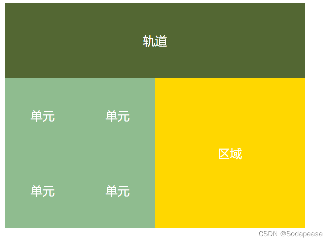

<!-- @format -->

# 元素水平垂直居中的方法

写在前面：淦，怎么那么多种，当年看 CSS 没看完的恶果出来了

- [元素水平垂直居中的方法](#元素水平垂直居中的方法)
  - [一、行内元素水平垂直居中](#一行内元素水平垂直居中)
    - [文本居中](#文本居中)
    - [图片相对文字在单行中垂直居中](#图片相对文字在单行中垂直居中)
  - [二、利用定位+margin:auto](#二利用定位marginauto)
  - [三、 利用定位+margin:负值](#三-利用定位margin负值)
  - [四、 利用定位 + transform](#四-利用定位--transform)
  - [五、flex 布局](#五flex-布局)
  - [六、 table 布局](#六-table-布局)
  - [七、grid 网格布局](#七grid-网格布局)
  - [总结](#总结)
  - [不知道元素宽高可以使用：](#不知道元素宽高可以使用)
  - [内联元素居中布局](#内联元素居中布局)
  - [块级元素居中布局](#块级元素居中布局)

<!--more-->

## 一、行内元素水平垂直居中

### 文本居中

父元素加入相关代码即可  
 注：不能让图片相对文字在单行中垂直居中

```CSS
div {
line-height: 50px;  /*垂直居中,通常是父元素的高度。当行高等于父元素的高度时，文本会垂直居中*/
text-align: center;/*水平居中*/
}
```

### 图片相对文字在单行中垂直居中

在上面的基础上加入相关的代码

```CSS
div i{
  vertical-align: middle;     /*图片与文字垂直居中，但会有少量偏差，再通过 */
  position:relative;   /*通过相对定位微调元素位置*/
  top:2px;     /*微调位置大小 */
}
```

## 二、利用定位+margin:auto

通常用于**块级元素**，并且**需要知道元素的确切宽度和高度**
实现代码：

```html
<div class="father">
  <div class="son"></div>
</div>
<style>
  .father {
    width: 500px;
    height: 300px;
    border: 1px solid #0a3b98;
    position: relative; /*子元素可以相对于父元素进行定位*/
  }
  .son {
    width: 100px; /*如果子级没有设置宽高，则会被拉开到和父级一样宽高,因此需替换为实际值 */
    height: 40px;
    background: #f0a238;
    position: absolute;
    top: 0; /*将元素的上、左、右、下边缘都设置为 0。这会使元素在容器中水平和垂直居中。 */
    left: 0;
    right: 0;
    bottom: 0;
    margin: auto; /*将元素的边距设置为自动。这会使浏览器计算出等于的上下左右边距，从而使元素居中 */
  }
</style>
```

## 三、 利用定位+margin:负值

**绝大多数情况下**，设置父元素为相对定位，子元素移动自身 50%实现水平垂直居中

```HTML
<div class="father">
    <div class="son"></div>
</div>
<style>
    .father {
        position: relative;
        width: 200px;
        height: 200px;  /*不要求父元素的高度和宽度*/
        background: skyblue;
    }
    .son {
        position: absolute;
        top: 50%; /*仅设置top和left，子盒子并不在父盒子中心,而是偏右下, */
        left: 50%;
        margin-left:-50px;/*需要将子盒子向上向右移动自身一半的值，实现水平垂直居中*/
        margin-top:-50px;
        width: 100px;
        height: 100px;
        background: red;
    }
</style>
```

## 四、 利用定位 + transform

与使用 margin 负值类似，但不需要知道子元素和父元素的高度和宽度

```HTML
<div class="father">
    <div class="son"></div>
</div>
<style>
    .father {
        position: relative;
        width: 200px;
        height: 200px;
        background: skyblue;
    }
    .son {
        position: absolute;
        top: 50%;
        left: 50%;
        transform: translate(-50%,-50%);/* 将会将元素位移自己宽度和高度的-50% */
        width: 100px;
        height: 100px;
        background: red;
    }
</style>
```

## 五、flex 布局

自己比较常用的一种，flex 布局的关键属性作用：

- `display`: flex 时，表示该容器内部的元素将按照 flex 进行布局
- `align-items`: 项目在交叉轴（cross axis）上的对齐方式。交叉轴垂直于主轴，center 表示这些元素将相对于本容器水平居中
- `justify-content`: 定义项目在主轴（main axis）上的对齐方式，center 也是同样的道理垂直居中

```HTML
<div class="father">
    <div class="son"></div>
</div>
<style>
    .father {
        display: flex;/* 表示该容器内部的元素将按照flex进行布局 */
        justify-content: center;/* center也是同样的道理垂直居中 */
        align-items: center; /* center表示这些元素将相对于本容器水平居中 */
        width: 200px;
        height: 200px;
        background: skyblue;
    }
    .son {
        width: 100px;
        height: 100px;
        background: red;
    }
</style>
```

## 六、 table 布局

设置父元素为`display:table-cell`，子元素设置`display: inline-block`
利用`vertical`和`text-align`可以让所有的行内块级元素水平垂直居中

```HTML
<div class="father">
    <div class="son"></div>
</div>
<style>
    .father {
        display: table-cell;
        width: 200px;
        height: 200px;
        background: skyblue;
        vertical-align: middle; /*用于设置元素的垂直对齐方式 */
        text-align: center;/*用于设置元素的水平对齐方式, center 值表示元素内的文本和内联元素在水平方向上居中对齐。*/
    }
    .son {
        display: inline-block;
        width: 100px;
        height: 100px;
        background: red;
    }
</style>
```

## 七、grid 网格布局

将网页划分成一个个网格，并且可以任意组合不同的网格以达到各种各样的布局效果.


```HTML
<div class="father">
    <div class="son"></div>
</div>
<style>
    .father {
            display: grid;
            align-items:center;
            justify-content: center;/*在 .father 元素中的网格项（包括 .son 元素）在垂直和水平方向上都居中 */
            width: 200px;
            height: 200px;
            background: skyblue;

        }
        .son {
            width: 10px;
            height: 10px;
            border: 1px solid red
        }
</style>
```

## 总结

## 不知道元素宽高可以使用：

- 利用定位+margin:auto
- 利用定位+transform
- flex 布局
- grid 布局

## 内联元素居中布局

水平居中：

- 行内元素可设置：`text-align: center`
- flex 布局设置父元素：`display: flex; justify-content: center`
  垂直居中
- 单行文本父元素确认高度：`height === line-height`
- 多行文本父元素确认高度：`display: table-cell; vertical-align: middle`

## 块级元素居中布局

水平居中:

- 定宽: `margin: 0 auto`
- 绝对定位 + `left:50%` + `margin:负自身一半`
  垂直居中:
- `position`: absolute 设置 left、top、margin-left、margin-top(定高)
- `display`: table-cell
- `transform`: translate(x, y)
- `flex`(不定高，不定宽)
- `grid`(不定高，不定宽)，兼容性相对比较差
