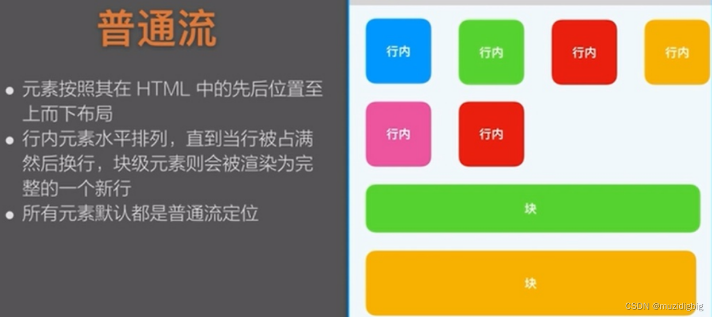
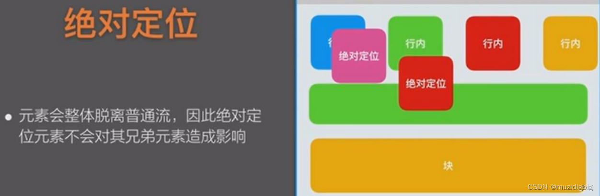
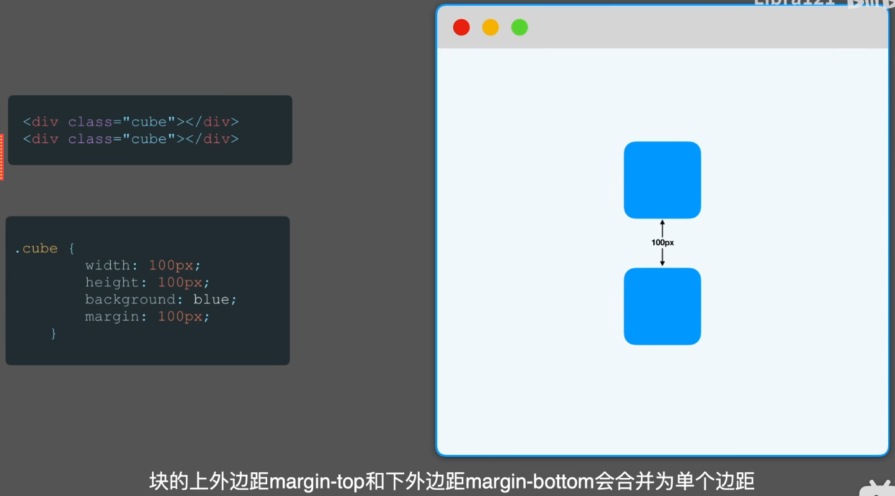
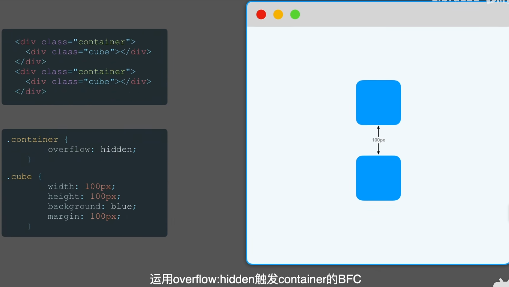

<!-- @format -->

# 对 BFC 的理解

# 什么是 BFC

首先要了解常见的定位方案，总共 3 种：

- 普通流

- 浮动

- 绝对定位

而`BFC`是**属于普通流**的，可以把`BFC`看作为页面的一块渲染区域，他有着自己的渲染规则

# 触发条件

触发`BFC`的条件包含不限于：

- 根元素，即`HTML`元素

- 浮动元素：`float`值为`left`、`right`

- `overflow`值不为`visible`，为`auto`、`scroll`、`hidden`

- `display`的值为`inline-block`、`inltable-cell`、`table-caption`、`table`、`inline-table`、`flex`、`inline-flex`、`grid`、`inline-grid`

- `position`的值为`absolute`或`fixed`

# BFC 作用

## 防止`margin`(外边距)重叠

- 无`BFC`的情况，块的上外边距和下外边距合并为单个边距

  

- 有`BFC`的情况，边距则不会重叠

  

## 清除内部浮动

- 无`BFC`，添加了浮动，脱离了文档流

  

- 有`BFC`，清除浮动

  

## 阻止元素被浮动元素覆盖

- 无`BFC`，元素被浮动覆盖

  

- 有`BFC`，元素互不干扰

  
