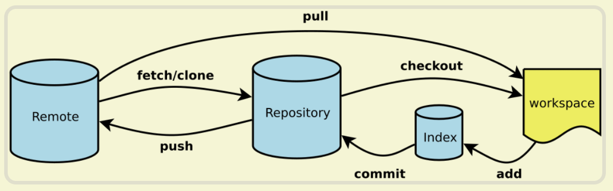

<!-- @format -->

# Git 基本概念

- [Git 基本概念](#git-基本概念)
  - [什么是 Git](#什么是-git)
  - [Git 工作流程](#git-工作流程)
    - [git 工作区域](#git-工作区域)
    - [git 文件状态](#git-文件状态)

## 什么是 Git

- Git 是一个免费的、开源的`分布式版本控制系统`，即 **一种记录文件内容变化，以便将来查阅特定版本修订情况的系统**

- 分布式版本控制系统的客户端并不只提取最新版本的文件快照，而是把代码仓库完整地镜像下来

## Git 工作流程



### git 工作区域

- 工作区
  相当于本地写代码的区域，它包含了所有的文件和子目录。你可以在这里编辑、添加和删除文件。

- 暂存区`（Stage 或 Index）`  
  执行`git add`命令时，更改的文件就会被添加到暂存区。暂存区是一个中间区域，用于临时保存你的更改，直到准备好提交这些更改

- `Git`本地仓库  
  执行`git commit`命令时，暂存区的所有更改就会被永久保存到 Git 仓库。这是 Git 保存项目历史记录的地方。

- `Git`远程仓库  
  存储在网络上的项目仓库

### git 文件状态

- `未跟踪（Untracked）`  
  这是文件刚被添加到项目，但还没有被 Git 跟踪的状态。

- `已跟踪（Tracked）`  
  已跟踪的文件是在上次快照中的文件，有三种状态：
  - `未修改（Unmodified）`：如果你从上次提交后没有修改过一个文件，那么`Git`将其标记为未修改
  - `已修改（Modified）`：当你修改了一个已跟踪的文件，`Git` 将其标记为已修改。这意味着你在本地修改了文件，但还没有提交保存
  - `已暂存（Staged）`：当你对一个已修改的文件执行`git add`命令后，`Git` 将其标记为已暂存。这意味着你已经标记了这个文件，在下次提交时，这些修改将会被提交到你的仓库

* 具体例子

```sh
>>> git status
## 当前在 main 分支上
On branch main
## main 分支与远程 origin/main 分支同步
Your branch is up to date with 'origin/main'.

## 这些文件已经被添加到暂存区，准备在下次提交时被提交到仓库。这些文件的状态是“已暂存（Staged）”。
Changes to be committed:
  (use "git restore --staged <file>..." to unstage)
        modified:   docs/posts/Git/Git-1.md
        new file:   docs/posts/Git/Git-2.md
        modified:   docs/posts/JavaScript/JavaScript-1.md
        new file:   docs/posts/images/blog-2024-05-21-15-19-48.png
        new file:   docs/posts/images/blog-2024-05-21-15-34-13.png
        new file:   docs/posts/images/blog-2024-05-21-16-28-48.png
        modified:   package-lock.json
        modified:   package.json
## 这些文件已经被修改，但还没有被添加到暂存区。这些文件的状态是“已修改（Modified）
Changes not staged for commit:
  (use "git add <file>..." to update what will be committed)
  (use "git restore <file>..." to discard changes in working directory)
        modified:   docs/posts/Git/Git-1.md

## 未追踪的文件，可以使用 git add <file> 命令。这个命令会将文件添加到暂存区，下次提交时被提交到仓库，会被 Git 跟踪了
Untracked files:
  (use "git add <file>..." to include in what will be committed)
        docs/posts/Git/Git3.md
```
