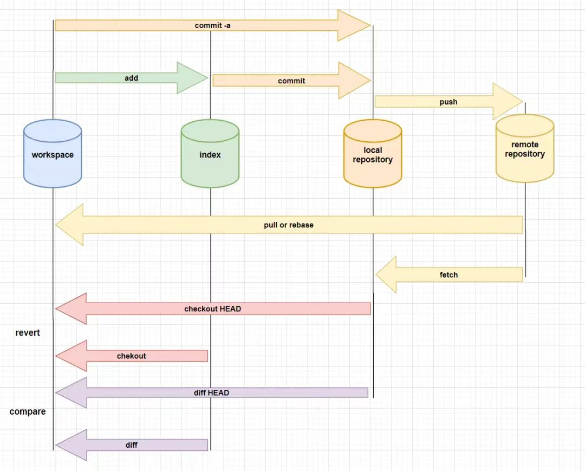
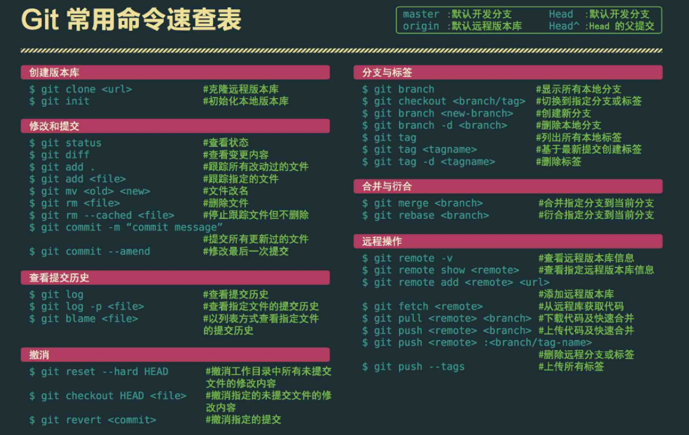

<!-- @format -->

# Git 常见指令

- [Git 常见指令](#git-常见指令)
  - [git config](#git-config)
  - [git 启动](#git-启动)
  - [常见 git 指令](#常见-git-指令)
    - [文件提交](#文件提交)
    - [分支](#分支)
    - [合并](#合并)
    - [远程同步](#远程同步)
    - [撤回](#撤回)
  - [Git 指令速查](#git-指令速查)

## git config

`Git`自带一个`git config`的工具来帮助设置控制`Git` 外观和行为的配置变量  
可以使用`git config`命令来查看或修改`Git`的配置

- `user.name`和` user.email`：  
  配置用户名和邮箱，提交时候 Git 使用这些信息标记提交者

  ```sh
  git config --global user.name "Your Name"
  git config --global user.email "your@email.com"
  ```

## git 启动

- `git init [project-name]`  
  创建或在当前目录初始化一个`git`代码库

- `git clone url`  
  下载一个项目和它的整个代码历史

## 常见 git 指令



### 文件提交

- ` git add [file]`： 将文件添加到暂存区(添加当前目录所有文件 使用`.`代替 )

- `git commit -m "[message]"`： 提交暂存区的改动

- `git commit -a -m "[message]"`： 自动把所有已经跟踪过的文件暂存起来一并提交，跳过`git add`的步骤

- `git push [remote] [branch]`： 将本地的改动推送到远程仓库

### 分支

- `git branch`：列出所有本地分支

- `git branch [branch-name]`：创建一个新的分支

- `git branch -d [branch-name]`：删除一个分支

- `git checkout [branch-name]`：切换到指定的分支

- `git checkout -b [branch-name]`：创建一个新的分支并立即切换到这个分支

### 合并

- `git pull [remote] [branch]：[branch]`： 从远程仓库拉取代码并合并到本地某分支

- `git merge [branch-name]`：将指定的分支合并到当前分支

- `git merge --abort`：合并分支出现冲突时，取消合并，一切回到合并前的状态

### 远程同步

- `git fetch origin`：下载远程仓库所有新的变动到本地的命令

- `git remote -v`：显示所有远程仓库，显示其对应的 Fetch 和 Push 地址

- `git remote add [shortname] [url]`：添加一个新的远程仓库，并为其指定一个简短的别名。

- `git remote rm [shortname]`：删除一个远程仓库

### 撤回

- `git checkout -- [file]`：撤销指定文件的所有本地修改

- `git reset --hard`：撤销所有未提交的修改（包括工作目录和暂存区的修改），并将 HEAD 指针重置到最近一次的提交

- `git reset [commit]`：重置当前分支的指针为指定 commit，同时重置暂存区，但工作区不变

- `git revert [commit]`：后者的所有变化都将被前者抵消，并且应用到当前分支

:::tip `reset` 与 `revert` 区别

`reset` ：你的文件修改（如果有的话）仍然保留，但是不会被标记为 `"staged"`。对于取消之前的 `git add `操作很有用

`revert` ：创建一个新的 `commit` ，该 `commit` 撤销指定 `commit` 的所有更改。

:::

## Git 指令速查


