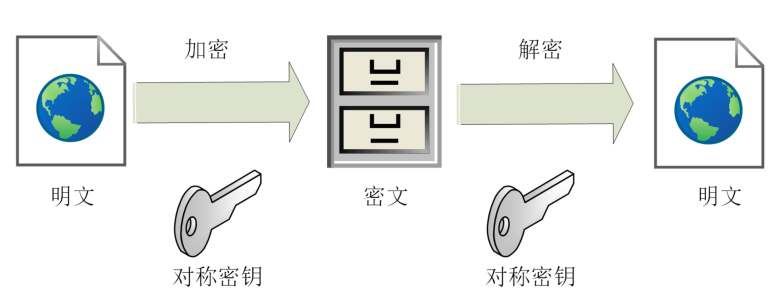
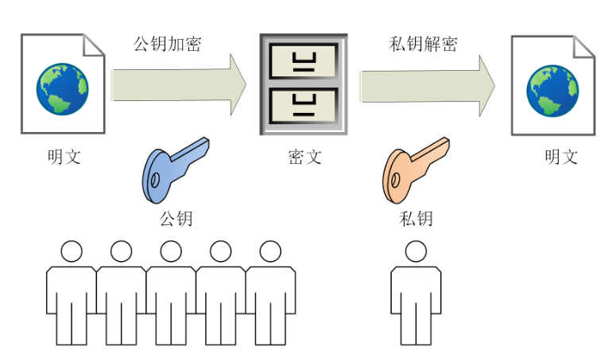
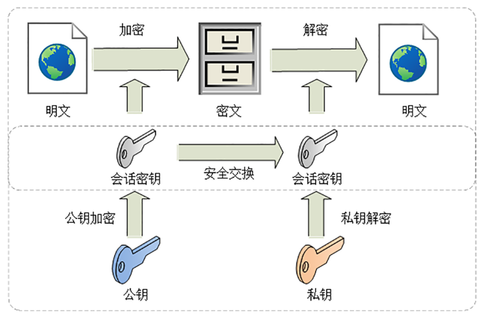
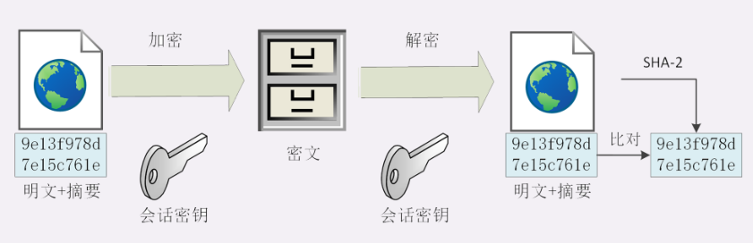
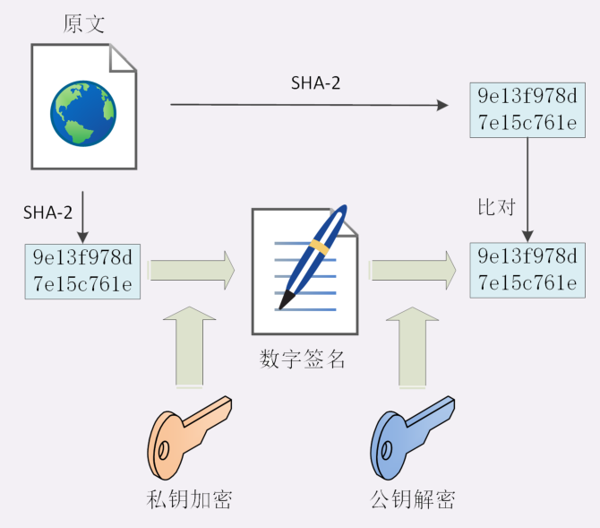
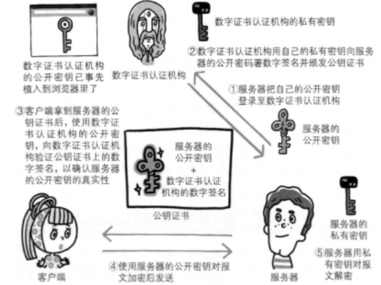

<!-- @format -->

# 对称加密和非对称加密

## 对称加密

对称加密指的是加密和解密使用的秘钥都是**同一个**，是对称的。只要保证了密钥的安全，那整个通信过程就可以说具有了机密性

## 非对称加密

非对称加密，存在两个秘钥，一个叫公钥，一个叫私钥。两个秘钥是不同的，公钥可以公开给任何人使用，私钥则需要保密

公钥和私钥都可以用来加密解密，但公钥加密后只能用私钥解 密，反过来，私钥加密后也只能用公钥解密

## 混合加密

在`HTTPS`通信过程中，采用的是对称加密+非对称加密，也就是混合加密

在对称加密中讲到，如果能够保证了密钥的安全，那整个通信过程就可以说具有了机密性

而`HTTPS`采用非对称加密解决秘钥交换的问题

具体做法是发送密文的一方使用对方的公钥进行加密处理“对称的密钥”，然后对方用自己的私钥解密拿到“对称的密钥”

## 摘要算法

实现完整性的手段主要是摘要算法，也就是常说的散列函数、哈希函数

可以理解成一种特殊的压缩算法，它能够把任意长度的数据“压缩”成固定长度、而且独一无二的“摘要”字符串，就好像是给这段数据生成了一个数字“指纹”

摘要算法保证了“数字摘要”和原文是完全等价的。所以，我们只要在原文后附上它的摘要，就能够保证数据的完整性

## 数字签名

数字签名能确定消息确实是由发送方签名并发出来的，因为别人假冒不了发送方的签名

原理其实很简单，就是用**私钥加密，公钥解密**

签名和公钥一样完全公开，任何人都可以获取。但这个签名只有用私钥对应的公钥才能解开，拿到摘要后，再比对原文验证完整性，就可以像签署文件一样证明消息确实是你发的

## CA 验证机构

数字证书认证机构处于客户端与服务器双方都可信赖的第三方机构的立场

CA 对公钥的签名认证要求包括序列号、用途、颁发者、有效时间等等，把这些打成一个包再签名，完整地证明公钥关联的各种信息，形成“数字证书”

<!-- @format -->
