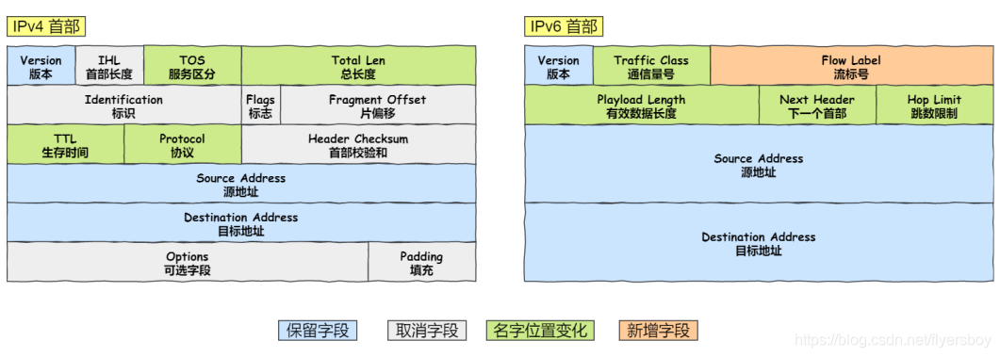

<!-- @format -->

# IPv4、IPv6、MAC

## IPv4

- 定义：即网际互连协议第四版，属于`OSI/RM`（开放系统互联/参考模型）的第三层----网络层

- 地址格式：`IPv4` 地址是`32`位的二进制数，采用 4 组点分十进制法，通常表示为**四个十进制数**，每个数值范围为 0 到 255，用点分隔，例如：`192.168.1.1`

- 地址数量：IPv4 地址总数为 2^32（约 42 亿）个( 2019 年`IPv4`地址就已经被分配完)

## IPv6

- 定义：`IPv6`（Internet Protocol version 6）是第六版互联网协议，设计用于替代`IPv4`，解决地址耗尽问题

- 地址格式：`IPv6` 地址是`128`位的二进制数，通常表示为**八组十六进制数，每组四个十六进制数**，用冒号分隔，例如：`2001:0db8:85a3:0000:0000:8a2e:0370:7334`

- 地址数量：IPv6 地址总数为 2^128（约 3.4×10^38）个，几乎无限

### IPv6 地址的结构

IPv6 类似 IPv4，也是通过 IP 地址的前⼏位标识 IP 地址的种类。

IPv6 的地址主要有以下类型地址：

- 单播地址，⽤于⼀对⼀的通信

- 组播地址，⽤于⼀对多的通信

- 任播地址，⽤于通信最近的节点，最近的节点是由路由协议决定

### 首部区别

`IPv6`相⽐`IPv4`的⾸部改进：

- **取消了首部校验和字段。** 因为在数据链路层和传输层都会校验，因此`IPv6`直接取消了`IP`的校验。

- **取消了分片重新组装相关字段。** 分⽚与重组是耗时的过程，`IPv6` 不允许在中间路由器进⾏分⽚与重组，这种操作只能在源与⽬标主机，这将⼤⼤提⾼了路由器转发的速度。

- **取消选项字段。** 选项字段不再是标准`IP`⾸部的⼀部分了，但它并没有消失，⽽是可能出现在`IPv6`⾸部中的「下⼀个首部」指出的位置上。删除该选项字段使的`IPv6`的⾸部成为固定⻓度的`40`字节。

## MAC

属于数据链路层，用于标识网络接口卡的地址。

- 定义：`MAC`（Media Access Control）地址是网络接口卡（NIC）的唯一标识符，用于局域网（LAN）通信

- 地址格式：`MAC`地址是 48 位的二进制数，通常表示为六组十六进制数，每组两个十六进制数，用冒号或连字符分隔，例如：`00:1A:2B:3C:4D:5E` 或 `00-1A-2B-3C-4D-5E`

- 地址数量：MAC 地址总数为 2^48（约 2.8×10^14）个。

## IP 与 MAC 的区别

1. 层次：

   - IP 地址：属于网络层（第三层）。
   - MAC 地址：属于数据链路层（第二层）。

2. 用途：

   - IP 地址：用于互联网和局域网中的设备标识和路由。
   - MAC 地址：用于局域网中的设备标识和数据链路层通信。

3. 可变性：

   - IP 地址：可以动态分配或静态配置。
   - MAC 地址：通常是硬编码的，不会改变。

<!-- @format -->
