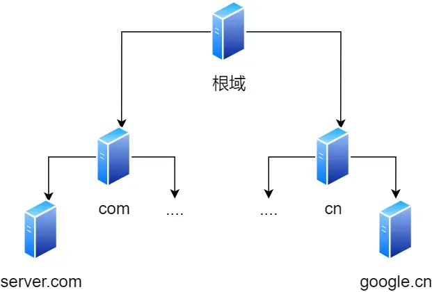

<!-- @format -->

# DNS 解析的过程

## DNS 的全称

DNS 的全称是` Domain Name System（域名系统）`，它是互联网中用于将域名转换为对应 IP 地址的分布式数据库系统。DNS 扮演着重要的角色，使得人们可以通过易记的域名访问互联网资源，而无需记住复杂的 IP 地址。

域名的层级关系类似一个树状结构:

- 根 DNS 服务器(.) **[根域的 DNS 服务器信息保存在互联网中所有的 DNS 服务器中。]**
- 顶级域 DNS 服务器(.com)
- 权威 DNS 服务器(server.com)

## DNS 域名解析的工作流程？

1. **用户发起 DNS 查询**

   当用户在浏览器中输入一个 URL（如 www.example.com）并按下回车键时，浏览器会首先检查本地缓存中是否有该域名的 IP 地址。如果有，则直接使用该 IP 地址；如果没有，则发起 DNS 查询。

2. **检查本地缓存**

   操作系统会检查本地 DNS 缓存中是否有该域名的 IP 地址。如果有，则直接返回该 IP 地址；如果没有，则将查询请求发送到本地 DNS 服务器（通常是 ISP 提供的 DNS 服务器）。

3. **查询本地 DNS 服务器**

   本地 DNS 服务器会首先检查自己的缓存中是否有该域名的 IP 地址。如果有，则直接返回该 IP 地址；如果没有，则发起递归查询，向根 DNS 服务器请求解析。

4. **根 DNS 服务器**

   本地 DNS 服务器向根 DNS 服务器发送查询请求。根 DNS 服务器不会直接返回域名的 IP 地址，而是返回`顶级域名服务器（TLD 服务器）`的地址。例如，对于 www.example.com，根 DNS 服务器会返回 .com 顶级域名服务器的地址。

5. **顶级域名服务器（TLD 服务器）**

   本地 DNS 服务器向顶级域名服务器发送查询请求。顶级域名服务器会返回负责该域名的权威 DNS 服务器的地址。例如，对于 www.example.com，.com 顶级域名服务器会返回 example.com 的权威 DNS 服务器的地址。

6. **权威 DNS 服务器**

   本地 DNS 服务器向权威 DNS 服务器发送查询请求。权威 DNS 服务器会返回该域名的 IP 地址。例如，对于 www.example.com，example.com 的权威 DNS 服务器会返回 www.example.com 的 IP 地址。

7. **返回结果**
   本地 DNS 服务器将权威 DNS 服务器返回的 IP 地址缓存起来，并将其返回给用户的操作系统。操作系统将 IP 地址返回给浏览器，浏览器使用该 IP 地址与目标服务器建立连接。

