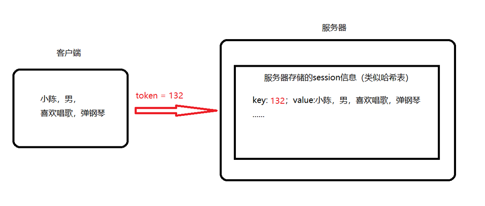
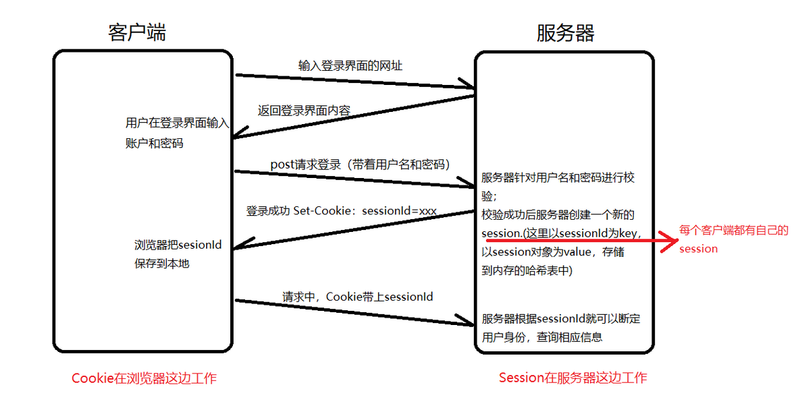
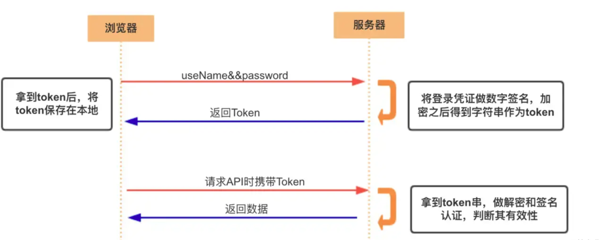

<!-- @format -->

# Cookie、Token、Session 的区别

写在前面：这三者都是为了解决 HTTP 协议无状态的问题，但这两天开始研究登录的内容了，刚搞好后端生成 JWT，顺手对这三个东西梳理一下

- [Cookie、Token、Session 的区别](#cookietokensession-的区别)
  - [Cookie](#cookie)
    - [Cookie 如何记录用户行为](#cookie-如何记录用户行为)
    - [Cookie 工作流程](#cookie-工作流程)
    - [应用场景](#应用场景)
  - [Session](#session)
    - [SessionId](#sessionid)
    - [Session 工作流程](#session-工作流程)
  - [Token](#token)
    - [Token 工作流程](#token-工作流程)
    - [Cookie 和 Token 区别](#cookie-和-token-区别)
  - [JWT(JSON Web Token):](#jwtjson-web-token)

<!--more-->

## Cookie

Cookie 是服务器发送到用户浏览器并保存在浏览器上的一小块数据，**浏览器在后续的请求中会自动带上这个 Cookie**。服务器可以读取这个 Cookie 来识别用户。Cookie 常用于实现`记住我`功能，以及`跟踪用户行为`。

### Cookie 如何记录用户行为

服务器在用户访问网站时，会向用户的浏览器发送一个或多个 Cookie。这些 Cookie 会被浏览器保存起来，并在后续的请求中自动发送回服务器。服务器可以通过读取这些 Cookie 来获取用户的信息和行为。  
具体来说，服务器可以在 Cookie 中存储一些标识用户的信息，例如用户 ID、用户名等。然后，当用户进行某些操作（如点击一个链接、提交一个表单等）时，服务器可以更新这个 Cookie，以记录用户的这次操作。这样，服务器就可以通过读取 Cookie 来了解用户的行为。

### Cookie 工作流程

- 在 `Express.js` 应用中使用 `cookie-parser` 中间件，并创建一个路由来设置 `Cookie`

  ```JS
  const express = require('express');
  const cookieParser = require('cookie-parser');

  const app = express();
  app.use(cookieParser());

  app.get('/setcookie', (req, res) => {
      // 当用户访问 /setcookie 路由时，服务器会设置一个名为 visited_pages 的 Cookie，其值为 home。
      res.cookie('visited_pages', 'home');
      res.send('Cookie has been set');
  });

  app.listen(3000, () => console.log('Server is running on port 3000'));
  ```

- 创建另一个路由来读取和更新这个`Cookie`，当用户访问 `/visitpage` 路由时，服务器会读取 `visited_pages Cookie`，然后在其值后面添加新访问的页面更新这个`Cookie`。

  ```JS
  app.get('/visitpage', (req, res) => {
    // 读取 'visited_pages' cookie
    let visitedPages = req.cookies.visited_pages;

    // 更新 'visited_pages' cookie，添加新访问的页面
    visitedPages += ',about';
    res.cookie('visited_pages', visitedPages);

    res.send(`You have visited: ${visitedPages}`);
  });
  ```

### 应用场景

1. **会话管理** ：服务器可以通过 Cookie 来区分不同用户的会话，保存用户的登录信息或其他会话相关的数据。
2. **持久登录** ：通过在 Cookie 中存储登录凭据或者登录状态，可以实现记住我功能，即使用户关闭浏览器再打开，也无需重新登录。
3. **个性化设置** ：网站可以在 Cookie 中存储用户的个性化设置，如主题、语言等，以便在用户下次访问时能够提供更符合其需求的内容。
4. **广告定向投放**：通过在 Cookie 中存储用户的浏览行为和偏好，可以向用户展示更加个性化和有针对性的广告。
5. **记住用户状态** ：通过 Cookie 记住用户在网站的一些状态，例如购物车中的商品、上次的浏览记录等，提供更好的用户体验。

## Session

1. 服务器每一时刻接收到的请求是很多的；服务器为了区分这些请求分别是哪一个用户的，就需要记录用户和该用户信息之间的对应关系，这时 Session 会话机制就起到关键的作用
2. Session 是在服务器端保存的一个数据结构，这个数据可以保存在集群、数据库、文件系统等地方。基于 Cookie 或者 URL 重写的方式来实现的，用来跟踪用户的状态。
3. 在用户通过浏览器访问网站时，服务器会为每个用户创建一个唯一的会话，并为该会话分配一个唯一的标识符（Session ID）。Session ID 会存在 Cookie 中或者通过 URL 参数传递给客户端的每个请求。服务器使用 Session ID 来查找并重建用户的会话状态，以便识别用户和跟踪其操作。

### SessionId

Session 会话的本质就是一个哈希表，用来存放一些键值对；例如用户登录一个网站，Session 的 key 就是用户名，value 就是该用户的信息

- 如图所示：
  

### Session 工作流程

1. **创建 Session** ：当用户首次访问网站时，服务器会创建一个新的 Session，并为该 Session 分配一个唯一的标识符，即 Session ID
2. **发送 Session ID**：服务器将 Session ID 发送给用户的浏览器。这通常是通过设置一个 Cookie 来完成的，但也可以通过 URL 参数来传递
3. **存储 Session 数据**：服务器可以在 Session 中存储与用户相关的数据，例如用户的登录状态、购物车内容等
4. **接收 Session ID**：当用户再次访问网站时，浏览器会将 Session ID 发送回服务器。这通常是通过 Cookie 或 URL 参数来完成的
5. **读取 Session 数据**：服务器可以通过 Session ID 来查找并重建用户的 Session，然后读取或修改 Session 中的数据
6. **销毁 Session**：当用户退出网站或长时间无操作时，服务器可以选择销毁该用户的 Session，以释放服务器资源

如图所示：


## Token

Token 是服务端生成的一串字符串，作为客户端请求的凭据，当第一次登录后，服务器生成一个 Token 返回给客户端，以后客户端只需带上这个 Token 来请求数据，无需再次登录验证。

简单 Token 的组成：uid(用户唯一的身份标识)、time(当前时间的时间戳)、sign（签名， Token 的前几位以哈希算法压缩成的一定长度的十六进制字符串。为防止 Token 泄露）。

### Token 工作流程

1. 用户登录：用户向服务器发送登录请求，包含用户名和密码。
2. 验证信息：服务器验证用户的用户名和密码。如果验证通过，服务器会生成一个 Token。
3. 发送 Token：服务器将生成的 Token 发送给用户的浏览器。这通常是通过在响应体或响应头中发送 Token。
4. 存储 Token：客户端收到 Token 后，会将其存储起来，通常是存储在 Cookie、localStorage 或 sessionStorage 中。
5. 发送 Token：当用户再次向服务器发送请求时，会在请求头中添加 Token。这通常是通过在请求头中添加一个 Authorization 字段来完成的，该字段的值就是 Token。
6. 验证 Token：服务器收到请求后，会验证请求头中的 Token。如果验证通过，服务器会处理请求并返回响应。如果验证失败，服务器会返回一个错误响应。
7. 更新 Token：为了提高安全性，服务器可能会在每次请求后更新 Token。这通常是通过在响应头或响应体中发送新的 Token 来完成的。
8. 退出登录：当用户退出登录时，客户端会删除存储的 Token。



在实际的 Web 开发中，Cookie 和 Token 通常会一起使用。例如，可以使用 Cookie 来存储 Token，这样就可以利用 Cookie 的自动发送特性，同时也可以利用 Token 的灵活性和安全性

### Cookie 和 Token 区别

Cookie 是一种特定的技术，主要用于在**浏览器和服务器**之间保持状态，而 Token 是一种更通用的概念，它可以用于身份验证和授权，可以在**任何客户端（APP、小程序）和服务器**之间使用。

## JWT(JSON Web Token):

一种特定格式的`Token`，它是一个开放的标准（RFC 7519），定义了一种用于在各方之间安全地传输信息的简洁的、URL 安全的方法。  
一个 JWT 实际上就是一个字符串，它由三部分组成：

- 头部（Header）:包含 Token 类型和所使用的加密算法
- 载荷（Payload）:包含一些声明（Claims），这些声明是关于用户和其他一些元数据的信息
- 签名（Signature）: 用于验证 Token 没有被篡改的。
