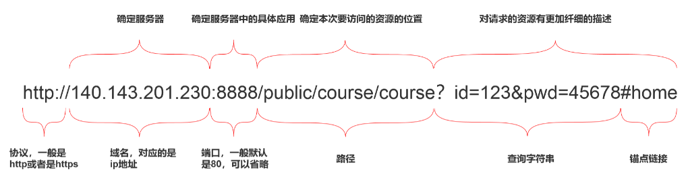

<!-- @format -->

# 地址栏输入 URL 敲下回车后发生了什么?

简单来说，发生了以下的行为：

- [地址栏输入 URL 敲下回车后发生了什么?](#地址栏输入-url-敲下回车后发生了什么)
  - [1. URL 解析](#1-url-解析)
  - [2. DNS 查询](#2-dns-查询)
  - [3. TCP 连接](#3-tcp-连接)
  - [4. 发送 http 请求](#4-发送-http-请求)
  - [5. 响应请求](#5-响应请求)
  - [6. 页面渲染](#6-页面渲染)
  - [7. 加载资源](#7-加载资源)
  - [总结](#总结)

## 1. URL 解析

首先判断你输入的是一个合法的`URL`还是一个待搜索的关键词，并且根据你输入的内容进行对应操作

`URL`的解析第过程中的第一步，一个`url`的结构解析如下：

## 2. DNS 查询

浏览器通过`DNS`（域名系统）查询将域名转换为服务器的`IP`地址。这个过程中，浏览器可能会使用缓存的 DNS 记录来加速查询过程，若缓存中无记录，则向本地`DNS`服务器请求，直至最终获得`IP`地址。

## 3. TCP 连接

一旦获取到服务器的`IP`地址，浏览器便通过`TCP`三次握手与服务器建立连接。如果是`HTTPS`网站，还需进行`TLS/SSL`握手，以确保数据传输的安全性。

## 4. 发送 http 请求

建立连接后，浏览器构造`HTTP`请求报文，包括请求行（方法、`URL`、协议版本）、请求头（如 `User-Agent`、`Accept-Language `等）和可能的请求体（如`POST`请求的数据）。然后将这个请求发送给服务器。

## 5. 响应请求

当服务器接收到浏览器的请求之后，就会进行逻辑操作，处理完成之后返回一个 HTTP 响应消息，包括：

- 状态行
- 响应头
- 响应正文

在服务器响应之后，由于现在`http`默认开始长连接`keep-alive`，当页面关闭之后，`tcp`链接则会经过四次挥手完成断开

## 6. 页面渲染

浏览器的渲染引擎（如 Chrome 的 Blink、Firefox 的 Gecko）开始解析`HTML`文档，构建`DOM`树。同时，`CSS`样式被解析生成`CSSOM`树，两者结合形成渲染树。接着计算布局（Layout），确定每个节点在屏幕上的位置和尺寸，最后绘制（Painting）到屏幕上。

## 7. 加载资源

页面渲染过程中，浏览器还会解析`HTML`中的资源引用（如图片、`JavaScript`、`CSS` 文件），并发起额外的`HTTP`请求来获取这些资源。`JavaScript` 的执行可能阻塞页面渲染，直到脚本执行完毕或使用异步加载技术。

## 总结

介绍了输入 URL 并敲下回车后，浏览器进行的一系列操作

<!-- @format -->
