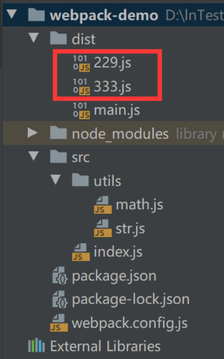

<!-- @format -->

# 对打包后的 JavaScript 文件的分离

默认情况下，`Webpack`会将所有的代码都打包生成到一个文件中，这样的话会导致文件体积过大，影响项目启动的速度。可以进行代码分割来提高性能。

代码分割`（Code Spliting）`，将打包生成的代码分割到不同的文件中，就可以按需加载文件，提高代码的加载性能。

`Webpack`中常用的代码分割方式有：

- `entry` 多入口：指定多个文件作为入口文件，就可以根据其依赖关系分别打包生成多个出入文件。
- `SplitChunks`：配置`SplitChunks`可以对代码中导入的模块进行代码分割，将其打包生成为单独的文件。
- 动态导入：`Webpack`默认就会对代码中异步导入的模块进行代码分割，将其打包生成为单独的文件。

## 通过配置`entry`多入口实现代码分割：

通过配置多个`entry`入口将打包后的代码分割到不同的文件中。

1. 新建`src/index.js`和`src/main.js`，并编写代码。

```js
// src/index.js
console.log("index");
```

```js
// src/index.js
console.log("index");
```

2. 在`webpack`配置文件中配置多个入口和出口。

```js
module.exports = {
  // 配置多个入口，以 key/value 的形式，key 是开发者自己定义的名称，value 是入口文件的路径
  entry: {
    main: "./src/main.js",
    index: "./src/index.js",
  },
  output: {
    // 配置多个出口，其中的占位符 [name] 就是在 entry 中配置的 key
    filename: "[name].js",
  },
};
```

3. 运行`webpack`命令进行打包，可以看到打包为了两个文件。


### 对通过配置 entry 多入口分割后的代码去重

如果`src/index.js`和`src/main.js`都依赖了`lodash`库，通过配置`entry`多入口手动分割代码后，会发现打包后的文件中重复有`lodash`。

可以通过配置`Entry Dependencies`入口依赖，避免被多个入口依赖的库被重复打包。但是官方并不太推荐这种方式。

1. 安装`lodash`，并在`src/index.js`和`src/main.js`中引入使用。

```js
// src/index.js
import _ from "lodash";
console.log("index");
console.log(_.join("index", "main"));
```

```js
// src/main.js
import _ from "lodash";
console.log("main");
console.log(_.join("main", "index"));
```

2. 在`Webpack`配置文件中进行配置。

```js
module.exports = {
  entry: {
    // 配置多个入口。通过 import 告诉 Webpack 入口文件的路径；通过 dependOn 告诉 Webpack 需要依赖的模快，dependOn 的属性值还可以是数组，用来配置依赖多个模块
    index: { import: "./src/index.js", dependOn: "lodash-output" },
    main: { import: "./src/main.js", dependOn: "lodash-output" },
    // 将 lodash 打包为一个单独的文件
    "lodash-output": "lodash",
  },
  output: {
    // 配置多个出口
    filename: "[name].js",
  },
};
```

3. 运行`webpack`命令进行打包，可以看到打包为了三个文件。


## 通过配置 SplitChunks 实现代码分割

可以通过配置`SplitChunks`对导入的模块进行代码分割。`SplitChunks`是通过` SplitChunksPlugin`插件来实现的，`Webpack`已经默认安装并集成了该插件，因此直接使用该插件的配置信息即可。

1. 新建`src/index.js`和`src/main.js`，并编写代码；安装`lodash`，并在`src/index.js`和`src/main.js`中引入使用。

2. 在`Webpack`配置文件中进行配置。

```js
module.exports = {
  entry: {
    index: "./src/index.js",
    main: "./src/main.js",
  },
  output: {
    filename: "[name].js",
  },
  optimization: {
    splitChunks: {
      // 不管是同步导入的模块还是异步导入的模块，都对其进行分割
      chunks: "all",
    },
  },
};
```

3. 运行`webpack`命令进行打包，可以看到打包为了三个文件。


### 常见的 SplitChunks 配置

1.  `chunks`：配置对哪些导入的模块进行分割。
    有三个属性值：

    - async：表示只有是异步导入的模块，才进行分割。默认值。
    - initial：表示只有是同步导入的模块，才进行分割。
    - all：表示不管是同步导入的模块还是异步导入的模块，都进行分割。

2.  `cacheGroups`：用于对拆分出来的包进行分组。属性值是一个对象，其中的`key`是分组的名称，用来区分不同的分组；`value` 是一个配置对象，用来指定每个分组的行为。
    `value` 对象中的配置选项有：

    - `test`：用于匹配哪些模块被打包到该分组中。
    - `filename`：用于指定该分组被最终打包生成的文件的名称。
    - `priority`：用于指定优先级。如果同一个模块能够被多个分组匹配上，该模块将会被打包到优先级更高的分组中。

```js
module.exports = {
  entry: {
    index: "./src/index.js",
    main: "./src/main.js",
  },
  output: {
    filename: "[name].js",
  },
  optimization: {
    splitChunks: {
      chunks: "all",
      cacheGroups: {
        // 如果被依赖的包是在 node_modules 文件夹下的，就打包到 vendor 分组下，打包后输出的名称为 output-vendor.js。一般情况下，会选择将第三方库都打包到一个分组中。
        // 由于 windows 中的路径分隔符为 \，mac 中的路径分割符为 /， 因此，使用 [\\/] 兼容性写法
        vendor: {
          test: /[\\/]node_modules[\\/]/,
          filename: "output-vendor.js",
        },
      },
    },
  },
};
```

3. `minSize`：拆分出来的包的最小体积，如果小于这个体积，将不会对其进行拆分。默认值是 20000，单位是字节。

4. `maxSize`：如果拆分出来的包的体积大于`maxSize`，就对其再进行一次拆分。

5. `minChunks`：包至少被导入几次，才会被拆分。默认值是 1。

## 通过动态导入实现代码分割

只要是异步导入的模块，不需要配置，Webpack 默认都会对其进行代码分割。

可以使用`ECMAScript`中的`import()`函数来实现动态导入；也可以使用`Wbepack`遗留的`require.ensure`来实现动态导入，但目前已经不再推荐使用这种方式。

1. 新建`src/index.js`、`src/utils/math.js`和`src/utils/str.js`，并编写代码。

```js
// src/utils/math.js
export function sum(num1, num2) {
  return num1 + num2;
}
```

```js
// src/utils/str.js
export function formatStr(str) {
  return "￥" + str;
}
```

```js
// src/index.js
import("./utils/math").then((res) => {
  console.log(res);
});
import("./utils/str").then((res) => {
  console.log(res);
});
```

2. 运行`webpack`命令进行打包，会发现异步导入的模块都被打包为了独立的文件。

   

## 通过魔法注释实现预获取和预加载模块

1. 新建`src/index.js`和`src/element.js`，并编写代码。

```js
// src/index.js
const button = document.createElement("button");
button.innerHTML = "加载元素";
button.addEventListener("click", () => {
  import("./element").then((res) => {
    console.log(res);
  });
});
document.body.appendChild(button);
```

```js
// src/element.js
const div = document.createElement("div");
div.innerHTML = "Hello";
export default div;
```

2. 新建`index.html`并编写代码。

```js
// index.html
<!DOCTYPE html>
<html lang="en">
<head>
  <meta charset="UTF-8">
  <meta name="viewport" content="width=device-width, initial-scale=1.0">
  <title>Document</title>
</head>
<body>
  <script src="./dist/main.js"></script>
</body>
</html>
```

3. 运行`webpack`命令进行打包后，在浏览器中运行，会发现，只加载了`index.html`和 `main.js`文件,点击`button`按钮，才会加载`element.js`文件。


btw,现在希望实现的是，当首页加载完毕浏览器处于闲置状态时，能提前把`element.js`文件下载好，这样的话，当点击`button`按钮时，就可以直接执行`element.js`文件。可以通过魔法注释来实现。

1. 修改`src/index.js`为其添加魔法注释。

```js
const button = document.createElement("button");
button.innerHTML = "加载元素";
button.addEventListener("click", () => {
  // 添加这行 Webpack 的魔法注释，当浏览器处于空闲状态时，就会预加载这个模块
  import(/*webpackPrefetch: true*/ "./element").then((res) => {
    document.body.appendChild(res.default);
  });
});
document.body.appendChild(button);
```

2. 运行 webpack 命令进行打包后，在浏览器中运行，会发现，加载了`element.js`文件，但它是在最后加载的。


## 预获取 prefetch 和预加载 preload

1. 预获取`(prefetch)`：会在浏览器处于空闲状态时预先获取模块。可以用于获取之后的某些时刻才可能会使用到的资源。

```
原理：会生成 <link rel="prefetch" href=""> 并追加到页面头部。
```

2. 预加载`(preload)`：会在父`chunk`加载时以并行的方式加载模块。可以用于获取当下时刻就可能会使用到的资源。

```
原理：会生成 <link rel="preload" href=""> 并追加到页面头部。
```
