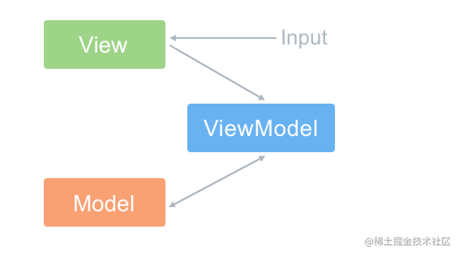

<!-- @format -->

# 什么是 Vue

Vue.js 是一个用于创建用户界面的开源 JavaScript 框架，也是一个创建单页应用的 Web 应用框架。

- [什么是 Vue](#什么是-vue)
  - [Vue 核心特性](#vue-核心特性)
  - [数据驱动（MVVM）](#数据驱动mvvm)
  - [组件化](#组件化)
  - [指令系统](#指令系统)
  - [虚拟 DOM](#虚拟-dom)
  <!--more-->

## Vue 核心特性

## 数据驱动（MVVM）

- View：视图层：负责将数据模型转化为 UI 展示出来，可以简单的理解为 HTML 页面
- Model：模型层，负责处理业务逻辑以及和服务器端进行交互
- ViewModel：视图模型层，用来连接 Model 和 View，是 Model 和 View 之间的通信桥梁
  

通过 ViewModel，做了两件事达到了数据的双向绑定：

1. 将【模型】转化成【视图】，即将后端传递的数据转化成所看到的页面。 实现的方式时：数据绑定。
2. 将【视图】转化成【模型】，即将所看到的页面转换成后端的数据。实现的方式是：DOM 事件监听。

严格的 MVVM 要求 View 不能和 Model 直接通信，而**Vue 提供了$refs 这个属性**，让 Model 可以直接操作 View，违反了这一规定，**所以是 Vue 没有完全遵循 MVVM**。

## 组件化

把图形、非图形的各种逻辑均**抽象为一个统一的概念（组件）**来实现开发的模式，组件化的优势：

- **降低整个系统的耦合度**，在保持接口不变的情况下，我们可以替换不同的组件快速完成需求
- 调试方便，由于整个系统是通过组件组合起来的，在出现问题的时候，可以用排除法直接移除组件，或者根据报错的组件快速定位问题，之所以能够快速定位，**是因为每个组件之间低耦合，职责单一**，所以逻辑会比分析整个系统要简单
- 提高可维护性，由于每个组件的职责单一，并且组件在系统中是被复用的，所以对代码进行优化可获得系统的整体升级

## 指令系统

指令是带有 v- 前缀的特殊属性作用：当表达式的值改变时，将其产生的连带影响，响应式地作用于 DOM

- v-if / v-else / v-else-if。可以配合 template 使用；在 render 函数里面就是三元表达式。
- v-model - 本质是一种语法糖写法。它负责监听用户的输入事件以更新数据，并对一些极端场景进行一些特殊处理。
- v-show - 使用指令来实现 -- 最终会通过 display 来进行显示隐藏
- v-for - **优先级比 v-if 高最好不要一起使用**，尽量使用计算属性去解决。注意增加唯一 key 值，不要使用 index 作为 key
- v-once - 定义它的元素或组件只渲染一次，包括元素或组件的所有节点，首次渲染后，不再随数据的变化重新渲染，将被视为静态内容。
- v-cloak - 这个指令保持在元素上直到关联实例结束编译 -- 解决初始化慢到页面闪动的最佳实践。
- v-bind - 绑定属性，动态更新 HTML 元素上的属性。例如 v-bind:class。
- v-on - 用于监听 DOM 事件。例如 v-on:click v-on:keyup
- v-html - 赋值就是变量的 innerHTML -- 注意防止 xss 攻击
- v-text - 更新元素的 textContent
- v-pre - 跳过这个元素以及子元素的编译过程，以此来加快整个项目的编译速度

## 虚拟 DOM

Vue 的虚拟 DOM 是一种编程技术，它使用 JavaScript 对象来描述真实 DOM 的信息（如元素类型、属性、事件等）。这个 JavaScript 对象就是虚拟 DOM。

Vue 使用虚拟 DOM 的主要步骤如下：

1. 生成虚拟 DOM：当 Vue 组件渲染时，会生成一个对应的虚拟 DOM 树。

2. 比较新旧虚拟 DOM：当组件的状态发生变化时，Vue 会生成一个新的虚拟 DOM 树，并与旧的虚拟 DOM 树进行比较。这个过程称为“diff”。

3. 更新真实 DOM：Vue 会根据 diff 的结果，找出需要更新的部分，并在真实 DOM 上进行更新。这个过程称为“patch”。

4. Vue 的虚拟 DOM 实现了一种抽象层，使得我们可以编写声明式 UI。当状态变化时，Vue 会自动更新 DOM，我们不需要手动操作 DOM，这大大提高了开发效率。

此外，由于在 JavaScript 中操作对象比操作 DOM 快得多，因此**Vue 的虚拟 DOM 还可以提高性能**。
