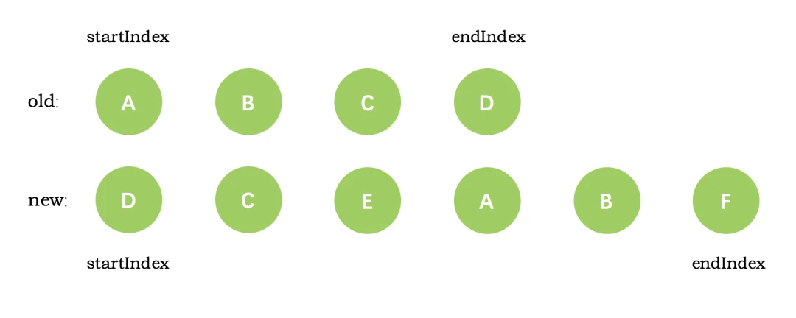
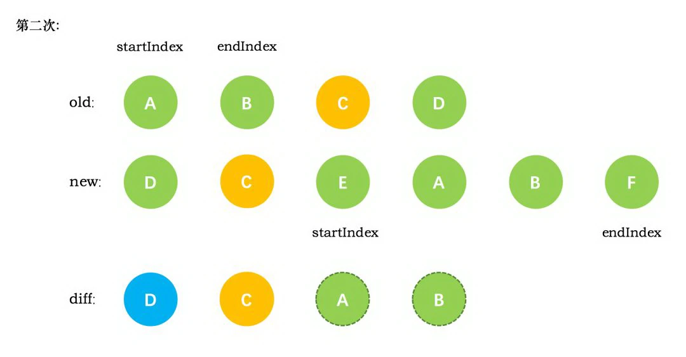
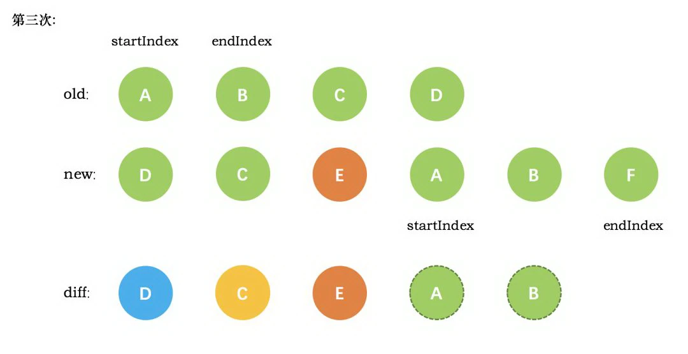
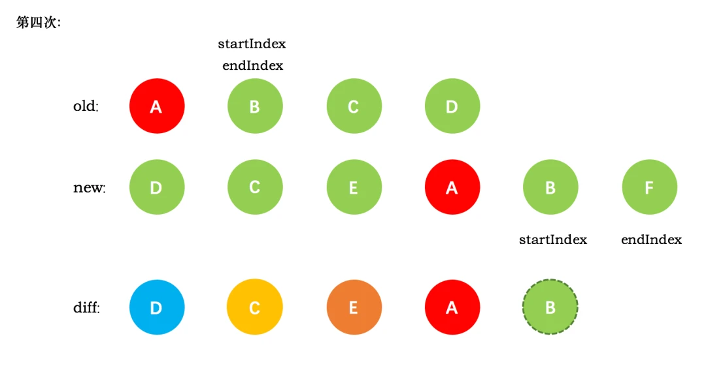
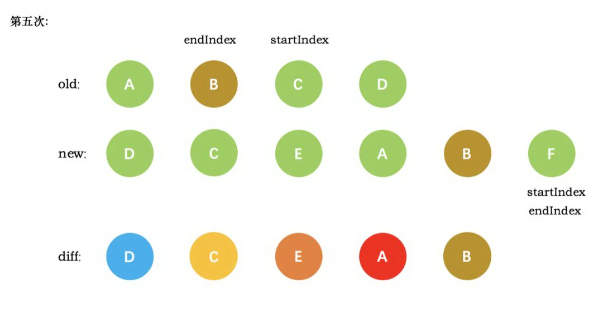
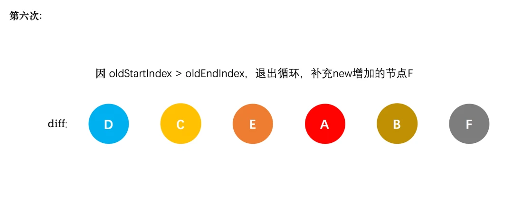

<!-- @format -->

# 虚拟 DOM

- [虚拟 DOM](#虚拟-dom)
  - [什么是虚拟 DOM](#什么是虚拟-dom)
  - [为什么使用虚拟 DOM](#为什么使用虚拟-dom)
  - [虚拟 DOM 与实际 DOM 的比较和更新](#虚拟-dom-与实际-dom-的比较和更新)
  - [vue 中的 diff](#vue-中的-diff)
  - [比较方式](#比较方式)
  - [Vue3 中的优化](#vue3-中的优化)

<!--more-->

## 什么是虚拟 DOM

- 虚拟 DOM（Virtual DOM）是一种编程概念，其中 DOM 的对象被抽象化为一个 JavaScript 对象，这个对象被称为 "虚拟 DOM 对象"，虚拟 DOM 至少包含三个属性：tag(html 标签)，props(标签的属性，如 class)，children(子元素对象)。
- 实际上它是一层对真实 DOM 的抽象，以 JavaScript 对象 (VNode 节点) 作为基础的树，用对象的属性来描述节点，最终可以通过一系列操作使这棵树映射到真实环境上
- 创建虚拟 DOM 是为了更好将虚拟的节点渲染到页面视图中，所以虚拟 DOM 对象的节点与真实 DOM 的属性一一照应

## 为什么使用虚拟 DOM

1. **提高性能**：直接操作 DOM 是非常消耗性能的，**因为每次 DOM 的改变都会引发浏览器的重排或重绘**。而虚拟 DOM 在内存中进行操作，只有在最后一步才将最终的改变应用到真实的 DOM 上，这大大减少了操作 DOM 的次数，从而提高了性能。
2. **跨平台**：虚拟 DOM 是在 JavaScript 中实现的，它并不依赖浏览器环境。这意味着它可以在任何可以运行 JavaScript 的环境中使用，如 Node.js、React Native 等。

## 虚拟 DOM 与实际 DOM 的比较和更新

1. 生成新的虚拟 DOM：当应用的状态发生变化时，会生成一个新的虚拟 DOM。
2. 对比新旧虚拟 DOM：新的虚拟 DOM 会与旧的虚拟 DOM 进行对比，这个过程通常被称为 "diffing"。在这个过程中，会计算出两个虚拟 DOM 之间的差异。
3. 生成差异对象：根据对比的结果，会生成一个描述这些差异的对象，这个对象通常被称为 "patches"。
4. 最后，这个差异对象会被应用到真实的 DOM 上，以实现 DOM 的更新。这个过程通常被称为 "patching"。

## vue 中的 diff

`diff` 算法是一种通过同层的树节点进行比较的高效算法，有两个特点：

- 比较只会在同层级进行, 不会跨层级比较
- 在 diff 比较的过程中，循环从两边向中间比较

`diff` 算法的目的是根据 key 复用 dom 节点，通过移动节点而不是创建新节点来减少 dom 操作

## 比较方式

`diff`整体策略为：深度优先，同层比较

示例如下：

第一次循环，发现旧节点 D 与新节点 D 相同，直接复用旧节点 D 作为 diff 后的第一个真实节点，同时旧节点 endIndex 向前移动到 C，新节点的 startIndex 向后移动到了 C

第二次循环，同样是旧节点的末尾和新节点的开头(都是 C)相同，diff 后创建了 C 的真实节点插入到第一次创建的 D 节点后面。同时旧节点的 endIndex 移动到了 B，新节点的 startIndex 移动到了 E

第三次循环，发现 E 没有找到，这时候直接创建新的真实节点 E，插入到第二次创建的 C 节点之后。同时新节点的 startIndex 移动到了 A。旧节点的 startIndex 和 endIndex 都保持不动

第四次循环，新旧节点的开头(都是 A)相同，于是 diff 创建 A 的真实节点，插入到前一次创建的 E 节点后面。同时旧节点的 startIndex 移动到了 B，新节点的 startIndex 移动到了 B

第五次循环，diff 后创建了 B 真实节点 插入到前一次创建的 A 节点后面。同时旧节点的 startIndex 移动到了 C，新节点的 startIndex 移动到了 F

最终，新节点的 startIndex 已经大于 endIndex 了，需要创建 newStartIdx 和 newEndIdx 之间的所有节点，也就是节点 F，直接创建 F 节点对应的真实节点放到 B 节点后面

## Vue3 中的优化

1. 静态树优化：Vue 3 引入了静态树（Static Tree）的概念。如果一个组件的虚拟 DOM 树在两次渲染之间没有发生变化，那么这个虚拟 DOM 树就被认为是静态的。在 diff 过程中，静态树会被直接复用，而不会进行任何比较和更新。
2. 静态节点优化：Vue 3 还引入了静态节点（Static Node）的概念。如果一个节点在两次渲染之间没有发生变化，那么这个节点就被认为是静态的。在 diff 过程中，静态节点会被直接复用，而不会进行任何比较和更新。
3. 更优的列表 diff 算法：Vue 3 的 diff 算法在处理动态列表时，采用了一种更优的算法，可以更有效地处理列表中的元素重排和复用。
