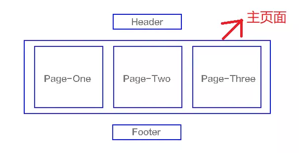

<!-- @format -->

# SPA 单页面应用的理解

- [SPA 单页面应用的理解](#spa-单页面应用的理解)
  - [什么是 SPA](#什么是-spa)
  - [SPA 和 MPA 的区别](#spa-和-mpa-的区别)
  - [SPA 的优缺点](#spa-的优缺点)
    - [优点](#优点)
    - [缺点](#缺点)
  - [MPA 的优缺点](#mpa-的优缺点)
    - [优点](#优点-1)
    - [缺点](#缺点-1)
  - [SPA 的原理](#spa-的原理)
    - [hash 模式](#hash-模式)
    - [history 模式](#history-模式)

## 什么是 SPA

- `SPA`（single-page application），翻译过来就是单页应用。
- 这是一种只需要加载一次页面的`Web`应用程序，后续的所有操作都通过`JavaScript`动态更新当前页面，而不需要加载新的页面，这种方法避免了页面之间切换打断用户体验。
- 单页应用中，所有必要的代码（`HTML`、`JavaScript` 和 `CSS`）都通过单个页面的加载而检索，或者根据需要（通常是为响应用户操作），动态装载适当的资源，并添加到页面。页面在任何时间点都不会重新加载，也不会将控制转移到其他页面
- 我们熟知的`JS`框架如`react`,`vue`,`angular`,`ember` 都属于`SPA`



:::tip MPA
多页应用 MPA（MultiPage-page application），翻译过来就是多页应用。在`MPA`中，每个页面都是一个主页面，都是独立的当我们在访问另一个页面的时候，都需要重新加载`html`、`css`、`js` 文件
:::

## SPA 和 MPA 的区别

| 特性             | 单页面应用（SPA）           | 多页面应用（MPA）                     |
| ---------------- | --------------------------- | ------------------------------------- |
| 组成             | 一个主页面和多个页面片段    | 多个主页面                            |
| 刷新方式         | 局部刷新                    | 整页刷新                              |
| url 模式         | 哈希模式                    | 历史模式                              |
| SEO 搜索引擎优化 | 难实现，可使用 SSR 方式改善 | 容易实现                              |
| 数据传递         | 容易                        | 通过 url、cookie、localStorage 等传递 |
| 页面切换         | 速度快，用户体验良好        | 切换加载资源，速度慢，用户体验差      |
| 维护成本         | 相对容易                    | 相对复杂                              |

## SPA 的优缺点

#### 优点

1. 用户体验好：由于大部分资源（如 `HTML`、`CSS`、脚本）在第一次加载后就存储在浏览器中，后续操作只需从服务器获取数据，因此响应速度快，用户体验好。
2. 开发效率高：可以重用相同的后端代码来构建移动应用，前后端分离也使得开发更加灵活。
3. 良好的交互性：可以实现各种复杂的用户交互和动画。

#### 缺点

1. `SEO`难度大：由于所有内容都在一个页面中，搜索引擎难以分析全站内容。但可以通过服务器端渲染（`SSR`）等技术来改善。
2. 初次加载时间长：由于需要加载整个应用的脚本和样式，可能导致初次加载时间较长。

## MPA 的优缺点

#### 优点

1. `SEO` 友好：每个页面都有自己的`URL`，容易被搜索引擎抓取和分析。
2. 初次加载快：只需要加载当前页面的资源，初次加载速度较快。

#### 缺点

1. 用户体验较差：每次页面跳转都需要从服务器加载新的`HTML`，速度较慢。
2. 维护复杂：每个页面可能会有自己的`CSS`和`JavaScript`代码，导致代码冗余，维护成本高。

## SPA 的原理

### hash 模式

监听地址栏中`hash`变化,驱动界面变，通过监听`url`中的`hash`来进行路由跳转

```js
// 定义 Router
class Router {
  constructor() {
    this.routes = {}; // 存放路由path及callback
    this.currentUrl = "";

    // 监听路由change调用相对应的路由回调
    window.addEventListener("load", this.refresh, false);
    window.addEventListener("hashchange", this.refresh, false);
  }

  route(path, callback) {
    this.routes[path] = callback;
  }

  push(path) {
    this.routes[path] && this.routes[path]();
  }
}

// 使用 router
window.miniRouter = new Router();
miniRouter.route("/", () => console.log("page1"));
miniRouter.route("/page2", () => console.log("page2"));

miniRouter.push("/"); // page1
miniRouter.push("/page2"); // page2
```

### history 模式

用`pushsate`记录浏览器的历史，驱动界面发送变化

借用` HTML5 history api`，其提供了丰富的`router`相关属性，先了解一个几个相关的 api

- `history.pushState` 浏览器历史纪录添加记录
- `history.replaceState` 修改浏览器历史纪录中当前纪录
- `history.popState` 当 `history` 发生变化时触发

```js
// 定义 Router
class Router {
  constructor() {
    this.routes = {};
    this.listerPopState();
  }

  init(path) {
    history.replaceState({ path: path }, null, path);
    this.routes[path] && this.routes[path]();
  }

  route(path, callback) {
    this.routes[path] = callback;
  }

  push(path) {
    history.pushState({ path: path }, null, path);
    this.routes[path] && this.routes[path]();
  }

  listerPopState() {
    window.addEventListener("popstate", (e) => {
      const path = e.state && e.state.path;
      this.routers[path] && this.routers[path]();
    });
  }
}

// 使用 Router

window.miniRouter = new Router();
miniRouter.route("/", () => console.log("page1"));
miniRouter.route("/page2", () => console.log("page2"));

// 跳转
miniRouter.push("/page2"); // page2
```
