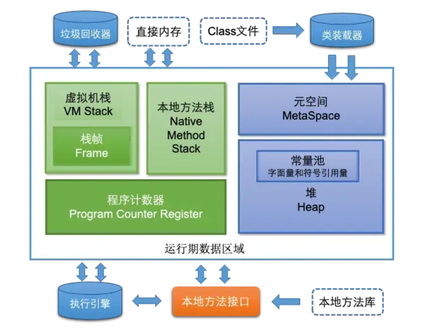

<!-- @format -->

# JVM 基本概念

## 什么是 JVM

`Java 虚拟机（Java Virtual Machine，简称 JVM）`是运行 Java 程序的虚拟计算机。它是 Java 平台的一部分，**负责将 Java 字节码（Bytecode）解释或编译为机器码**，并在不同的硬件和操作系统上执行。JVM 提供了一个抽象层，使得 Java 程序可以在不同的平台上运行，而无需修改代码。

## JVM 的主要功能

1. **加载和执行字节码**：JVM 负责加载 .class 文件中的字节码，并将其解释或编译为机器码执行。

2. **内存管理**：JVM 管理程序运行时的内存，包括堆、栈、方法区等内存区域。JVM 提供垃圾回收机制，自动回收不再使用的对象，避免内存泄漏。

3. **平台无关性**：JVM 提供了一个抽象层，使得 Java 程序可以在不同的平台上运行，而无需修改代码。Java 程序编译成字节码后，可以在任何安装了 JVM 的平台上运行。

4. **安全性**：JVM 提供了多种安全机制，如类加载器、字节码验证器等，确保 Java 程序的安全性。JVM 可以防止恶意代码的执行，保护系统的安全。

5. **多线程支持**：JVM 提供了对多线程的支持，使得 Java 程序可以并发执行多个任务。JVM 提供了线程调度和同步机制，确保多线程程序的正确性。

## JVM 的组成部分

1. **类加载器（Class Loader）：**

- 类加载器负责加载 .class 文件，将字节码加载到 JVM 中。
- 类加载器可以从不同的来源加载类，如本地文件系统、网络等。

2. **运行时数据区（Runtime Data Area）：**

- JVM 在运行时管理的内存区域，包括方法区、堆、栈、程序计数器和本地方法栈。

3. **执行引擎（Execution Engine）：**

- 执行引擎负责执行字节码，将字节码解释或编译为机器码执行。
- 执行引擎包括解释器和即时编译器（JIT Compiler）。

4. **本地方法接口（Native Interface）：**

- 本地方法接口允许 JVM 调用本地方法（用其他编程语言编写的方法，如 C/C++）。
- 本地方法接口提供了与操作系统和硬件交互的能力

## JVM 的内存模型

- **元空间：**元空间的本质和永久代类似，都是对 JVM 规范中方法区的实现。不过元空间与永久代之间最大的区别在于：元空间并不在虚拟机中，而是使用本地内存。

- **Java 虚拟机栈：**每个线程有一个私有的栈，随着线程的创建而创建。栈里面存着的是一种叫“栈帧”的东西，每个方法会创建一个栈帧，栈帧中存放了局部变量表（基本数据类型和对象引用）、操作数栈、方法出口等信息。栈的大小可以固定也可以动态扩展。

- **本地方法栈：**与虚拟机栈类似，区别是虚拟机栈执行 java 方法，本地方法站执行 native 方法。在虚拟机规范中对本地方法栈中方法使用的语言、使用方法与数据结构没有强制规定，因此虚拟机可以自由实现它。

- **程序计数器：**程序计数器可以看成是当前线程所执行的字节码的行号指示器。在任何一个确定的时刻，一个处理器（对于多内核来说是一个内核）都只会执行一条线程中的指令。因此，为了线程切换后能恢复到正确的执行位置，每条线程都需要一个独立的程序计数器，我们称这类内存区域为“线程私有”内存。

- **堆内存：**堆内存是 JVM 所有线程共享的部分，在虚拟机启动的时候就已经创建。所有的对象和数组都在堆上进行分配。这部分空间可通过 GC 进行回收。当申请不到空间时会抛出 OutOfMemoryError。堆是 JVM 内存占用最大，管理最复杂的一个区域。其唯一的用途就是存放对象实例：所有的对象实例及数组都在对上进行分配。jdk1.8 后，字符串常量池从永久代中剥离出来，存放在队中。

- **直接内存：**直接内存并不是虚拟机运行时数据区的一部分，也不是 Java 虚拟机规范中农定义的内存区域。在 JDK1.4 中新加入了 NIO(New Input/Output)类，引入了一种基于通道(Channel)与缓冲区（Buffer）的 I/O 方式，它可以使用 native 函数库直接分配堆外内存，然后通脱一个存储在 Java 堆中的 DirectByteBuffer 对象作为这块内存的引用进行操作。这样能在一些场景中显著提高性能，因为避免了在 Java 堆和 Native 堆中来回复制数据。

## 总结

常看常新
