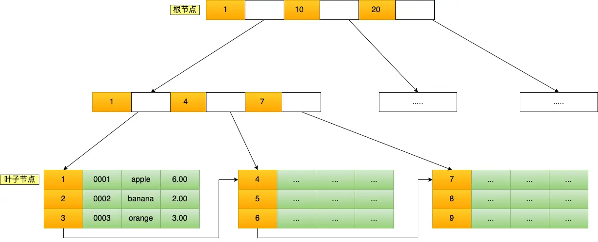
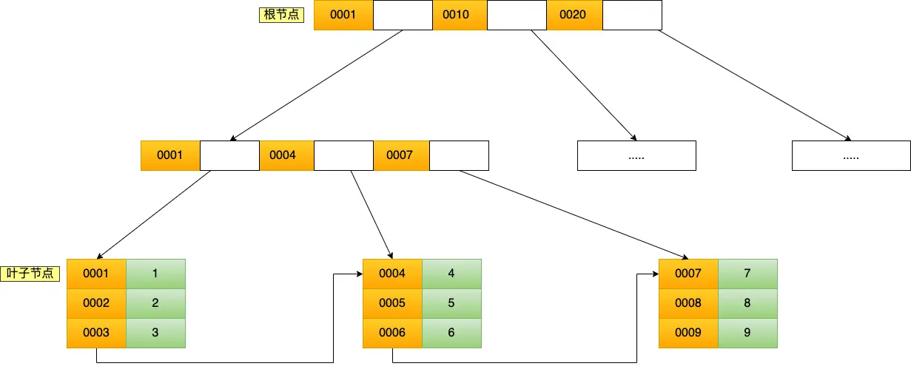
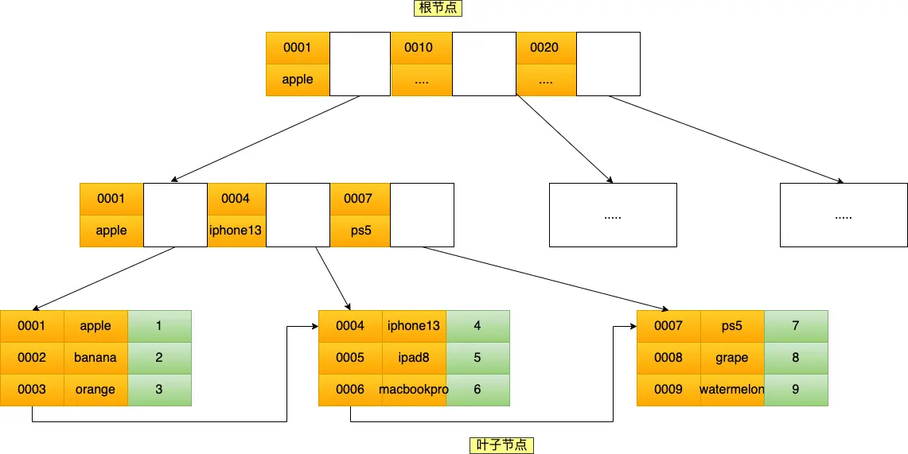

<!-- @format -->

# MySQL 索引

## 索引的分类

可以按四个角度进行索引的分类：

- 按「数据结构」分类：`B+tree`索引、`Hash`索引、`Full-text`索引。
- 按「物理存储」分类：聚簇索引（主键索引）、二级索引（辅助索引）。
- 按「字段特性」分类：主键索引、唯一索引、普通索引、前缀索引。
- 按「字段个数」分类：单列索引、联合索引。

### 按数据结构分类

`InnoDB`是在`MySQL 5.5`之后成为默认的`MySQL`存储引擎,`B+Tree`索引类型也是`MySQL`存储引擎采用最多的索引类型

- 在创建表时，`InnoDB`存储引擎会根据不同的场景选择不同的列作为索引:

  - 如果有主键，默认会使用主键作为聚簇索引的索引键`(key)`;
  - 如果没有主键，就选择第一个不包含`NULL`值的唯一列作为聚簇索引的索引键`(key)`;
  - 在上面两个都没有的情况下，`InnoD8` 将自动生成一个隐式自增 id 列作为聚簇索引的索引键`(key)`

其它索引都属于辅助索引`(Secondary Index)`，也被称为二级索引或非聚簇索引。创建的主键索引和二级索引默认使用的是`B+Tree`索引

#### B+树

`B+Tree`是一种多叉树，叶子节点才存放数据，非叶子节点只存放索引，而且每个节点里的数据是按主键
顺序存放的。每一层父节点的索引值都会出现在下层子节点的索引值中，因此在叶子节点中，包括了所有
的索引值信息，并且每一个叶子节点都有两个指针，分别指向下一个叶子节点和上一个叶子节点，形成一
个双向链表。

- 主键索引的`B+Tree`如图所示（注意里面应该是双向链表）

  

- 主键索引的`B+Tree`和二级索引的`B+Tree`区别如下:

  - 主键索引的`B+Tree`的叶子节点存放的是实际数据，所有完整的用户记录都存放在主键索引的`B+Tree`
    的叶子节点里;
  - 二级索引的`B+Tree`的叶子节点存放的是主键值，而不是实际数据。
    
    其中非叶子的`key`值是` product no`(图中橙色部分)，叶子节点存储的数据是主键值(图中绿色部
    分)。

#### 为什么 MySQL InnoDB 选择 B+tree 作为索引的数据结构？

- `B+Tree` vs `B Tree`

  - `B+Tree` 只在叶子节点存储数据，而`B`树 的非叶子节点也要存储数据，所以 `B+Tree` 的单个节点的数据量
    更小，在相同的磁盘`I/0`次数下，就能查询更多的节点。

  - 另外，`B+Tree`叶子节点采用的是双链表连接，适合`MySQL`中常见的基于范围的顺序查找，而`B`树无法做
    到这一点。

- `B+Tree` vs 二叉树

  - 对于有`N`个叶子节点的`B+Tree`，其搜索复杂度为`O(logN)`，其中`d`表示节点允许的最大子节点个数为`d `个。

  - 在实际的应用当中，`d`值是大于`100`的，这样就保证了，即使数据达到千万级别时，`B+Tree`的高度依然维持在`3~4`层左右，也就是说一次数据査询操作只需要做`3~4`次的磁盘`I/0`操作就能查询到目标数据。

  - 而二叉树的每个父节点的儿子节点个数只能是`2`个，意味着其搜索复杂度为`O(logN)`，这已经比 B+Tree
    高出不少，因此二又树检索到目标数据所经历的磁盘`0`次数要更多。

- `B+Tree` vs `Hash`

  - `Hash` 在做等值查询的时候效率贼快，搜索复杂度为 `O(1)`。

  - 但是 `Hash` 表不适合做范围查询，它更适合做等值的査询，这也是`B+Tree`索引要比`Hash`表索引有着更广
    泛的适用场景的原因。

### 按物理存储分类

从物理存储的角度来看，索引分为聚簇索引（主键索引）、二级索引（辅助索引）

- 主键索引的`B+Tree`的叶子节点存放的是实际数据，所有完整的用户记录都存放在主键索引的`B+Tree`
  的叶子节点里

- 二级索引的`B+Tree`的叶子节点存放的是主键值，而不是实际数据

所以，在查询时使用了二级索引，如果查询的数据能在二级索引里查询的到，那么就不需要回表，这个过
程就是覆盖索引。如果查询的数据不在二级索引里，就会先检索二级索引，找到对应的叶子节点，获取到
主键值后，然后再检索主键索引，就能查询到数据了，这个过程就是回表。

### 按字段特性分类

从字段特性的角度来看，索引分为主键索引、唯一索引、普通索引、前缀索引。

#### 主键索引

主键索引就是建立在主键字段上的索引，通常在创建表的时候一起创建, 一张表最多只有一个主键索引,
索引列的值不允许有空值。

在创建表时，创建主键索引的方式如下：

```SQL
CREATE TABLE table_name(
  ....
  PRIMARY KEY (index_column) USING BTREE
)
```

#### 唯一索引

唯一索引建立在`UNIQUE`字段上的索引，一张表可以有多个唯一索引，索引列的值必须唯一，但是允许有空值。

- 在创建表时，创建唯一索引的方式如下：

```SQL
CREATE TABLE table_name(
  ....
  UNIQUE KEY(index_column1_1,index_column1_2,...)
)
```

- 建表后，如果要创建唯一索引，可以使用这面这条命令：

```SQL
CREATE UNIQUE INDEX index_name
ON table_name(index_column1_1,index_column1_2,...)
```

#### 普通索引

普通索引就是建立在普通字段上的索引，既不要求字段为主键，也不要求字段为`UNIQUE`。

- 在创建表时，创建普通索引的方式如下：

```SQL
CREATE TABLE table_name(
  ....
  INDEX(index_column1_1,index_column1_2,...)
)
```

- 建表后，如果要创建普通索引，可以使用这面这条命令：

```SQL
CREATE INDEX index_name
ON table_name(index_column1_1,index_column1_2,...)
```

#### 前缀索引

前缀索引是指对字符类型字段的前几个字符建立的索引，而不是在整个字段上建立的索引，前缀索引可以建立在字段类型为`char`、`varchar`、`binary`、`varbinary` 的列上。

使用前缀索引的目的是为了减少索引占用的存储空间，提升查询效率。

- 在创建表时，创建前缀索引的方式如下：

```SQL
CREATE TABLE table_name(
  column_list,
  INDEX(column_name(length))
)
```

- 建表后，如果要创建前缀索引，可以使用这面这条命令：

```SQL
CREATE INDEX index_name
ON table_name(column_name(length))
```

### 按字段个数分类

从字段个数的角度来看，可以分为 「单列索引」、「联合索引」

#### 联合索引

通过将多个字段组合成一个索引，该索引就被称为联合索引。

比如，将商品表中的`product_no`和`name`字段组合成联合索引

```SQL
CREATE INDEX index_product_no_nmae ON product(product_no,name)
```

- 联合索引`(product_no, name) `的 `B+Tree` 示意图如下

  

:::tip 最左匹配原则
使用联合索引时，存在最左匹配原则，，也就是按照最左优先的方式进行索引的匹配。在使用联合索引进行查询的时候，如果不遵循「最左匹配原则」，联合索引会失效，这样就无法利用到索引快速查询的特性了。
:::

## 索引使用条件

### 什么时候适用索引

- 字段有唯一性限制的，比如商品编码;
- 经常用于 WHERE 查询条件的字段，这样能够提高整个表的查询速度，如果查询条件不是一个字段，可以建立联合索引。
- 经常用于 GROUPBY 和 ORDER BY 的字段，这样在查询的时候就不需要再去做一次排序了，因为我们都已经知道了建立索引之后在 B+Tree 中的记录都是排序好的。

### 什么时候不需要创建索引？

- `WHERE`条件，`GROUP BY`，`ORDER BY` 里用不到的字段，索引的价值是快速定位，如果起不到定位的字段通常是不需要创建索引的，因为索引是会占用物理空间的。

- 字段中存在大量重复数据，不需要创建索引，比如性别字段，只有男女，如果数据库表中，男女的记录分布均匀，那么无论搜索哪个值都可能得到一半的数据。在这些情况下，还不如不要索引，因为 MvSQL 还有一个查询优化器，查询优化器发现某个值出现在表的数据行中的百分比很高的时候，它一般会忽略索引，进行全表扫描。

- 表数据太少的时候，不需要创建索引;

- 经常更新的字段不用创建索引，比如不要对电商项目的用户余额建立索引，因为索引字段频繁修改，由于要维护`B+Tree`的有序性，那么就需要频繁的重建索引，这个过程是会影响数据库性能的

### 参考

:::tip 参考文献

https://www.xiaolincoding.com/mysql/index/index_intervie

:::

<!-- @format -->
