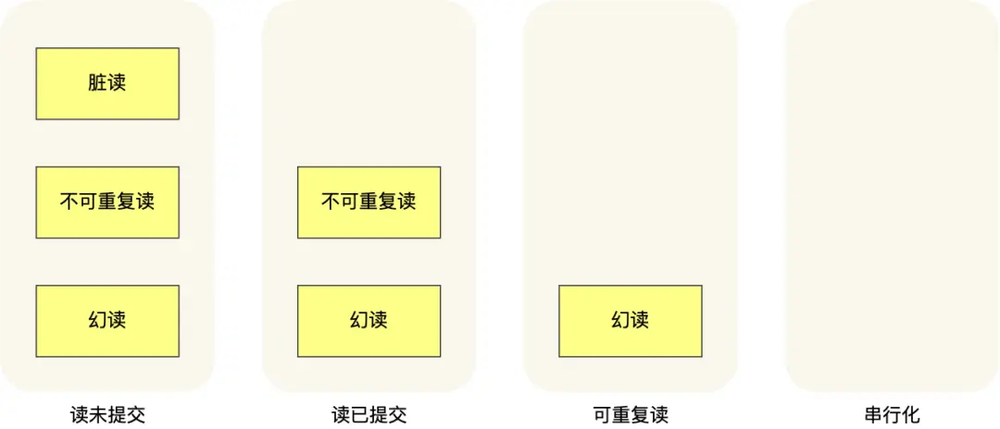

<!-- @format -->

# MySQL 事务篇

## 事务的特性有哪些

- **原子性（Atomicity）**

  原子性确保事务中的所有操作要么全部完成，要么全部不完成。换句话说，事务是一个不可分割的工作单元，事务中的所有操作要么全部提交成功，要么全部回滚到事务开始前的状态。

- **一致性（Consistency）**

  一致性确保事务在完成时，数据库从一个一致性状态转换到另一个一致性状态。事务的执行不能破坏数据库的完整性约束和业务规则。

- **隔离性（Isolation）**

  隔离性确保并发执行的事务彼此之间不受干扰。一个事务的中间状态对其他事务是不可见的，不同事务之间的操作是相互隔离的。

- **持久性（Durability）**

  持久性确保一旦事务提交成功，其对数据库的更改将永久保存，即使系统发生故障也不会丢失。

### `InnoDB`引擎通过什么技术来保证事务的这四个特性

- 原子性是通过`undo log（回滚日志）`来保证的

- 一致性则是通过持久性+原子性+隔离性来保证

- 隔离性是通过` MVCC（多版本并发控制）` 或锁机制来保证的

- 持久性是通过` redo log （重做日志）`来保证的

## 并行事务会引发什么问题？

`MySQL` 服务端是允许多个客户端连接的，这意味着`MySQL`会出现同时处理多个事务的情况。

在同时处理多个事务的时候，就可能出现`脏读（dirty read）、不可重复读（non-repeatable read）、幻读（phantom read）`的问题

- 脏读

  如果一个事务「读到」了另一个「未提交事务修改过的数据」，就意味着发生了「脏读」现象。

- 不可重复读

  在一个事务内多次读取同一个数据，如果出现前后两次读到的数据不一样的情况，就意味着发生了「不可重复读」现象。

- 幻读

  在一个事务内多次查询某个符合查询条件的「记录数量」，如果出现前后两次查询到的记录数量不一样的情况，就意味着发生了「幻读」现象。

## 事务的隔离级别有哪些？

`SQL`标准提出了四种隔离级别来规避这些现象，隔离级别越高，性能效率就越低，这四个隔离级别如下：

1. `读未提交（Read Uncommitted）`

   (脏读：可能发生 不可重复读：可能发生 幻读：可能发生)

   在读未提交隔离级别下，一个事务可以读取另一个事务尚未提交的数据。这种隔离级别提供最低的隔离性，可能会导致脏读`（Dirty Read）`问题。

2. `读已提交（Read Committed）`

   (脏读：不可能发生 不可重复读：可能发生 幻读：可能发生)

   在读已提交隔离级别下，一个事务只能读取另一个事务已提交的数据。这种隔离级别解决了脏读问题，但可能会导致不可重复读`（Non-repeatable Read）`问题。

3. `可重复读（Repeatable Read）`

   (脏读：不可能发生 不可重复读：不可能发生 幻读：可能发生)

   在可重复读隔离级别下，一个事务在开始时读取的数据在整个事务期间保持一致。这种隔离级别解决了脏读和不可重复读问题，但可能会导致幻读（Phantom Read）问题。

4. `串行化（Serializable）`

   (脏读：不可能发生 不可重复读：不可能发生 幻读：不可能发生)

   会对记录加上读写锁，在多个事务对这条记录进行读写操作时，如果发生了读写冲突的时候，后访问的事务必须等前一个事务执行完成，才能继续执行；

## MySQL 的解决方案

`MySQL InnoDB`引擎的可重复读隔离级别（默认隔离级），根据不同的查询方式，分别提出了避免幻读的方案：

- 针对快照读（普通`select`语句），是通过`多版本并发控制（MVCC）`方式解决了幻读

  - `MVCC（Multi-Version Concurrency Control）`：
    - `MVCC`通过维护数据的多个版本来实现并发控制。
    - 当一个事务开始时，它会看到一个数据的快照，这个快照是事务开始时的数据状态。
    - 任何其他事务对数据的修改不会影响当前事务的快照视图。
    - 这样，快照读可以避免幻读，因为它总是看到事务开始时的数据状态。

- 针对当前读（`select ... for update `等语句），是通过`next-key lock`（记录锁+间隙锁）方式解决了幻读。

  - `Next-Key Lock`：
    - `Next-Key Lock` 是记录锁`（Record Lock）`和间隙锁`（Gap Lock）`的组合。
    - 记录锁锁定的是索引记录本身。
    - 间隙锁锁定的是索引记录之间的间隙。
    - `Next-Key Lock` 可以防止其他事务在当前事务读取的记录之间插入新的记录，从而避免幻读。

  **`MySQL`可重复读隔离级别并没有彻底解决幻读，只是很大程度上避免了幻读现象的发生。**
