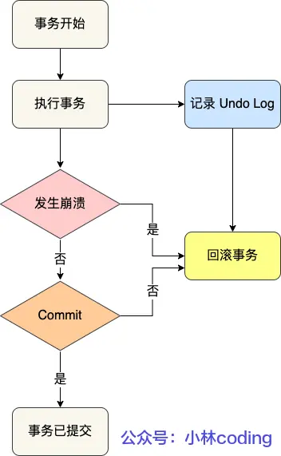
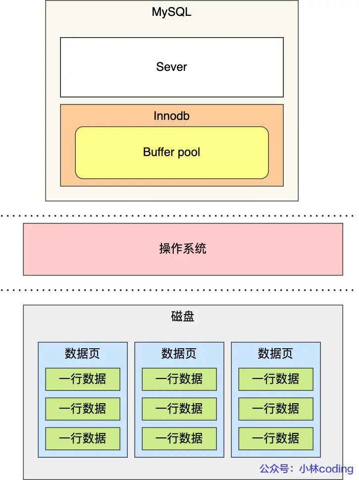
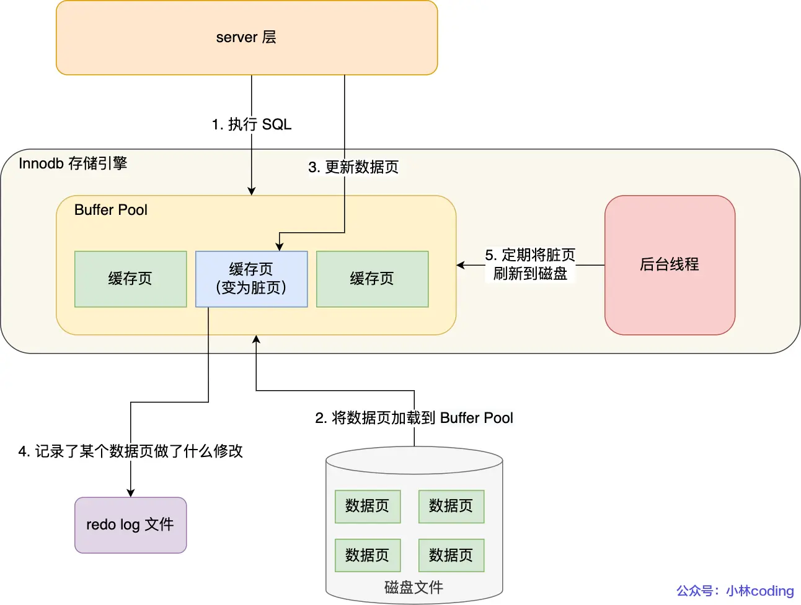
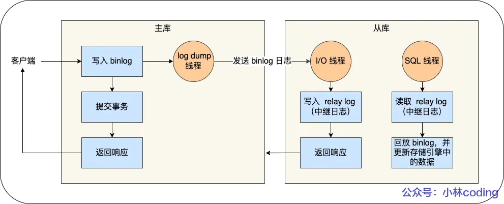
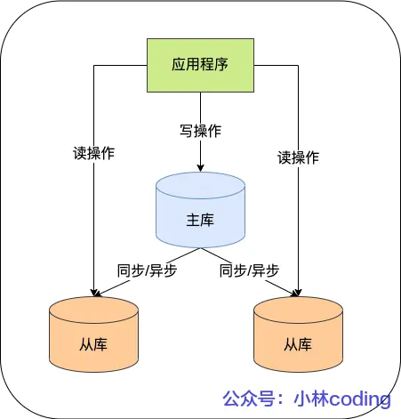

<!-- @format -->

# MySQL 日志

更新语句的流程会涉及到` undo log（回滚日志）`、`redo log（重做日志）`、`binlog （归档日志）`这三种日志：

- `undo log(回滚日志)`:是`Innodb`存储引擎层生成的日志，实现了事务中的**原子性**，主要用于**事务回滚和 MVCC。**

- `redo log(重做日志)`:是`Innodb`存储引擎层生成的日志，实现了事务中的**持久性**，主要用于**掉电等故障恢复;**

- `binlog (归档日志)`:是`Server`层生成的日志，主要用于**数据备份和主从复制**

## 为什么需要 undo log？

**undo log（回滚日志），它保证了事务的 ACID 特性 (opens new window)中的原子性（Atomicity）。**

`undo log`是一种用于撤销回退的日志。在事务没提交之前，`MySQL`会先记录更新前的数据到 `undo log`日志文件里面，当事务回滚时，可以利用`undo log`来进行回滚。如下图：

- `undo log`的作用

  - **实现事务回滚，保障事务的原子性。**事务处理过程中，如果出现了错误或者用户执
    行了`ROLLBACK`语句，`MySQL`可以利用`undo log`中的历史数据将数据恢复到事务开始之前的状态。

  - **实现` MVCC（多版本并发控制）`关键因素之一。**`MVCC`是通过`ReadView + undo log`实现的。`undo log`为每条记录保存多份历史数据，MySQL 在执行快照读（普通 select 语句）的时候，会根据事务的 Read View 里的信息，顺着`undo log`的版本链找到满足其可见性的记录。

## 为什么需要 Buffer Pool？

`Innodb 存储引擎`设计了一个**缓冲池（Buffer Pool）**，来提高数据库的读写性能。

- `Buffer Pool`作用：

  - 当读取数据时，如果数据存在于`Buffer Pool`中，客户端就会直接读取`Buffer Pool`中的数据，否则再去磁盘中读取。
  - 当修改数据时，如果数据存在于`Buffer Pool`中，那直接修改`Buffer Pool`中数据所在的页，然后将其页设置为脏页（该页的内存数据和磁盘上的数据已经不一致），为了减少磁盘`I/O`，不会立即将脏页写入磁盘，后续由后台线程选择一个合适的时机将脏页写入到磁盘。

## 为什么需要 redo log ？

为了防止断电导致数据丢失的问题，当有一条记录需要更新的时候，InnoDB 引擎就会先更新内存（同时标记为脏页），然后将本次**对这个页的修改以 redo log 的形式记录下来，**这个时候更新就算完成了

后续，`InnoDB 引擎`会在适当的时候，由后台线程将缓存在`Buffer Pool`的脏页刷新到磁盘里，这就是` WAL （Write-Ahead Logging）技术`，通过先写`redo log`再写数据，`MySQL`可以减少磁盘`I/O`操作，提高写性能。

**WAL 技术指的是， MySQL 的写操作并不是立刻写到磁盘上，而是先写日志，然后在合适的时间再写到磁盘上**

- 具体流程如下：

  

## 为什么需要 binlog ？

MySQL 在完成一条更新操作后，Server 层还会生成一条 binlog，等之后事务提交的时候，会将该事物执行过程中产生的所有 binlog 统一写 入 binlog 文件。

binlog 文件是记录了所有数据库表结构变更和表数据修改的日志，不会记录查询类的操作，比如 SELECT 和 SHOW 操作。

### redo log 和 binlog 有什么区别？

1. 适用对象不同：

   - `binlog`是 MySQL 的 Server 层实现的日志，所有存储引擎都可以使用；
   - `redo log`是 Innodb 存储引擎实现的日志；

2. 文件格式不同：

   - `binlog`有 3 种格式类型，分别是` STATEMENT（默认格式）`、`ROW`、 `MIXED`，区别如下：

     - **STATEMEN**T：每一条修改数据的 SQL 都会被记录到 binlog 中（相当于记录了逻辑操作，所以针对这种格式， binlog 可以称为逻辑日志），主从复制中 slave 端再根据 SQL 语句重现。但 STATEMENT 有动态函数的问题，比如你用了 uuid 或者 now 这些函数，你在主库上执行的结果并不是你在从库执行的结果，这种随时在变的函数会导致复制的数据不一致；

     - **ROW**：记录行数据最终被修改成什么样了（这种格式的日志，就不能称为逻辑日志了），不会出现 STATEMENT 下动态函数的问题。但 ROW 的缺点是每行数据的变化结果都会被记录，比如执行批量 update 语句，更新多少行数据就会产生多少条记录，使 binlog 文件过大，而在 STATEMENT 格式下只会记录一个 update 语句而已；

     - **MIXED**：包含了 STATEMENT 和 ROW 模式，它会根据不同的情况自动使用 ROW 模式和 STATEMENT 模式；

   - `redo log`是物理日志，记录的是在某个数据页做了什么修改，比如对 XXX 表空间中的 YYY 数据页 ZZZ 偏移量的地方做了 AAA 更新；

3. 写入方式不同：

- `binlog`是追加写，写满一个文件，就创建一个新的文件继续写，不会覆盖以前的日志，保存的是全量的日志。

- `redo log`是循环写，日志空间大小是固定，全部写满就从头开始，保存未被刷入磁盘的脏页日志。

4. 用途不同：

- `binlog`用于备份恢复、主从复制；

- `redo log`用于掉电等故障恢复。

## 主从复制

MySQL 的主从复制（Replication）是一种将数据从一个数据库服务器（主库）复制到一个或多个数据库服务器（从库）的机制。

这个过程一般是**异步**的，也就是主库上执行事务操作的线程不会等待复制 binlog 的线程同步完成。

- `MySQL`集群的主从复制过程梳理成 3 个阶段：

  - **写入 Binlog**：主库写 binlog 日志，提交事务，并更新本地存储数据。

  - **同步 Binlog**：把 binlog 复制到所有从库上，每个从库把 binlog 写到暂存日志中。

  - **回放 Binlog**：回放 binlog，并更新存储引擎中的数据。

在完成主从复制之后，你就可以在写数据时只写主库，在读数据时只读从库，这样即使写请求会锁表或者锁记录，也不会影响读请求的执行。

## 事务提交流程

- **prepare 阶段**:将 redo log 对应的事务状态设置为 prepare，然后将 redo log 刷新到硬盘;
- **commit 阶段**:将 binlog 刷新到磁盘，接着调用引擎的提交事务接口，将 redo log 状态设置为 commit(将事务设置为 commit 状态后，刷入到磁盘 redo log 文件);

## 参考

:::tip 参考文献

https://xiaolincoding.com/mysql/log/how_update.html

:::
