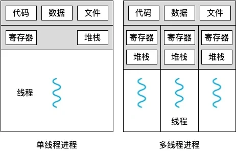
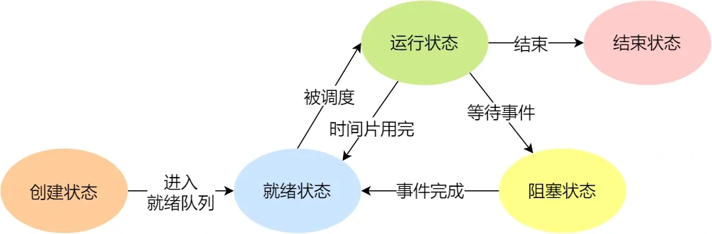

<!-- @format -->

# 进程，线程，协程的区别

## 进程和线程的区别

- **本质区别** ：进程是操作系统资源分配的基本单位，而线程是任务调度和执行的基本单位

- **开销方面** ：每个进程都有独立的代码和数据空间（程序上下文），程序之间的切换会有较大的开销；线程可以看做轻量级的进程，同一类线程共享代码和数据空间，每个线程都有自己**独立的运行栈和程序计数器（PC）**，线程之间切换的开销小

- **稳定性方面** ：进程中某个线程如果崩溃了，可能会导致整个进程都崩溃。而进程中的子进程崩溃，并不会影响其他进程。

- **内存分配方面** ：系统在运行的时候会为每个进程分配不同的内存空间；而对线程而言，除了 CPU 外，系统不会为线程分配内存（线程所使用的资源来自其所属进程的资源），线程组之间只能共享资源

- **包含关系** ：没有线程的进程可以看做是单线程的，如果一个进程内有多个线程，则执行过程不是一条线的，而是多条线

## 进程，线程，协程的区别是什么？

- **进程** :进程是操作系统中进行资源分配和调度的基本单位，它拥有自己的独立内存空间和系统资源。每个进程都有独立的堆和栈，不与其他进程共享。进程间通信需要通过特定的机制，如管道、消息队列、信号量等。由于进程拥有独立的内存空间，因此其稳定性和安全性相对较高，但同时上下文切换的开销也较大，因为需要保存和恢复整个进程的状态。

- **线程** :线程是进程内的一个执行单元，也是 CPU 调度和分派的基本单位。与进程不同，线程共享进程的内存空间，包括堆和全局变量。线程之间通信更加高效，因为它们可以直接读写共享内存。线程的上下文切换开销较小，因为只需要保存和恢复线程的上下文，而不是整个进程的状态。然而，由于多个线程共享内存空间，因此存在数据竞争和线程安全的问题，需要通过同步和互斥机制来解决。

- **协程** :协程是一种用户态的轻量级线程，其调度完全由用户程序控制，而不需要内核的参与。协程拥有自己的寄存器上下文和栈，但与其他协程共享堆内存。协程的切换开销非常小，因为只需要保存和恢复协程的上下文，而无需进行内核级的上下文切换。这使得协程在处理大量并发任务时具有非常高的效率。然而，协程需要程序员显式地进行调度和管理，相对于线程和进程来说，其编程模型更为复杂。

## 进程的状态（五种状态）

完整的进程状态的变迁如下图：

进程的状态变迁：

- `NULL -> 创建状态`，新进程被创建时的第一个状态；

- `创建状态 -> 就绪状态`，当进程被创建完成并初始化后，一切就绪准备运行时，变为就绪状态，这个过程是很快的；

- `就绪态 -> 运行状态`，处于就绪状态的进程被操作系统的进程调度器选中后，就分配给 CPU 正式运行该进程；

- `运行状态 -> 结束状态`，当进程已经运行完成或出错时，会被操作系统作结束状态处理；

- `运行状态 -> 就绪状态`，处于运行状态的进程在运行过程中，由于分配给它的运行时间片用完，操作系统会把该进程变为就绪态，接着从就绪态选中另外一个进程运行；

- `运行状态 -> 阻塞状态`，当进程请求某个事件且必须等待时，例如请求 I/O 事件；

- `阻塞状态 -> 就绪状态`，当进程要等待的事件完成时，它从阻塞状态变到就绪状态；
