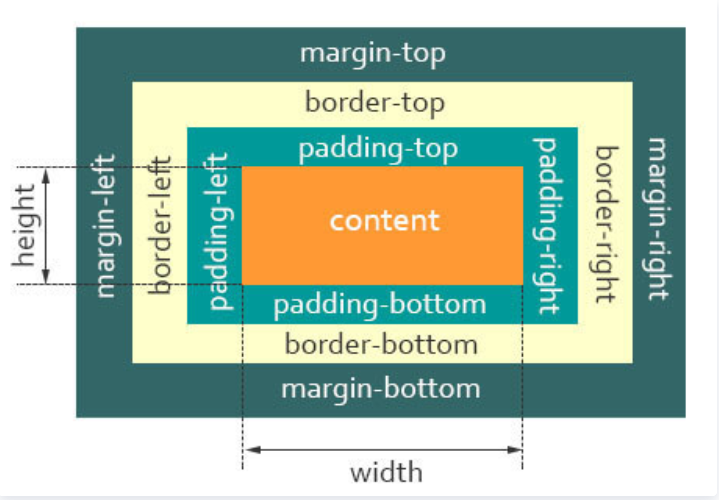
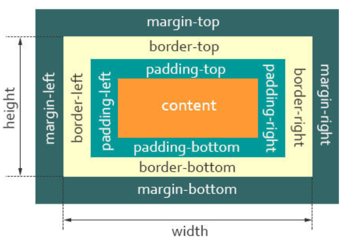

<!-- @format -->

# 盒子模型

- [盒子模型](#盒子模型)
  - [什么是盒子模型](#什么是盒子模型)
  - [标准盒子模型](#标准盒子模型)
  - [IE 怪异盒子模型](#ie-怪异盒子模型)
  - [Box-sizing 切换](#box-sizing-切换)

<!--more-->

## 什么是盒子模型

当对一个文档进行布局（layout）的时候，浏览器的渲染引擎会根据标准之一的 CSS 基础框盒模型（CSS basic box model），将所有元素表示为一个个矩形的盒子（box）

一个盒子由四个部分组成：

- **`content`** : 实际内容，显示文本和图像

- **`padding`** : 边框，围绕元素内容的内边距的一条或多条线，由粗细、样式、颜色三部分组成

- **`border`** :内边距，清除内容周围的区域，内边距是透明的，取值不能为负，受盒子的`background`属性影响

- **`margin`** :外边距，在元素外创建额外的空白，空白通常指不能放其他元素的区域

## 标准盒子模型



- 盒子总宽度 = width + padding + border + margin

- 盒子总高度 = height + padding + border + margin

## IE 怪异盒子模型



- 盒子总宽度 = width + margin;

- 盒子总高度 = height + margin;

## Box-sizing 切换

现代浏览器默认使用标准盒子模型，但可以通过 CSS 的 box-sizing 属性切换到怪异盒子模型

```CSS
.box {
  box-sizing: border-box; /* 使用怪异盒子模型 */
}
```
