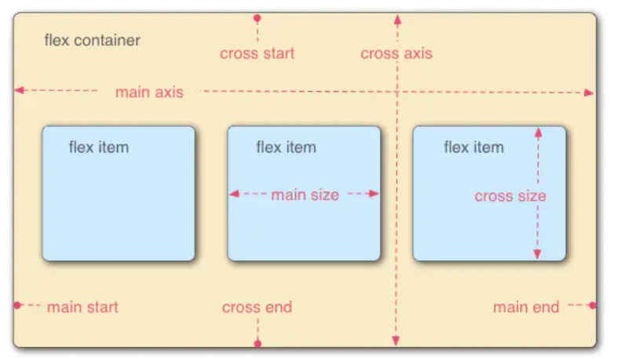
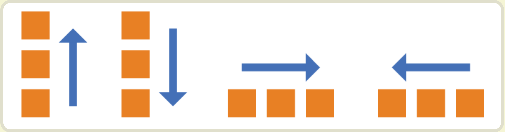
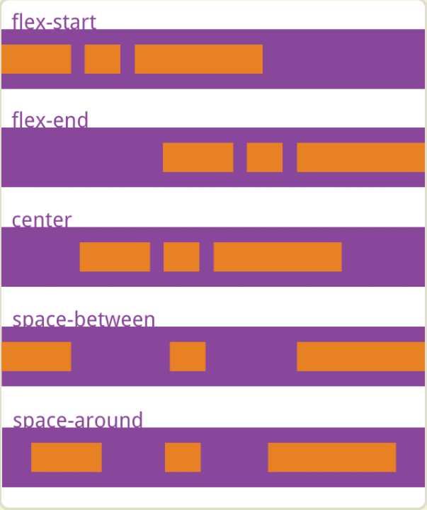
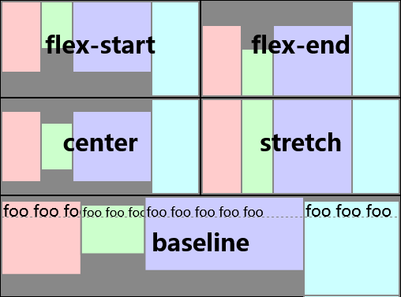
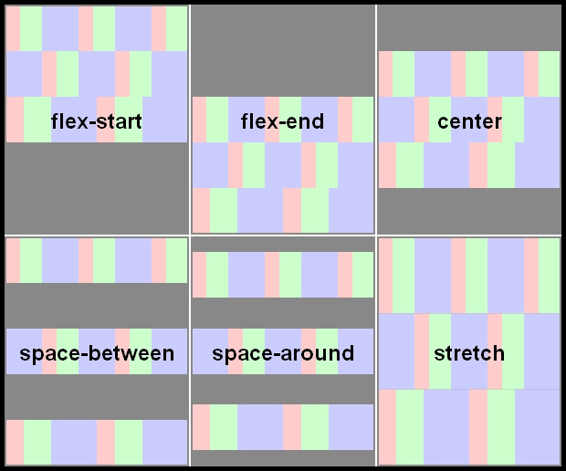
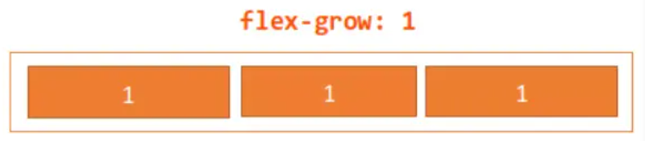
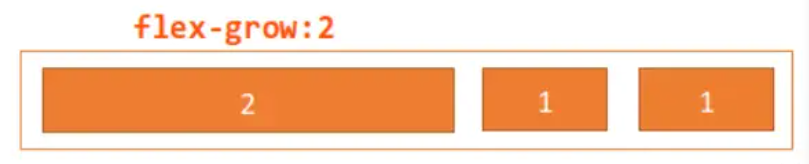
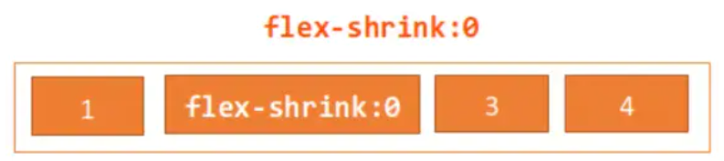
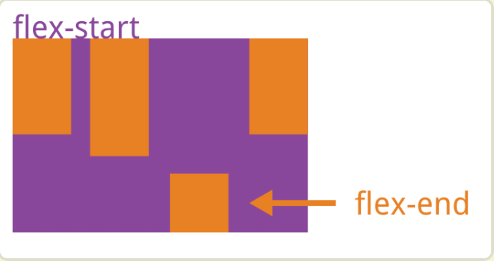

<!-- @format -->

# 盒子模型

- [盒子模型](#盒子模型)
  - [什么是盒子模型](#什么是盒子模型)
  - [标准盒子模型](#标准盒子模型)
  - [IE 怪异盒子模型](#ie-怪异盒子模型)
  - [Box-sizing 切换](#box-sizing-切换)
  - [flexbox（弹性盒布局模型）](#flexbox弹性盒布局模型)
  - [flex 属性](#flex-属性)
    - [flex-direction](#flex-direction)
    - [flex-wrap](#flex-wrap)
    - [flex-flow](#flex-flow)
    - [justify-content](#justify-content)
    - [align-items](#align-items)
    - [align-content](#align-content)
  - [容器成员属性](#容器成员属性)
    - [order](#order)
    - [flex-grow](#flex-grow)
    - [flex-shrink](#flex-shrink)
    - [flex-basis](#flex-basis)
    - [flex](#flex)
    - [align-self](#align-self)

<!--more-->

## 什么是盒子模型

当对一个文档进行布局（layout）的时候，浏览器的渲染引擎会根据标准之一的 CSS 基础框盒模型（CSS basic box model），将所有元素表示为一个个矩形的盒子（box）

一个盒子由四个部分组成：

- **`content`** : 实际内容，显示文本和图像

- **`padding`** : 边框，围绕元素内容的内边距的一条或多条线，由粗细、样式、颜色三部分组成

- **`border`** :内边距，清除内容周围的区域，内边距是透明的，取值不能为负，受盒子的`background`属性影响

- **`margin`** :外边距，在元素外创建额外的空白，空白通常指不能放其他元素的区域

## 标准盒子模型


- 盒子总宽度 = width + padding + border + margin

- 盒子总高度 = height + padding + border + margin

## IE 怪异盒子模型


- 盒子总宽度 = width + margin;

- 盒子总高度 = height + margin;

## Box-sizing 切换

现代浏览器默认使用标准盒子模型，但可以通过 CSS 的 box-sizing 属性切换到怪异盒子模型

```CSS
.box {
  box-sizing: border-box; /* 使用怪异盒子模型 */
}
```

## flexbox（弹性盒布局模型）

`Flexible Box `简称 `flex`，意为”弹性布局”，可以简便、完整、响应式地实现各种页面布局

采用`Flex`布局的元素，称为`flex`容器`container`

它的所有子元素自动成为容器成员，称为`flex`项目`item`



容器中默认存在两条轴，主轴和交叉轴，呈 90 度关系。项目默认沿主轴排列，通过`flex-direction`来决定主轴的方向

每根轴都有起点和终点，这对于元素的对齐非常重要

## flex 属性

### flex-direction

决定主轴的方向

```CSS
.container {
    flex-direction: row | row-reverse | column | column-reverse;
}
```



从左到右依次为：

- column-reverse：主轴为垂直方向，起点在下沿

- column：主轴为垂直方向，起点在上沿。

- row-reverse：主轴为水平方向，起点在右端

- row（默认值）：主轴为水平方向，起点在左端

### flex-wrap

弹性元素永远沿主轴排列，那么如果主轴排不下，通过`flex-wrap`决定容器内项目是否可换行

```CSS
.container {
    flex-wrap: nowrap | wrap | wrap-reverse;
}
```

- nowrap（默认值）：不换行
- wrap：换行，第一行在下方
- wrap-reverse：换行，第一行在上方

### flex-flow

是`flex-direction`属性和`flex-wrap`属性的简写形式，默认值为`row nowrap`

```CSS
.box {
  flex-flow: <flex-direction> || <flex-wrap>;
}

```

### justify-content

项目在主轴上的对齐方式

```CSS
.box {
    justify-content: flex-start | flex-end | center | space-between | space-around;
}
```



- flex-start（默认值）：左对齐

- flex-end：右对齐
- center：居中
- space-between：两端对齐，项目之间的间隔都相等
- space-around：两个项目两侧间隔相等

### align-items

项目在交叉轴上如何对齐

```CSS
.box {
  align-items: flex-start | flex-end | center | baseline | stretch;
}

```



- flex-start：交叉轴的起点对齐
- flex-end：交叉轴的终点对齐
- center：交叉轴的中点对齐
- baseline: 项目的第一行文字的基线对齐
- stretch（默认值）：如果项目未设置高度或设为 auto，将占满整个容器的高度

### align-content

定义了多根轴线的对齐方式。**如果项目只有一根轴线，该属性不起作用**

```CSS
.box {
    align-content: flex-start | flex-end | center | space-between | space-around | stretch;
}
```



- flex-start：与交叉轴的起点对齐
- flex-end：与交叉轴的终点对齐
- center：与交叉轴的中点对齐
- space-between：与交叉轴两端对齐，轴线之间的间隔平均分布
- space-around：每根轴线两侧的间隔都相等。所以，轴线之间的间隔比轴线与边框的间大一倍
- stretch（默认值）：轴线占满整个交叉轴

## 容器成员属性

### order

定义项目的排列顺序。数值越小，排列越靠前，默认为 0

```CSS
.item {
    order: <integer>;
}
```

### flex-grow

定义项目的放大比例（容器宽度>元素总宽度时如何伸展）,当容器设为`flex-wrap: nowrap;`不换行的时候，容器宽度有不够分的情况，弹性元素会根据`flex-grow`来决定  
注：弹性容器的宽度正好等于元素宽度总和，无多余宽度，此时无论`flex-grow`是什么值都不会生效

```CSS
.item {
     flex-grow: <number>;
}
```

默认为 0，即如果存在剩余空间，也不放大

- 如果所有项目的 flex-grow 属性都为 1

  

- 如果一个项目的 flex-grow 属性为 2，其他项目都为 1

  

### flex-shrink

定义了项目的缩小比例，默认为 1，即如果空间不足，该项目将缩小

```CSS
.item {
      flex-shrink: <number>; /* default 1 */
}
```

- 如果所有项目的 flex-shrink 属性都为 1，当空间不足时，都将等比例缩小

- 如果一个项目的 flex-shrink 属性为 0，其他项目都为 1，则空间不足时，前者不缩小



### flex-basis

设置的是元素在主轴上的初始尺寸，所谓的初始尺寸就是元素在`flex-grow`和`flex-shrink`生效前的尺寸,默认值为`auto`，即项目的本来大小，当设置为 0 的是，会根据内容撑开

```CSS
.item {
      flex-basis: <length> | auto; /* default auto */
}
```

### flex

`flex`属性是`flex-grow`, `flex-shrink` 和 `flex-basis`的简写，默认值为`0 1 auto`

```CSS
.item {
  flex: none | [ <'flex-grow'> <'flex-shrink'>? || <'flex-basis'> ]
}
```

注：flex: 1 的项目初始大小为 0，而 flex: auto 的项目初始大小为它的默认大小

- flex: 1 = flex: 1 1 0%
- flex: 2 = flex: 2 1 0%
- flex: auto = flex: 1 1 auto
- flex: none = flex: 0 0 auto，常用于固定尺寸不伸缩

### align-self

允许单个项目有与其他项目不一样的对齐方式，可覆盖`align-items`属性
默认值为`auto`，表示继承父元素的`align-items`属性，如果没有父元素，则等同于`stretch`

```CSS
.item {
    align-self: auto | flex-start | flex-end | center | baseline | stretch;
}
```


