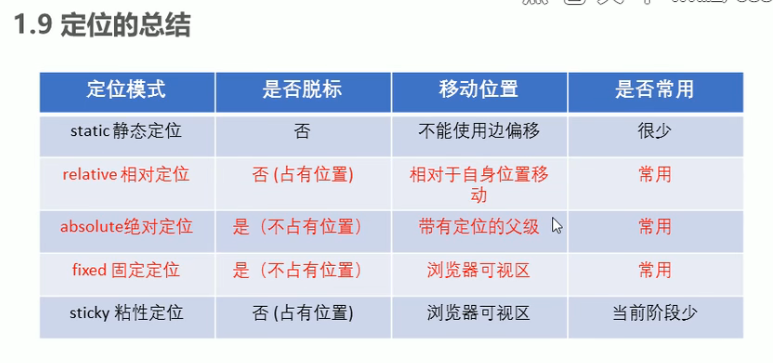
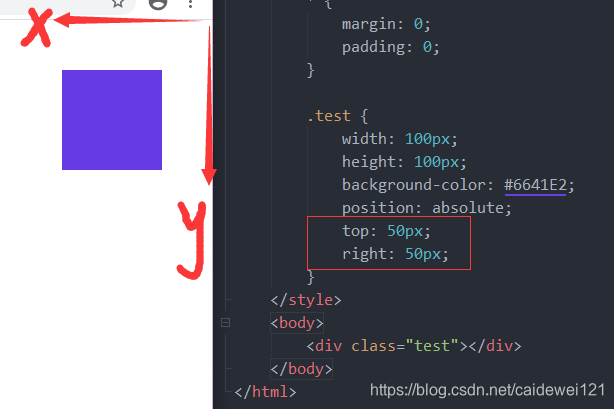

<!-- @format -->

# Position 布局

- [Position 布局](#position-布局)
  - [HTML 中的布局方式](#html-中的布局方式)
  - [定位布局](#定位布局)
    - [position 可选参数](#position-可选参数)
    - [static](#static)
    - [absolute](#absolute)
    - [relative](#relative)
    - [fixed](#fixed)
    - [sticky（了解即可，兼容性差，IE 不支持](#sticky了解即可兼容性差ie-不支持)

<!--more-->

## HTML 中的布局方式

HTML 中的两大元素 : 块级元素、内联元素

| 常见块级元素 | 常见内联元素       |
| ------------ | ------------------ |
| 独占一行     | 和相临元素在同一行 |
| div          | a                  |
| h1~h6        | span               |
| ol、ul、li   | img                |
| table        | input              |
| p            | …                  |

## 定位布局

### position 可选参数

| position 参数 | 解释                                                                                                           |
| ------------- | -------------------------------------------------------------------------------------------------------------- |
| static        | 默认值，元素按照标准流正常的显示                                                                               |
| relative      | 相对定位，元素依然处于正常的文档流中，可以通过 left ， right，bottom，top 改变元素的位置                       |
| absolute      | 绝对定位，元素脱离文档流，可以通过 left ， right，bottom，top 改变元素的位置，它会基于游览器的四个边角进行定位 |
| fixed         | 固定定位，使用 top，left，right，bottom 定位，会脱离正常文档流，不受标准流的约束，并拥有层级的概念             |
| inherit       | 会继承父元素的属性                                                                                             |

### static

默认定位，无定位的意思，无边偏移。

### absolute

绝对于"网页页面"的布局.这个页面就是指网页从开始一直到网页尾部为止的页面，如果祖先元素有定位（相对、绝对、固定），以最近一级的有祖先定位元素为参考点移动位置。，**后写的元素会覆盖先写的元素**  

### relative

相对布局相对的是其父布局的一种布局.可以通过 left，right，top，bottom 移动元素，并且后写的元素会覆盖先写的元素  
“**子绝父相**”最常用，指的是子级是绝对定位（不需要占位），父级要用相对定位（需要占位）。

### fixed

使用 fixed 固定定位的元素不会受其它元素的约束，它也是以游览器的四个边角为基准，但是**当页面发生滚动的时候**，使用 fixed 定位的元素，**会依然在页面中的位置固定不动**

### sticky（了解即可，兼容性差，IE 不支持

在屏幕范围时该元素的位置并不受到定位影响(设置是 top、left 等属性无效),当该元素的位置将要移出偏移范围时,定位又会变成 fixed,根据设置的 left、top 等属性成 fixed(固定布局)的效果.
