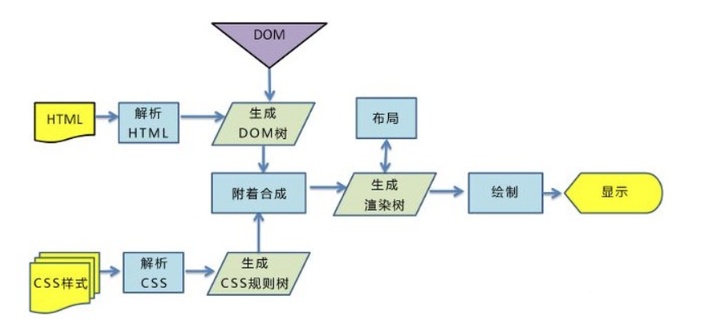

<!-- @format -->

# 前端浏览器渲染原理

写在前面：不太好分类，但又不能专开一个浏览器专列，只能先分到这类了

## 浏览器内核

浏览器内核主要分成两部分：

- **渲染引擎**：渲染，即在浏览器窗口中显示所请求的内容。默认情况下，渲染引擎可以显示 `html`、`xml` 文档及图片，它也可以借助插件显示其他类型数据，例如使用`PDF`阅读器插件，可以显示 `PDF` 格式。
- **JS 引擎**：解析和执行`javascript`来实现网页的动态效果。

最开始渲染引擎和`JS`引擎并没有区分的很明确，后来`JS`引擎越来越独立，内核就倾向于只指渲染引擎。

## 浏览器的渲染过程

具体是以下五个步骤：

1. **解析 HTML**：浏览器首先解析 HTML 文档，生成 DOM 树。DOM 树是由 HTML 元素组成的树形结构。
2. **解析 CSS**：浏览器解析 CSS 样式信息，生成 CSSOM 树。CSSOM 树是由 CSS 选择器和样式信息组成的树形结构。
3. **构建渲染树**：浏览器将 DOM 树和 CSSOM 树合并，生成渲染树。渲染树包含了页面上所有可见元素的样式和内容信息。
4. **布局**：浏览器根据渲染树计算每个元素的大小和位置，这个过程也被称为“回流”。
5. **绘制**：浏览器根据布局信息在屏幕上绘制每个元素，这个过程也被称为“重绘”。
6. **合成**：最后，浏览器将各个层进行合成，然后显示在屏幕上。

## 浏览器渲染优化

### 针对 JavaScript

`JavaScript`既会阻塞`HTML`的解析，也会阻塞`CSS`的解析。因此我们可以对 `JavaScript`的加载方式进行改变，来进行优化：

- 尽量将 JavaScript 文件放在 body 的最后
- body 中间尽量不要写`<script>`标签
- `<script>`标签的引入资源方式有三种，有一种就是我们常用的直接引入，还有两种就是使用 async 属性和 defer 属性来异步引入，两者都是去异步加载外部的 JS 文件，不会阻塞 DOM 的解析 **（尽量使用异步加载）**。三者的区别如下：
  - `script` **立即停止**页面渲染去加载资源文件，当资源加载完毕后立即执行 js 代码，js 代码执行完毕后继续渲染页面。
  - `async`是在下载完成之后，立即异步加载，加载好后立即执行，**多个带 async 属性的标签，不能保证加载的顺序**。
  - `defer`是在下载完成之后，立即异步加载。加载好后，如果 DOM 树还没构建好，则先等 DOM 树解析好再执行；如果 DOM 树已经准备好，则立即执行。多个带 defer 属性的标签，**按照顺序执行**。

### 针对 CSS

`css`要放在顶部，它不会阻塞`html`的解析

使用`CSS`有三种方式：使用`link`、`@import`、内联样式，其中`link`和`@import`都是导入外部样式。它们之间的区别：

- `link`：浏览器会派发一个新的线程(HTTP 线程)去加载资源文件，与此同时 GUI 渲染线程会继续向下渲染代码
- `@import`：GUI 渲染线程会暂时停止渲染，去服务器加载资源文件，资源文件没有返回之前不会继续渲染(阻碍浏览器渲染)
- `style`：GUI 直接渲染

外部样式如果长时间没有加载完毕，浏览器为了用户体验，会使用浏览器会默认样式，确保首次渲染的速度。所以`CSS`一般写在`head`中，让浏览器尽快发送请求去获取`Css`样式。

所以，在开发过程中，导入外部样式使用`link`，而不用`@import`。如果`css`少，尽可能采用内嵌样式，直接写在`style`标签中

:::tip style 和 link 的区别
`style`样式解析:

- 由 html 解析器解析
- 不会阻塞浏览器渲染，但可能出现闪屏现象
- 不会阻塞 DOM 解析
- 通过 style 标签引入会一边解析，一边渲染。

`link`引入:

- link 进来的样式，由 css 解析器去解析，并且是同步解析的。
- css 解析器会阻塞页面的渲染。(link 引入的外部样式会阻塞页面渲染，可以利用这种阻塞避免"闪屏现象")
- 推荐使用 link 引入样式。
- 阻塞后面的 js 语句的执行

:::

### 针对 DOM 树、CSSOM 树

- HTML 文件的代码层级尽量不要太深
- 使用语义化的标签，来避免不标准语义化的特殊处理（如 `<header>`、`<footer>`、`<article>`、`<section>` 等），而不是仅仅使用 `
` 或 ``。）
- 减少 CSSD 代码的层级，因为选择器是从左向右进行解析的（尽可能减少 CSS 选择器的层级）
