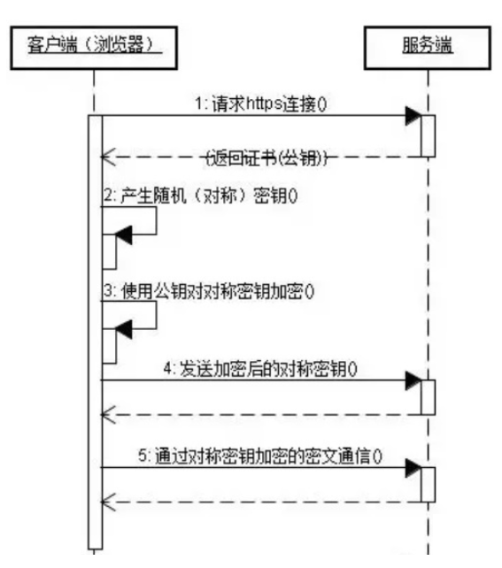

<!-- @format -->

# HTTP 和 HTTPS

- [HTTP 和 HTTPS](#http-和-https)
  - [什么是 HTTP](#什么是-http)
  - [什么是 HTTPS](#什么是-https)
  - [HTTP 与 HTTPS 区别](#http-与-https-区别)
  <!-- more -->

## 什么是 HTTP

HTTP (HyperText Transfer Protocol)，即超文本运输协议，是实现网络通信的一种规范
在实际应用中，HTTP 常被用于在 Web 浏览器和网站服务器之间传递信息，**以明文方式发送内容，不提供任何方式的数据加密**
特点如下：

- 支持客户/服务器模式
- 简单快速：客户向服务器请求服务时，只需传送请求方法和路径。由于 HTTP 协议简单，使得 HTTP 服务器的程序规模小，因而通信速度很快
- 灵活：HTTP 允许传输任意类型的数据对象。正在传输的类型由 Content-Type 加以标记
- 无连接：无连接的含义是限制每次连接只处理一个请求。服务器处理完客户的请求，并收到客户的应答后，即断开连接。采用这种方式可以节省传输时间
- 无状态：HTTP 协议无法根据之前的状态进行本次的请求处理

## 什么是 HTTPS

HTTPS 出现是为了解决 HTTP 不安全的特性，为了保证这些隐私数据能加密传输，让 HTTP 运行安全的 SSL/TLS 协议上，即 `HTTPS = HTTP + SSL/TLS`，通过 SSL 证书来验证服务器的身份，并为浏览器和服务器之间的通信进行加密
SSL 协议位于 TCP/IP 协议与各种应用层协议之间，浏览器和服务器在使用 SSL 建立连接时需要选择一组恰当的加密算法来实现安全通信，为数据通讯提供安全支持

- HTTPS 流程：
  

  1. 客户端发起请求：当你在浏览器中输入一个 HTTPS 网址并按下回车，浏览器就会向服务器发起一个 HTTPS 连接请求。
  2. 服务器响应：服务器收到请求后，会返回一个包含公钥的证书给客户端。这个证书是由证书颁发机构（CA）签发的，包含了网站的公钥、证书颁发机构的信息、证书的有效期等。
  3. 客户端验证证书：客户端收到证书后，会验证证书的有效性。这包括检查证书是否过期，证书的颁发机构是否可信，证书是否被篡改等。如果证书有效，浏览器会显示一个锁的图标。
  4. 生成会话密钥：客户端验证证书后，会使用证书中的公钥加密一个随机生成的会话密钥，并将加密后的会话密钥发送给服务器。
  5. 服务器解密会话密钥：服务器使用自己的私钥解密会话密钥。
  6. 建立安全通信：客户端和服务器都有了相同的会话密钥，就可以使用这个密钥对数据进行加密和解密，从而实现安全通信。

## HTTP 与 HTTPS 区别

1. 协议的安全性：HTTP 是不安全的，因为它以明文方式发送内容，不提供任何方式的数据加密。而 HTTPS 则是安全的，它在 HTTP 的基础上加入了 SSL/TLS 协议，可以对数据进行加密，防止数据被窃取或篡改。
2. 端口：HTTP 默认使用 80 端口，而 HTTPS 默认使用 443 端口。
3. URL 开头：HTTP 的 URL 以 "http://" 开头，而 HTTPS 的 URL 以 "https://" 开头。
4. 证书：HTTPS 需要到 CA（Certificate Authority，证书颁发机构）申请证书，一般免费证书较少，因而需要一定费用。
5. 网络速度：由于 HTTPS 需要进行加密和解密操作，所以在网络传输速度上，HTTPS 会比 HTTP 慢一些。但这个差异对于用户来说，几乎是感觉不到的。
6. SEO：从搜索引擎优化（SEO）的角度来看，Google 等搜索引擎更倾向于排名使用 HTTPS 的网站。
