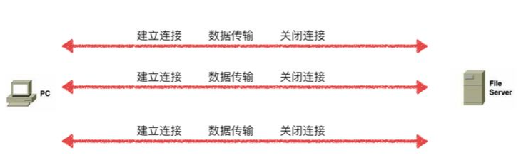
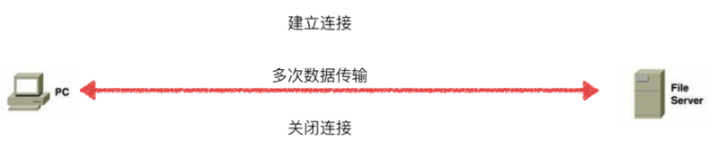
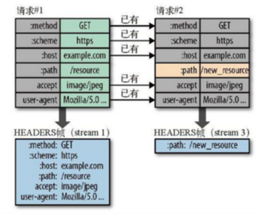
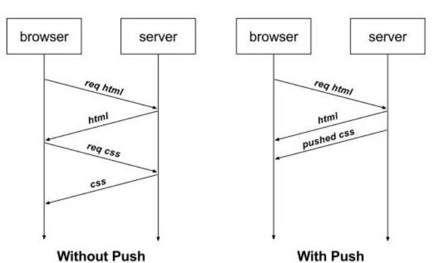

<!-- @format -->

# HTTP1.0/1.1/2.0 的区别

## HTTP1.0

`HTTP 1.0`浏览器与服务器只保持短暂的连接，每次请求都需要与服务器建立一个`TCP`连接

服务器完成请求处理后立即断开`TCP`连接，服务器不跟踪每个客户也不记录过去的请求，每次与服务器交互，都需要新开一个连接

## HTTP1.1

在`HTTP1.1`中，默认支持长连接`（Connection: keep-alive）`(使用`Connection: keep-alive`头部字段)，即在一个`TCP`连接上可以传送多个`HTTP`请求和响应，允许客户端不用等待上一次请求结果返回，就可以发出下一次请求，减少了建立和关闭连接的消耗和延迟  
**建立一次连接，多次请求均由这个连接完成**

但是，同一个`TCP`连接里面，**所有的数据通信是按次序进行的**，服务器只有处理完一个请求，才会接着处理下一个请求。如果前面的处理特别慢，后面就会有许多请求排队等着

## HTTP2.0

`HTTP2.0`性能上有很大的提升，添加了以下特性：

### 多路复用

`HTTP2`复用`TCP`连接，在一个连接里，客户端和浏览器都可以同时发送多个请求或回应，而且不用按照顺序一一对应，这样就避免了”队头堵塞”

### 二进制分帧

`HTTP2`采用二进制格式传输数据，而非`HTTP 1.x`的文本格式，解析起来更高效，**将请求和响应数据分割为更小的帧，并且它们采用二进制编码**

`HTTP2`中，同域名下所有通信都在单个连接上完成，该连接可以承载任意数量的双向数据流

每个数据流都以消息的形式发送，而消息又由一个或多个帧组成。多个帧之间可以乱序发送，根据帧首部的流标识可以重新组装，这也是多路复用同时发送数据的实现条件

### 首部压缩

`HTTP2` 在客户端和服务器端使用“首部表”来跟踪和存储之前发送的键值对，首部表在 HTTP/2 的连接存续期内始终存在，由客户端和服务器共同渐进地更新，对于相同的数据，不再通过每次请求和响应发送  
例如：下图中的两个请求， 请求一发送了所有的头部字段，第二个请求则只需要发送差异数据，这样可以减少冗余数据，降低开销

### 服务器推送

`HTTP2`引入服务器推送，允许服务端推送资源给客户端  
服务器会顺便把一些客户端需要的资源一起推送到客户端，免得客户端再次创建连接发送请求到服务器端获取

<!-- @format -->
