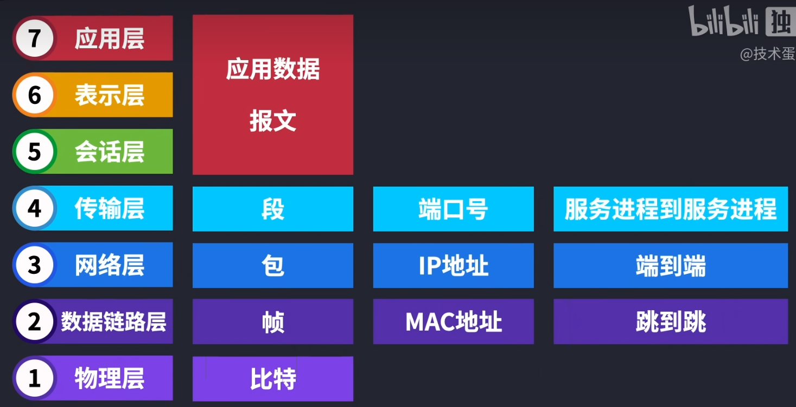
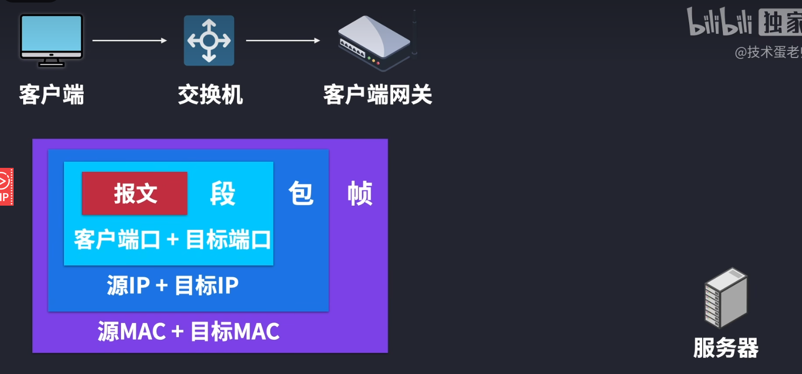

<!-- @format -->

# OSI 七层模型

## 七层模型的详细介绍

### 物理层（Physical Layer）

负责管理计算机通信设备和网络媒体之间的互通

- 功能：负责物理连接的建立、维护和断开，传输原始的比特流。

- 协议和设备：网线、光纤、集线器、交换机、调制解调器等。

### 数据链路层（Data Link Layer）

定义了在单个链路层上如何传输数据

- 功能：提供可靠的数据传输，进行帧的封装和解封装（封装的时候会加上`MAC`地址），错误检测和纠正。

- 协议和设备：以太网（Ethernet）、MAC 地址、交换机、桥接器等。

### 网络层（Network Layer）

规定网络地址的协议，就做`ip`协议

- 功能：负责路径选择和逻辑地址（`IP`地址）的管理，实现数据包的路由和转发。

- 协议和设备：`IP（Internet Protocol）`、路由器、`ICMP（Internet Control Message Protocol）`等。

### 传输层（Transport Layer）

定义传输数据的协议端口号，以及流控和差错校验。

- 功能：提供端到端的通信服务，确保数据的完整性和可靠传输，进行流量控制和错误恢复。

- 协议和设备：`TCP（Transmission Control Protocol）`、`UDP（User Datagram Protocol）`等。

### 会话层（Session Layer）

确保在通信双方之间建立一个逻辑连接，并在会话结束时正确关闭连接。提供数据流同步、决定哪个设备可以在特定时间发送数据、在会话中断时，恢复会话状态等功能

- 功能：管理会话和连接，建立、维护和终止通信会话。

- 协议和设备：`NetBIOS`、`RPC（Remote Procedure Call）`等。

### 表示层（Presentation Layer）

将接收到的数据翻译成二进制数组成的计算机语言，并对数据进行压缩和解压、数据加密和解密等工作

- 功能：数据的表示、加密和解密、压缩和解压缩，确保数据格式的兼容性。

- 协议和设备：`SSL/TLS`、`JPEG`、`MPEG`、`ASCII`、`EBCDIC` 等。

### 应用层（Application Layer）

网络服务与最终用户的一个接口。人机交互窗口，把人的语言输入到计算机当中。

- 功能：提供网络服务和应用程序接口，直接面向用户。

- 协议与设备：`HTTP`、`DNS`、`FTP`、`SMTP`、`Telnet`、`SNMP` 等。

## 模型数据总结

- 各层的数据名称及地址如下：
  
- 信息封装
  

<!-- @format -->
