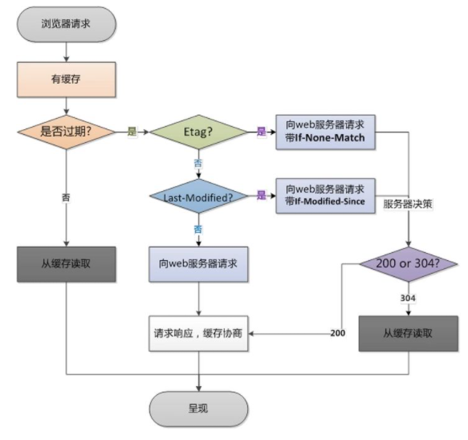

<!-- @format -->

# HTTP 常见的请求头和响应头与使用场景

写在前面：平常很明显经常使用 HTTP 请求，但具体请求头和响应头了解还是不够。

- [HTTP 常见的请求头和响应头与使用场景](#http-常见的请求头和响应头与使用场景)
  - [什么是 http 消息头](#什么是-http-消息头)
  - [常见请求头](#常见请求头)
  - [常见响应头](#常见响应头)
  - [协商缓存与强缓存](#协商缓存与强缓存)
  - [强缓存](#强缓存)
  - [协商缓存](#协商缓存)

<!--more-->

## 什么是 http 消息头

客户端请求（Request）或服务器响应（Response）时传递的，**位请求或响应的第一行**，HTTP 消息体（请求或响应的内容）是其后传输。HTTP 消息头，以明文的字符串格式传送，是以冒号分隔的键/值对，如：Accept-Charset: utf-8，每一个消息头最后以回车符(CR)和换行符(LF)结尾。  
HTTP 头部字段可以自己根据需要定义，因此可能在 Web 服务器和浏览器上发现非标准的头字段

- 请求头示例：

  ```http

  GET /home.html HTTP/1.1 //请求行，表示这是一个使用 HTTP/1.1 协议的 GET 请求，请求的资源是 /home.html
  Host: developer.mozilla.org //表示请求的主机名
  User-Agent: Mozilla/5.0 (Macintosh; Intel Mac OS X 10.9; rv:50.0) Gecko/20100101 Firefox/50.0 //表示发出请求的用户代理的信息，这里是 Firefox 浏览器。
  Accept: text/html,application/xhtml+xml,application/xml;q=0.9,*/*;q=0.8  //表示客户端接受的 MIME 类型, q 参数表示优先级，值越大优先级越高。*/*;q=0.8 表示客户端可以接受任何类型的响应，但优先级较低
  Accept-Language: en-US,en;q=0.5 //表示客户端接受的语言
  Accept-Encoding: gzip, deflate, br //表示客户端接受的编码方式
  Referer: https://developer.mozilla.org/testpage.html //表示发出请求的页面的 URL
  Connection: keep-alive //表示连接应保持活动状态，以便进行后续请求
  Upgrade-Insecure-Requests: 1 //表示客户端希望使用更安全的协议进行连接
  If-Modified-Since: Mon, 18 Jul 2016 02:36:04 GMT //表示如果自指定日期以来资源已被修改，则获取资源
  If-None-Match: "c561c68d0ba92bbeb8b0fff2a9199f722e3a621a" //表示如果 ETag（资源的版本标记）没有改变，则获取资源
  Cache-Control: max-age=0 //表示客户端希望获取的是最新的资源，不接受缓存的资源

  ```

## 常见请求头

- `Accept` : 用来告知服务器，客户端能够处理的媒体类型，可以包含多个媒体类型，用逗号分隔(`Accept: text/html` ：这表示客户端希望接收 HTML 格式的响应)

- `Accept-Charset` : 客户端能够理解的字符集。(`Accept-Charset:` utf-8)

- `Accept-Encoding：`客户端能够处理的编码方式，如 gzip, deflate
- `Accept-Language：`客户端的自然语言偏好
- `Authorization：`用于超文本传输协议的认证的认证信息
- `Cache-Control：`指定请求和响应遵循的缓存机制
- `Connection：`表示是否需要持久连接
- `Cookie：`服务器之前发送的 `cookie`
- `Content-Length：`请求体的长度
- `Content-Type：`请求体的 MIME 类型
- `Host：`请求的服务器的 URL
- `If-Modified-Since：`如果指定的日期/时间之后资源被修改则获取资源
- `If-Match：`发送的请求只有在目标资源的当前 ETag 与给定的 ETag 匹配时才会被处理 （用于防止“丢失更新”问题）
- `If-None-Match：`如果资源的 ETag 没有改变，则获取资源
- `Referer：`发出请求的页面的地址
- `User-Agent：`发出请求的用户代理的信息
- `Upgrade-Insecure-Requests：`提示服务器客户端愿意升级到更安全的连接

## 常见响应头

- `Access-Control-Allow-Origin：`指定哪些网站可以进行跨域资源共享

- `Access-Control-Allow-Methods：`指定允许哪些 HTTP 方法
- `Access-Control-Allow-Credentials：`指定是否允许发送 Cookie
- `Cache-Control：`指定请求和响应遵循的缓存机制
- `Content-Type：`响应体的 MIME 类型
- `Content-Length：`响应体的长度
- `Content-Encoding：`响应体的编码方式，如 gzip
- `Connection：`指定 TCP 连接的类型
- `ETag：`提供资源的标识值，用于判断资源是否已被修改
- `Refresh：`用于重定向或在新资源被创建时刷新页面

## 协商缓存与强缓存

## 强缓存

强缓存不会向服务器发送请求，直接从缓存中读取资源。  
在 Chrome 控制台的 Network 选项中，可以看到该请求的 Size 显示为 from disk cache 或 from memory cache。  
强缓存由 HTTP 头信息中的 `Expires` 和 `Cache-Control` 两个字段控制

- `Expires：` 这个字段的值是一个日期，表示资源的过期时间。如果请求的时间小于这个时间，浏览器就直接使用缓存的资源，不会向服务器发送请求。但是`Expires`受到本地时间的影响，如果本地时间被修改，可能会导致缓存失效
- `Cache-Control：` 这个字段的值可以是多个指令，常见的有 max-age、no-cache、no-store、public、private 等。其中 max-age 指定了资源的最大有效时间，单位是秒。如果从缓存中获取资源的时间小于这个时间，浏览器就直接使用缓存的资源，不会向服务器发送请求。Cache-Control 的优先级高于 Expires。

## 协商缓存

协商缓存会先向服务器发送请求，询问资源是否有更新。如果没有更新，服务器会返回 304 状态码，告诉浏览器继续使用缓存。
如果有更新，服务器会返回新的资源和 200 状态码。在 Chrome 控制台的 Network 选项中，可以看到该请求的 Size 显示为 304。  
协商缓存由 HTTP 头信息中的 `Last-Modified/If-Modified-Since` 和 `ETag/If-None-Match` 两对字段控制。

- `Last-Modified/If-Modified-Since：` 服务器在返回资源时，会在 HTTP 响应头中添加 `Last-Modified` 字段，该字段的值表示资源的最后修改时间。当浏览器再次请求这个资源时，会在请求头中添加 `If-Modified-Since` 字段，其值为上次返回的 `Last-Modified` 的值。服务器会比较这两个时间，如果相同，说明资源没有变化，服务器会返回 `304 Not Modified` 状态码，浏览器就直接使用缓存的资源；如果不同，说明资源已经改变，服务器会返回新的资源和 `200 OK` 状态码。

- `ETag/If-None-Match：` ETag 是服务器为每个资源生成的一个唯一标识符，当资源发生变化时，ETag 也会改变。服务器在返回资源时，会在 HTTP 响应头中添加 ETag 字段。当浏览器再次请求这个资源时，会在请求头中添加 `If-None-Match` 字段，其值为上次返回的 ETag 的值。服务器会比较这两个值，如果相同，说明资源没有变化，服务器会返回 `304 Not Modified` 状态码，浏览器就直接使用缓存的资源；如果不同，说明资源已经改变，服务器会返回新的资源和 `200 OK` 状态码。


