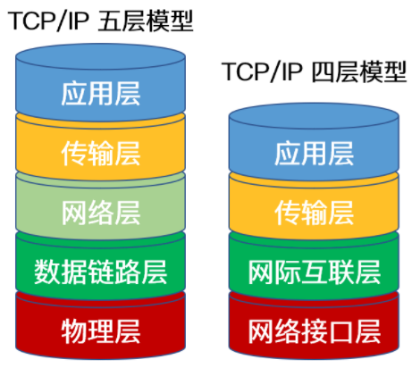

<!-- @format -->

# TCP/IP 协议

## 什么是 TCP/IP 协议

TCP/IP，传输控制协议/网际协议，是指能够在多个不同网络间实现信息传输的协议簇，其中：

- TCP（传输控制协议）：一种面向连接的、可靠的、基于字节流的传输层通信协议
- IP（网际协议）：用于封包交换数据网络的协议

TCP/IP 协议不仅仅指的是 TCP 和 IP 两个协议，而是指一个由 FTP、SMTP、TCP、UDP、IP 等协议构成的协议簇

## TCP/IP 体系划分

TCP/IP 协议族按层次可以划分为五层体系或者四层体系
五层体系的协议结构是综合了 OSI 和 TCP/IP 优点的一种协议，包括应用层、传输层、网络层、数据链路层和物理层，但只是为介绍网络原理而设计的，**实际应用还是 TCP/IP 四层体系结构**

### 应用层

- 应用层负责处理特定的网络应用程序，直接与用户交互，提供网络服务。
- 应用层中主要协议有域名系统`DNS`，文件传输协议`FTP`，远程终端协议`TELNET`，超文本传输协议`HTTP`，简单邮件传送协议`SMTP`，邮件读取协议 `POP3`和 `IMAP`，动态主机配置协议`DHCP`，简单网络管理协议`SNMP`。

### 传输层

- 传输层负责端到端的数据传输和连接管理

- 传输层主要协议包括`TCP`（传输控制协议）和`UDP`（用户数据报协议）。

### 网络层

- 网络层负责为分组网络中的不同主机提供通信服务，并通过选择合适的路由将数据传递到目标主机，在发送数据时，网络层把运输层产生的报文段或用户数据封装成分组或包进行传送
- 网络层主要协议是`IP`（互联网协议），包括`IPv4`和`IPv6`，还包括`ICMP`（互联网控制消息协议）和`ARP`（地址解析协议）

### 链路层（网络接口层）

- 数据链路层是 TCP/IP 协议栈中的最底层协议，负责物理网络上的数据传输，包括数据链路层和物理层，涉及网络接口卡、驱动程序、网络交换机等。
- 主要协议包括`Ethernet`（以太网）、`PPP`（点对点协议）等。
<!-- @format -->
