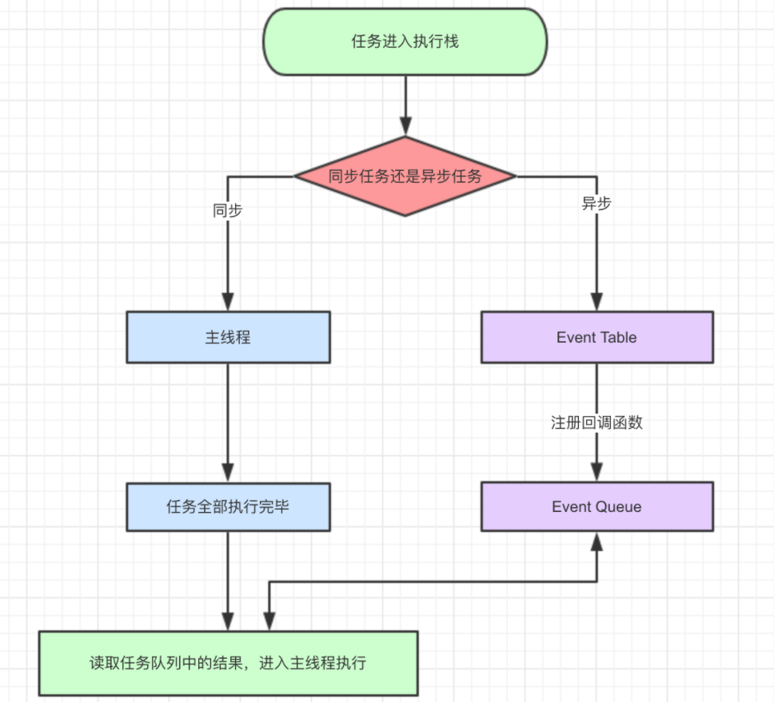
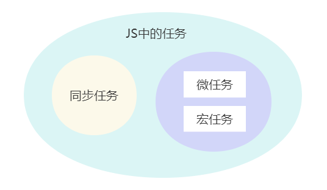
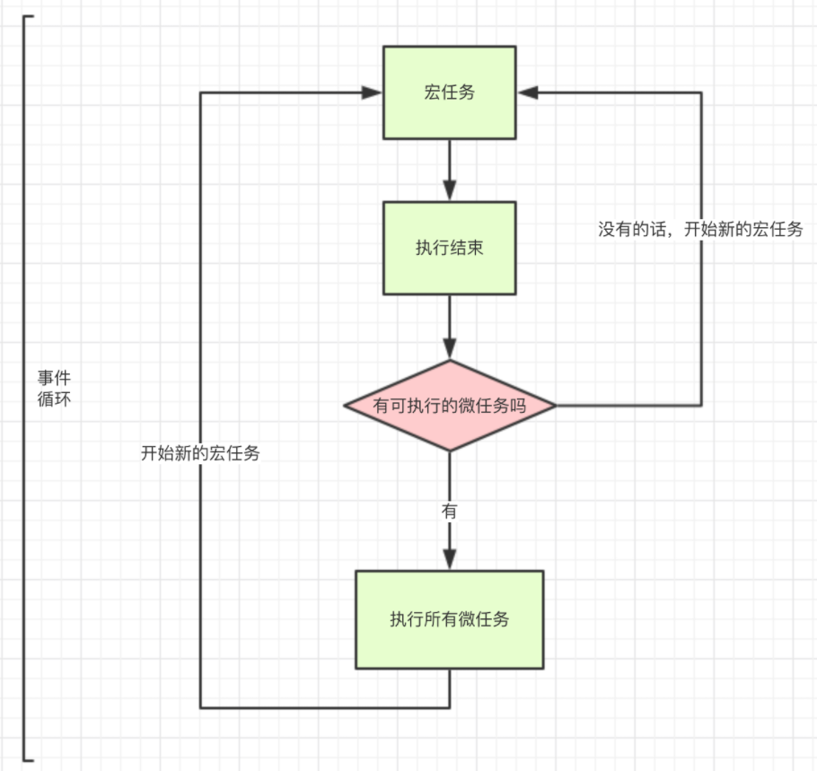

<!-- @format -->

# JavaScript 的事件循环机制与宏任务和微任务

- [JavaScript 的事件循环机制与宏任务和微任务](#javascript-的事件循环机制与宏任务和微任务)
  - [JavaScript 的特点 -- 单线程](#javascript-的特点----单线程)
  - [JS 如何解决单线程阻塞问题 -- 同步任务与异步任务](#js-如何解决单线程阻塞问题----同步任务与异步任务)
  - [宏任务与微任务](#宏任务与微任务)
  - [宏任务微任务执行顺序 -- 先同步再异步，异步中先微任务，再宏任务](#宏任务微任务执行顺序----先同步再异步异步中先微任务再宏任务)
  - [async 与 await](#async-与-await)
  - [async](#async)
  - [await](#await)
  - [Promise 对象](#promise-对象)
  - [一些示例题目](#一些示例题目)
  - [示例 1：](#示例-1)
  - [示例 2：](#示例-2)
  - [示例 3：](#示例-3)
  - [奇怪的知识点](#奇怪的知识点)

## JavaScript 的特点 -- 单线程

JavaScript 的主要用途是与用户互动，以及操作 DOM。这决定了它只能是单线程，否则会带来很复杂的同步问题。比如，假定 JavaScript 同时有两个线程，一个线程在某个 DOM 节点上添加内容，另一个线程删除了这个节点，这时浏览器应该以哪个线程为准？

因此，JavaScript 语言的一大特点就是**单线程**，即同一个时间只能做一件事。

## JS 如何解决单线程阻塞问题 -- 同步任务与异步任务

因为浏览器是多线程的，当 JS 需要执行异步任务时，**浏览器会另外启动一个线程去执行该任务**。

“JS 是单线程的”指的是执行 JS 代码的线程只有一个，是浏览器提供的 JS 引擎线程（主线程）。
浏览器中还有定时器线程和 HTTP 请求线程等，这些线程主要不是来跑 JS 代码的。

JS 中任务可以分为：

- 同步任务：在主线程上排队执行的任务，只有前一个任务执行完毕，才能执行后一个任务
- 异步任务：不进入主线程、而进入"任务队列"（task queue）的任务，只有"任务队列"通知主线程，某个异步任务可以执行了，该任务才会进入主线程执行

同步异步的运行流程：


同步任务进入主线程，即主执行栈，异步任务进入任务队列，主线程内的任务执行完毕为空，会去任务队列读取对应的任务，推入主线程执行。上述过程的不断重复就事件循环

## 宏任务与微任务

单纯将事件分为同步和异步并不准确，还要将异步任务区分为宏任务与微任务


- 宏任务：是指在当前执行栈执行完毕后立即执行的任务。由**宿主（浏览器、Node）发起的**，**进程的切换定是宏任务，因为需要花费大量的资源**
  - `script`标签中的代码
  - `setTimeou`t：在指定的延时之后执行一个函数或指定的代码块
  - `setInterval`：按照指定的时间间隔重复执行一个函数或指定的代码块
  - `setImmediate`：在 Node.js 环境中，此方法用于在当前事件循环结束后执行一个脚本，这个 API 不属于 JavaScript 规范，但在 Node.js 中被实现
  - `requestAnimationFrame`：浏览器特有的 API，用于在下次重绘之前执行动画相关的代码
  - I/O 操作：如文件读写、网络请求等，在完成操作后，其回调函数被加入到宏任务队列中
  - UI 渲染：浏览器环境中的 UI 渲染通常也被视为宏任务，浏览器会在合适的时机对页面进行渲染
- 微任务：是在当前任务结束后立即执行的任务，但是在下一个宏任务开始之前。由**JS 引擎发起的**，线程的切换是微任务，因为只需要在同一个进程中切换就行
  - `Promise`的回调：包括`.then、.catch`和`.finally`方法提供的回调函数
  - `MutationObserver的`回调：一个浏览器 API，用于监视 DOM 变更，当 DOM 变化时触发的回调函数作为微任务执行
  - `process.nextTick`：这是 Node.js 特有的 API，用于将回调函数放到事件循环的下一个迭代中尽可能早地执行
  - `queueMicrotask`：这是一个允许开发者将函数显式加入到微任务队列中的方法，使得它在当前宏任务完成后、下一轮宏任务开始前执行

## 宏任务微任务执行顺序 -- 先同步再异步，异步中先微任务，再宏任务

- 执行一个宏任务，如果遇到微任务就将它放到微任务的事件队列中
- 当前宏任务执行完成后，会查看微任务的事件队列，然后将里面的所有微任务依次执行完



更详细的执行流程：

1. **JavaScript 引擎开始执行脚本**  
   当 JavaScript 引擎开始执行脚本时，它首先会**处理整个脚本作为一个宏任务**。这包括变量声明、函数声明以及同步执行的代码。
2. **执行宏任务**  
   在当前宏任务执行期间，可以进行异步操作，如设置 setTimeout、setInterval、发起异步请求等。
   这些操作将相应的回调函数排队为新的宏任务，它们将在当前宏任务完成后的将来某个时间点执行。
3. **宏任务执行完成**
   一旦当前宏任务 **包括同步代码和该宏任务中产生的同步代码** 执行完成，JavaScript 引擎会查看是否有微任务需要执行
4. **执行所有微任务**
   在进入下一个宏任务之前，JavaScript 引擎会处理所有的微任务队列。**如果执行微任务期间产生了更多的微任务，这些新的微任务也会被添加到队列中并在这个阶段执行，直到微任务队列为空。**
5. **渲染 UI（如果需要）**
6. **开始下一个宏任务**

## async 与 await

async 是异步的意思，await 则可以理解为 async wait。所以可以理解 async 就是用来声明一个异步方法，而 await 是用来等待异步方法执行

## async

async 函数返回一个 promise 对象，下面两种方法是等效的

```JavaScript
function f() {
    return Promise.resolve('TEST');
}

// asyncF is equivalent to f!
async function asyncF() {
    return 'TEST';
}
```

## await

1. 正常情况下，**await 命令后面是一个 Promise 对象**，返回该对象的结果。如果不是 Promise 对象，就直接返回对应的值
2. 不管 await 后面跟着的是什么，await 都会阻塞后面的代码

## Promise 对象

`Promise` 是 JavaScript 中的一个对象，用于处理异步操作。它代表了一个最终可能会完成（resolve）或者失败（reject）的操作，以及其结果值。  
Promise 对象处于以下三种状态之一：

- Pending（待定）：初始状态，既不是成功，也不是失败状态。
- Fulfilled（已成功）：表示操作成功完成。
- Rejected（已失败）：表示操作失败。
  Promise 对象是一个返回值，这个返回值在 Promise 被创建时可能是未知的。它允许你**将异步操作的处理程序附加到成功或失败的结果上**，而不是立即返回最终值

创建`Promise` 对象,可以使用`.then`方法来安排当`Promise`成功时的回调函数，或者使用 `.catch `方法来安排当`Promise`失败时的回调函数。
示例：

```JavaScript
let promise = new Promise((resolve, reject) => {
    // 这里是异步操作
    let operationSuccessful = true; // 假设操作成功

    if (operationSuccessful) {
        resolve('Operation was successful.'); // 成功时调用 resolve 并传入结果值
    } else {
        reject('There was an error.'); // 失败时调用 reject 并传入错误信息
    }
});

promise
    .then(value => {
        // 当 Promise 成功时，这个函数会被调用
        console.log('Success:', value);
    })
    .catch(error => {
        // 当 Promise 失败时，这个函数会被调用
        console.log('Error:', error);
    });
```

## 一些示例题目

## 示例 1：

```JavaScript
setTimeout(function () {
    new Promise(function (resolve, reject) {
        console.log('异步宏任务promise');
        resolve();
    }).then(function () {
        console.log('异步微任务then')
    })
    console.log('异步宏任务');
}, 0)
new Promise(function (resolve, reject) {
    console.log('同步宏任务promise');
    resolve();
}).then(function () {
    console.log('同步微任务then')
})
console.log('同步宏任务')
```

- 代码输出:

| 输出顺序 | 输出内容           |
| -------- | ------------------ |
| 1        | 同步宏任务 promise |
| 2        | 同步宏任务         |
| 3        | 同步微任务 then    |
| 4        | 异步宏任务 promise |
| 5        | 异步宏任务         |
| 6        | 异步微任务 then    |

- 代码解析：

1. 执行同步代码。**new Promise 是同步执行的**，所以 "同步宏任务 promise" 和 "同步宏任务" 会首先打印出来。
2. 执行微任务队列中的任务。Promise.then 是微任务，所以 "同步微任务 then" 会接着打印出来。
3. 执行下一个宏任务。setTimeout 的回调函数是宏任务，所以 "异步宏任务 promise" 和 "异步宏任务" 会接着打印出来。
4. 执行微任务队列中的任务。Promise.then 是微任务，所以 "异步微任务 then" 会最后打印出来。

## 示例 2：

```JavaScript
setTimeout(() => {
    console.log('异步1任务time1');
    new Promise(function (resolve, reject) {
        console.log('异步1宏任务promise');
        setTimeout(() => {
            console.log('异步1任务time2');
        }, 0);
        resolve();
    }).then(function () {
        console.log('异步1微任务then')
    })
}, 0);
console.log('主线程宏任务');
setTimeout(() => {
    console.log('异步2任务time2');

}, 0);
new Promise(function (resolve, reject) {
    console.log('宏任务promise');
    // reject();
    resolve();
}).then(function () {
    console.log('微任务then')
}).catch(function () {
    console.log('微任务catch')
})
console.log('主线程宏任务2');
```

- 代码输出:

| 输出顺序 | 输出内容              |
| -------- | --------------------- |
| 1        | 主线程宏任务          |
| 2        | 宏任务 promise        |
| 3        | 主线程宏任务 2        |
| 4        | 微任务 then           |
| 5        | 异步 1 任务 time1     |
| 6        | 异步 1 宏任务 promise |
| 7        | 异步 1 微任务 then    |
| 8        | 异步 2 任务 time2     |
| 9        | 异步 1 任务 time2     |

- 代码解析：

1. 执行同步代码。console.log('主线程宏任务')、console.log('宏任务 promise') 和 console.log('主线程宏任务 2') 是同步执行的。
2. 执行微任务队列中的任务。Promise.then 是微任务，所以 "微任务 then" 会接着打印出来。
3. 执行下一个宏任务。setTimeout 的回调函数是宏任务，所以 "异步 1 任务 time1" 和 "异步 1 宏任务 promise" 会接着打印出来。
4. 执行下一个宏任务。setTimeout 的回调函数是宏任务，所以 "异步 2 任务 time2" 会接着打印出来。
5. 执行微任务队列中的任务。Promise.then 是微任务，所以 "异步 1 微任务 then" 会接着打印出来。
6. 执行下一个宏任务。setTimeout 的回调函数是宏任务，所以 "异步 1 任务 time2" 会最后打印出来。

## 示例 3：

```JavaScript
//代码1：
for (var i = 0; i < 10; i++) {
    setTimeout(() => {
        console.log(i); // 打印出 10
    }, 1000);
}
//代码2：
for (let i = 0; i < 10; i++) {
    setTimeout(() => {
        console.log(i); // 打印出 0 到 9
    }, 1000);
}
```

- 代码解析：

1. 使用 var 声明的 i 是**全局作用域或函数作用域（在这个例子中是全局作用域）**。当 setTimeout 的回调函数在一秒后执行时，for 循环已经完成，i 的值已经变成了 10。所以，这段代码会打印出十个 10。
2. 使用 let 声明的 i 是**块级作用域**。每次迭代 for 循环时，都会创建一个新的 i 变量，这个变量只在当前的循环迭代中有效。所以，当 setTimeout 的回调函数在一秒后执行时，它会记住它所在的循环迭代中 i 的值。这段代码会按顺序打印出 0 到 9。

## 奇怪的知识点

- ajax 请求本身不是宏任务或微任务，它是一个异步操作。当你发送一个 ajax 请求时，它会在后台运行，不会阻塞当前的 JavaScript 执行

- axios 是一个基于 Promise 的 HTTP 客户端，用于浏览器和 node.js。当你使用 axios 发送请求时，它返回一个 Promise 对象。

- Promise 对象本身并不是宏任务或微任务，但它的 .then() 或 .catch() 方法中的回调函数会被添加到微任务队列中，等待当前宏任务完成后立即执行。

::: tip 参考链接
<https://blog.csdn.net/qq_63534905/article/details/127789918>  
<https://zhuanlan.zhihu.com/p/580956436>  
<https://vue3js.cn/interview/JavaScript/event_loop.html>
:::
