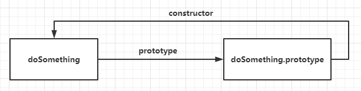
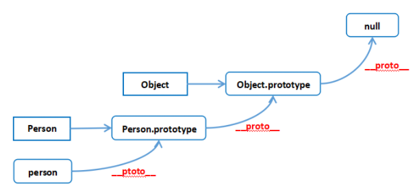

<!-- @format -->

# JavaScript 原型与原型链

- [JavaScript 原型与原型链](#javascript-原型与原型链)
  - [JS 原型](#js-原型)
  - [JS 中的构造函数](#js-中的构造函数)
  - [原型对象](#原型对象)
  - [原型链](#原型链)
  - [prototype 和 proto](#prototype-和-proto)
  - [原型链](#原型链-1)
  - [一些题目](#一些题目)

<!--more-->

## JS 原型

`JS`的复杂类型都是对象类型的（Object），js 是一种脚本语言，不是面向对象的。所以如何涉及继承机制是个问题。  
 `JavaScript` 常被描述为一种基于原型的语言（每个对象拥有一个原型对象）
当试图访问一个对象的属性时，**它不仅仅在该对象上搜寻，还会搜寻该对象的原型**，以及该对象的原型的原型，依次层层向上搜索，直到找到一个名字匹配的属性或到达原型链的末尾

## JS 中的构造函数

JS 中没有类（Class）这个概念，所以 JS 的设计者使用了构造函数来实现继承机制
注： ES6 中的 class 可以看作一个语法糖，它的绝大部分的功能，ES5 都能做到。新的 class 写法只是让原型的写法更加的清晰、更像面向对象编程的语法而已

- JS 通过构造函数来生成实例：

```JS
  // 构造函数
  function Person(name,age){
      this.name = name;
      this.age = age;
  }
  // 创建实例
  const lili = new Person('lili',18)
```

在构造函数中通过 this 赋值的属性或者方法，是每个实例的实例属性以及实例方法，**无法共享公共属性**。所以又设计出了一个原型对象，**来存储这个构造函数的公共属性以及方法**

## 原型对象

JS 的每个函数在创建的时候，都会生成一个属性`prototype`，这个属性指向一个对象，**这个对象就是此函数的原型对象**。该原型对象中有个属性为`constructor`，指向该函数。这样原型对象和它的函数之间就产生了联系。


## 原型链

原型对象也可能拥有原型，并从中继承方法和属性，一层一层、以此类推。这种关系常被称为原型链 (prototype chain)，它解释了为何一个对象会拥有定义在其他对象中的属性和方法

- 代码示例：

```JS
  // 构造函数
function Person(name,age){
    this.name = name;
    this.age = age;
}

// 原型对象上的公共方法
Person.prototype.say =  function (word)  {
    // 模板字符串
    console.log(`${this.name}说：${word}`)
}

// 创建实例
const lili = new Person('lili',18);
// 返回布尔值，指对象自身属性中是否有指定属性
console.log("hasOwnProperty",lili.hasOwnProperty('say')) // false 说明不是定义再本身上的

lili.say('hello world') // 可以调用公共方法
```

JS 的原型查找机制，把原来定义在实例上的方法，放到原型对象上去，通过构造函数的 new 操作，**会把原型对象赋值给实例的**proto**属性**，那么当使用返回的实例去调用某一个方法的时候，**如果实例本身上没有，就去自动去实例的**proto**上去查找**，这样达到方法的复用，减少内存开销。

## prototype 和 proto

- **prototype**

  这个属性主要存在于**函数对象**中。每个函数都有一个 prototype 属性，它默认指向一个由 constructor 属性组成的对象。当这个函数被作为构造函数（通过 new 关键字）来创建新对象时，新对象的 **proto** 属性就会被赋值为构造函数的 prototype 对象。这就是新对象如何继承构造函数 prototype 中的属性和方法的方式。

  ```JS
  function Person(name) {
  this.name = name;
  }

  Person.prototype.sayHello = function() {
    console.log(`Hello, my name is ${this.name}`);
  }

  let alice = new Person('Alice');
  alice.sayHello();  // 输出：Hello, my name is Alice
  ```

- **proto**（指向原型对象的 prototype）

  这个属性存在于几乎所有的 JavaScript 对象（null、undefined、基本类型、Math、JSON、宿主对象中没有）中，是实例对象指向原型对象的指针，隐式原型，是每一个对象都有的属性

## 原型链

原型对象也可能拥有原型，并从中继承方法和属性，一层一层、以此类推。这种关系常被称为原型链 (prototype chain)，它解释了为何一个对象会拥有定义在其他对象中的属性和方法  
 在对象实例和它的构造器之间建立一个链接（它是**proto**属性，是从构造函数的 prototype 属性派生的），之后通过上溯原型链，在构造器中找到这些属性和方法  
 

## 一些题目

- 题目一：

  ```JS
  function F() { this.a = 1; }
  var obj = new F();
  console.log(obj.__proto__);
  console.log(obj.__proto__.__proto__);
  console.log(obj.__proto__.__proto__.__proto__);
  ```

  输出：

  ```JS
    // F.prototype
    // Object.prototype
    // null
  ```

  解释：

  1. `obj.__proto__` 是 `F.prototype`。当我们使用 new 关键字和构造函数 F 创建一个新的对象 obj 时，obj 的内部属性 `[[Prototype]]`（可以通过` __proto__` 属性访问）会被设置为构造函数 F 的 prototype 对象

  2. `obj.__proto__.__proto__` 是 `Object.prototype`。因为 `F.prototype` 是一个对象，它的 `__proto__` 链接到 `Object.prototype`。

  3. `obj.__proto__.__proto__.__proto__` 是 `null`。`Object.prototype` 是原型链的末端，它的`__proto__`是 `null`。

- 题目二：

  ```JS
  Object.prototype.a = 1;
  var obj = {
      b: undefined
  };

  console.log(obj.a);//1
  console.log('b' in obj);//true  //能找到处于原型链里面的bar属性

  console.log(obj.hasOwnProperty('a'));//false 不是自身的属性
  console.log(obj.hasOwnProperty('b'));//true  是自身的属性
  ```

- 题目三：

  ```JS
  function A () {
  }
  A.prototype.n = 1;

  var b = new A();//b实例对象已经建立原型连接

  //原型对象指向被改变，不会切断b实例对象的
  A.prototype = {
      n: 2,
      m: 3
  }
  var c = new A();//c实例对象将根据新的原型建立连接

  console.log(b.n, b.m); //1 undefined  这里拿到是改变prototype之前的
  console.log(c.n, c.m); //2 3		这里拿到是改变prototype之后的
  ```
