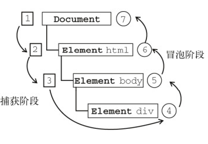

<!-- @format -->

# 事件模型与事件代理

- [事件模型与事件代理](#事件模型与事件代理)
  - [事件与事件流](#事件与事件流)
    - [事件捕获](#事件捕获)
    - [事件冒泡](#事件冒泡)
  - [事件模型](#事件模型)
    - [原始事件模型](#原始事件模型)
    - [标准事件模型](#标准事件模型)
    - [IE 事件模型](#ie-事件模型)
  - [事件代理](#事件代理)
    - [事件代理适用场景](#事件代理适用场景)

## 事件与事件流

`javascript`中的事件，可以理解就是在`HTML`文档或者浏览器中发生的一种交互操作，使得网页具备互动性， 常见的有加载事件、鼠标事件、自定义事件等
由于`DOM`是一个树结构，如果在父子节点绑定事件时候，当触发子节点的时候，就存在一个顺序问题，这就涉及到了事件流的概念

**事件流都会经历三个阶段：**

- 事件捕获阶段(capture phase)

  - 事件从最外层的祖先元素逐级向下传播到目标元素。
  - 在捕获阶段，如果父元素上有`addEventListener`事件监听器，它会在目标元素触发之前被触发。

- 处于目标阶段(target phase)

  - 事件到达目标元素时触发。
  - 在目标阶段，触发绑定在目标元素的`addEventListener`事件监听器

- 事件冒泡阶段(bubbling phase)

  - 事件从目标元素开始向上传播到最外层的组件元素。
  - 在冒泡阶段，如果父元素上有`addEventListener`事件监听器，它会在目标元素触发之后被触发

  

### 事件捕获

事件捕获阶段从最不具体的元素（通常是 document 对象或 window 对象）开始，然后逐级向下，直到最具体的元素（也就是事件的目标元素）

### 事件冒泡

是一种从下往上的传播方式，由最具体的元素（触发节点）然后逐渐向上传播到最不具体的那个节点（通常是 document 对象或者 window 对象）。

- 示例：

```js
// 创建三个嵌套的 div 元素
let outerDiv = document.createElement("div");
let middleDiv = document.createElement("div");
let innerDiv = document.createElement("div");

outerDiv.appendChild(middleDiv);
middleDiv.appendChild(innerDiv);

// 在捕获阶段处理事件
outerDiv.addEventListener(
  "click",
  function (event) {
    console.log("outer div capture");
  },
  true
);

middleDiv.addEventListener(
  "click",
  function (event) {
    console.log("middle div capture");
  },
  true
);

innerDiv.addEventListener(
  "click",
  function (event) {
    console.log("inner div capture");
  },
  true
);

// 在冒泡阶段处理事件
outerDiv.addEventListener(
  "click",
  function (event) {
    console.log("outer div bubble");
  },
  false
);

middleDiv.addEventListener(
  "click",
  function (event) {
    console.log("middle div bubble");
  },
  false
);

innerDiv.addEventListener(
  "click",
  function (event) {
    console.log("inner div bubble");
  },
  false
);

// 模拟点击 innerDiv
innerDiv.click();
```

输出：

```
outer div capture
middle div capture
inner div capture
inner div bubble
middle div bubble
outer div bubble
```

这个输出展示了事件捕获和事件冒泡的过程。首先，事件从`outerDiv`开始捕获，然后是 `middleDiv`，最后是`innerDiv`。然后，事件开始从`innerDiv`开始冒泡，然后是 `middleDiv`，最后是`outerDiv`。

## 事件模型

在 JavaScript 中，事件模型主要包括以下几个部分：

- **事件监听器（Event Listeners）**

  事件监听器是一个函数，当指定的事件发生时，会调用这个函数。

- **事件对象（Event Objects）**

  当事件发生时，浏览器会创建一个事件对象，并将它传递给事件监听器。事件对象包含了关于事件的详细信息，例如事件的类型、目标元素、发生的时间等。

- **事件类型（Event Types）**

  每个事件都有一个类型，例如 "click"、"mouseover"、"keydown" 等。事件类型决定了事件的行为和事件对象的类型。

- **事件流（Event Flow）**

  事件流描述了事件从发生到被处理的过程。

- **事件代理（Event Delegation）**

  事件代理是一种技术，通过在父元素上设置事件监听器，来处理子元素上的事件。

- **事件取消（Event Cancellation）**

  有些事件是可以被取消的。你可以使用`event.preventDefault`方法来取消事件的默认行为，使用`event.stopPropagation`方法来阻止事件的进一步传播。

事件模型可以分为三种：

- 原始事件模型（DOM0 级）
- 标准事件模型（DOM2 级）
- IE 事件模型（基本不用）

### 原始事件模型

DOM0 级事件模型是最早的事件模型，非常简单。在这个模型中，事件监听器直接作为 DOM 元素的属性添加。

```js
element.onclick = function () {
  console.log("Element was clicked!");
};
```

- 特点：

  - 绑定速度快（但由于绑定速度太快，可能页面还未完全加载出来，以至于事件可能无法正常运行）
  - 只支持冒泡，不支持捕获
  - 同一个类型的事件只能绑定一次

### 标准事件模型

在这个模型中，事件监听器使用`addEventListener`方法添加

```js
// 定义事件监听器
function handleClick(event) {
  console.log("Element was clicked!");
}
//添加事件
element.addEventListener("click", handleClick);
//移除事件
element.removeEventListener("click", handleClick);
```

- 特点

  - 可以在一个 DOM 元素上绑定多个事件处理器，各自并不会冲突
  - 当第三个参数(`useCapture`)设置为`true`就在捕获过程中执行，反之在冒泡过程中执行处理函数

### IE 事件模型

在 IE 事件模型中，事件监听器使用`attachEvent`方法添加，使用`detachEvent`方法移除。

```js
// 定义事件监听器
function handleClick() {
  console.log("Element was clicked!");
}

// 添加事件监听器
element.attachEvent("onclick", handleClick);

// 移除事件监听器
element.detachEvent("onclick", handleClick);
```

- 特点
  - 可以在一个 DOM 元素上绑定多个事件处理器，各自并不会冲突
  - 只支持事件冒泡，不支持事件捕获
  - 事件监听器的 this 关键字指向全局对象（通常是 window），而不是触发事件的元素

## 事件代理

事件代理，俗地来讲，就是把一个元素响应事件（`click`、`keydown`......）的函数委托到另一个元素，允许你在一个元素上设置事件监听器，来处理在其子元素上触发的事件。这种技术的优点是可以减少事件监听器的数量，从而提高性能。

- 例子

```js
// 获取父元素
let parent = document.getElementById("parent");

// 在父元素上设置事件监听器
parent.addEventListener("click", function (event) {
  // 检查事件的目标元素
  if (event.target.matches(".child")) {
    console.log("A child element was clicked!");
  }
});
```

### 事件代理适用场景

适合事件委托的事件有：`click`，`mousedown`，`mouseup`，`keydown`，`keyup`，`keypress`

从上面应用场景中，我们就可以看到使用事件委托存在两大优点：

- 减少整个页面所需的内存，提升整体性能
- 动态绑定，减少重复工作

但是使用事件委托也是存在局限性：

- `focus`、`blur` 这些事件没有事件冒泡机制，所以无法进行委托绑定事件

- `mousemove`、`mouseout` 这样的事件，虽然有事件冒泡，但是只能不断通过位置去计算定位，对性能消耗高，因此也是不适合于事件委托的

如果把所有事件都用事件代理，可能会出现事件误判，即本不该被触发的事件被绑定上了事件
