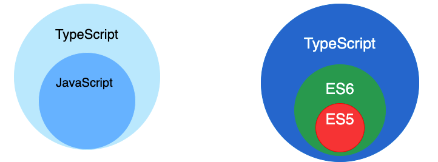

<!-- @format -->

# TypeScript 与 JavaScript 的区别

写在前面：使用 Vue3 后写 ts 比写 js 的时候更多，但是发现每次写 ts 的时候还是采用 js 的方法，虽然知道一点它们的区别，但没有系统的总结过，面试的时候答的也是模模糊糊的，所以还是得总结一下

- [TypeScript 与 JavaScript 的区别](#typescript-与-javascript-的区别)
  - [什么是 TypeScript](#什么是-typescript)
  - [静态类型语言与动态类型语言](#静态类型语言与动态类型语言)
  - [TypeScript 与 JavaScript 的区别](#typescript-与-javascript-的区别-1)
  - [TypeScript 的特性](#typescript-的特性)
  - [总结](#总结)

## 什么是 TypeScript

TypeScript 是一种由微软开发和维护的免费开源编程语言。它是一个**强类型的 JavaScript 超集**，它通过添加静态类型、类、接口和模块等功能来扩展 JavaScript。**可编译为纯 JavaScript**（编译阶段会编译为 js 语言）。


## 静态类型语言与动态类型语言

- 静态类型语言
  静态类型语言**在编译时进行类型检查**。这意味着你在编写代码时必须明确每个变量的类型。  
  如果你试图将错误的类型赋值给变量，编译器会在编译时报错。这可以帮助开发者在代码运行之前发现和修复错误。静态类型语言的例子包括 C++、Java 和 TypeScript。
- 动态类型语言  
  动态类型语言在**运行时进行类型检查**。这意味着你在编写代码时不需要明确每个变量的类型。如果你试图将错误的类型赋值给变量，程序可能会在运行时抛出错误。  
  动态类型语言的优点是编写代码更加灵活和快速，但缺点是可能会在运行时出现类型错误。动态类型语言的例子包括 Python、Ruby 和 JavaScript。

## TypeScript 与 JavaScript 的区别

- `TypeScript` 是 `JavaScript` 的超集，扩展了 `JavaScript` 的语法
- `TypeScript` 可处理已有的 `JavaScript` 代码，并只对其中的 `TypeScript` 代码进行编译
- `TypeScript` 文件的后缀名 `.ts （.ts，.tsx，.dts）`，`JavaScript` 文件是 `.js`

- 在编写`TypeScript`的文件的时候就会自动编译成`js`文件

## TypeScript 的特性

- 静态类型检查
  TypeScript 在编译时进行类型检查，这意味着编写代码时必须明确每个变量的类型。如果试图将错误的类型赋值给变量，编译器会在编译时报错。

- 类型注解  
  你可以在 TypeScript 中为变量、函数参数和函数返回值添加类型注解。类型注解是一种轻量级的文档，它可以帮助你和你的团队理解代码的行为。例如：

```TypeScript
//name类型为string
let name: string = 'World';
//greet返回值类型为string
function greet(name: string): string {
  return `Hello, ${name}`;
}
```

- 联合类型和交叉类型  
  你可以使用联合类型（|）用于表示一个值可以是几种类型之一,交叉类型（&）用于表示一个值同时具有多种类型

```TypeScript
//联合类型
let value: number | string;
value = 1; // OK
value = 'hello'; // OK
value = true; // Error: Type 'boolean' is not assignable to type 'number | string'

//交叉类型
interface A {
  a: number;
}
interface B {
  b: string;
}
let value: A & B = { a: 1, b: 'hello' }; // OK
```

- 类型别名

  类型别名用于给一个类型创建一个新的名字

  ```TypeScript
  type StringOrNumber = string | number;

  let value: StringOrNumber;
  value = 1; // OK
  value = 'hello'; // OK
  ```

- 类型推断和类型断言  
  类型推断是 TypeScript 编译器自动确定变量类型的过程。
  类型断言（Type Assertion）是一种告诉编译器“我知道我在做什么”的方式

  ```TypeScript
  //类型断言尖括号写法
  let someValue: any = "this is a string";
  let strLength: number = (<string>someValue).length;
  //类型断言as写法
  let someValue: any = "this is a string";
  let strLength: number = (someValue as string).length;
  ```

- 接口  
  可以使用接口来定义复杂的类型,用来描述对象的形状，即对象有哪些属性，这些属性的类型是什么。接口也可以用来描述函数的形状，即函数的参数和返回值的类型。

```TypeScript
interface Animal {
  //btw,加问号属于可选属性
  name?: string;
  makeSound(): void;
}

// 使用接口来定义一个对象
let dog: Animal = {
  name: 'Spot',
  makeSound: () => { console.log('Woof!'); }
};

dog.makeSound(); // 输出：Woof!
```

- 类  
  TypeScript 支持面向对象编程的类，包括继承、接口实现等特性。
  **注**：接口只定义了对象的形状，但没有提供实现（即上述的`makeSound`方法的具体代码）。而类既定义了对象的形状，也提供了实现。

```TypeScript
class Animal {
  name: string;

  constructor(name: string) {
    this.name = name;
  }

  makeSound(): void {
    console.log('Generic animal sound!');
  }
}
// 使用类来创建一个对象
let cat = new Animal('Whiskers');
cat.makeSound(); // 输出：Generic animal sound!
```

- 抽象类  
  抽象类（Abstract Class）是一种特殊的类，它不能被直接实例化。只有它的子类可以被实例化。抽象类通常作为其他派生类的基类使用  
  **注**：抽象类不能被直接实例化，只能被子类实例化。抽象类既定义了对象的形状，也可以提供实现，**但抽象方法必须在子类中实现。**

```TypeScript
abstract class Animal {
  name: string;

  constructor(name: string) {
    this.name = name;
  }

  abstract makeSound(): void;
}

class Dog extends Animal {
  makeSound() {
    console.log('Woof!');
  }
}

let dog = new Dog('Spot');
dog.makeSound(); // 输出：Woof!
```

- 泛型  
  泛型是指在定义函数、接口或类的时候，不预先指定具体的类型，使用时再去指定类型的一种特性。泛型可以帮助创建可重用的组件，这些组件支持多种类型的数据，而不是只支持一种类型的数据

```TypeScript
//泛型函数  T代表任何类型变量
function identity<T>(arg: T): T {
  return arg;
}
//调用identity时指定T的具体类型
let output = identity<string>('GitHub Copilot');
```

## 总结

哥们梦回 C#了，问就是前端后端化，后端前端化

:::tip 参考

<https://vue3js.cn/interview/typescript/typescript_javascript.html>  
<https://blog.csdn.net/weixin_42560424/article/details/131912721>  
<https://www.cnblogs.com/coderzjz/p/14235494.html>  
:::
