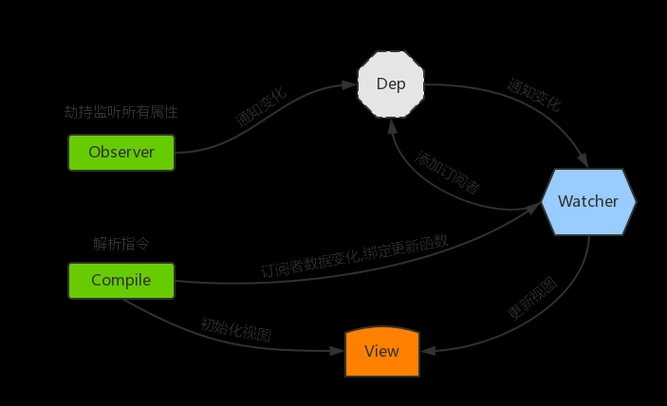
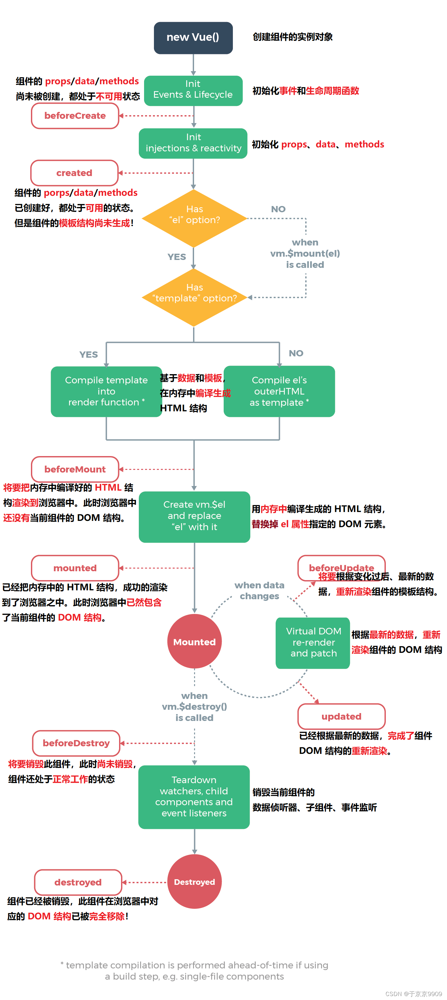

<!-- @format -->

# Vue3 与 Vue2 区别

## 一、双向数据绑定原理发生了改变

## Vue2 数据绑定原理实现

Vue2 的双向数据绑定原理相对较为复杂，需要不断遍历数据对象的属性，对比前后的值是否发生了改变，从而决定是否更新相关的视图。  
 
利用 ES5 的一个 API Object.definePropert()去劫持各个属性的 setter/getter 方法，结合发布订阅模式的方式来实现的，基本步骤：

1. 数据劫持：Vue2 通过 Object.defineProperty() 方法**遍历并包装对象属性**，使得 Vue 可以在数据变化时通知视图更新。这个过程通常在 Vue 实例初始化时进行，被称为数据劫持。

2. 依赖收集：当渲染 Vue 组件时，会访问到一些响应式数据，Vue2 会在这个过程中把这些数据和当前的组件实例关联起来，以便在这些数据变化时，知道应该更新哪些组件。这个过程被称为依赖收集。

3. 视图更新：当响应式数据变化时，Vue 会找到依赖这些数据的组件，并重新渲染这些组件，以更新视图。

## Vue3 数据绑定原理实现

vue3 中使用了 es6 的 ProxyAPI 对数据代理。Proxy 是 ES6 中新增的特性，它可以劫持整个对象，代理对对象的操作，并在操作发生时触发对应的行为。  
 与 Vue2 区别主要是在数据代理部分，Vue3 使用 Proxy 对象创建一个数据的代理，这个代理可以**拦截对数据的所有操作**，包括读取、写入、删除等。这个过程通常在 Vue 实例初始化时进行。

## 相比于 vue2.x，Vue3 使用 proxy 的优势如下

1. defineProperty 只能监听某个属性，不能对全对象监听
2. 可以省去 for in、闭包等内容来提升效率（直接绑定整个对象即可）
3. 可以监听数组，不用再去单独的对数组做特异性操作 vue3.x 可以检测到数组内部数据的变化

## Object.defineProperty 与 Proxy

### Object.defineProperty

`Object.defineProperty() `方法会直接在一个对象上定义一个新属性，或者修改一个对象的现有属性，并返回此对象

1.  **如何实现响应式：**
    - **get**  
      属性的 getter 函数，**当访问该属性时，会调用此函数**。执行时不传入任何参数，但是会传入 this 对象（由于继承关系，这里的 this 并不一定是定义该属性的对象）。**该函数的返回值会被用作属性的值**
    - **set**  
      属性的 setter 函数，**当属性值被修改时，会调用此函数**。该方法接受一个参数（也就是被赋予的新值），会传入赋值时的 this 对象。默认为 undefined
2.  **缺点：**
    - 检测不到对象属性的添加和删除
    - 数组 API 方法无法监听到
    - 需要对每个属性进行遍历监听，如果嵌套对象，需要深层监听，造成性能问题

### Proxy

`Proxy`的监听是针对一个对象的，那么对这个对象的所有操作会进入监听操作，这就完全可以代理所有属性了

- 代码示例：

```JavaScript
   function reactive(obj) {
     if (typeof obj !== 'object' && obj != null) {
         return obj
     }
     // Proxy相当于在对象外层加拦截
     const observed = new Proxy(obj, {
         get(target, key, receiver) {
             const res = Reflect.get(target, key, receiver)
             console.log(`获取${key}:${res}`)
             return res
         },
         set(target, key, value, receiver) {
             const res = Reflect.set(target, key, value, receiver)
             console.log(`设置${key}:${value}`)
             return res
         },
         deleteProperty(target, key) {
             const res = Reflect.deleteProperty(target, key)
             console.log(`删除${key}:${res}`)
             return res
         }
     })
     return observed
  }

```

## 二、Vue3 支持碎片(Fragments)

在 Vue2 中，每个组件必须有一个根元素，这有时会导致不必要的 DOM 元素。  
而在 Vue3 中，引入了碎片的概念，允许组件有多个根元素，在 Vue3 中，你可以在一个组件的模板中直接返回多个元素，而不需要一个包裹元素。这可以减少不必要的 DOM 节点，使得 HTML 结构更加清晰。

## Vue3 版本

```HTML
<template>
  <div>元素 1</div>
  <div>元素 2</div>
</template>

<script>
export default {
  // ...
}
</script>
```

## Vue2 版本

```HTML
<template>
  <!--需要一个元素包裹两个-->
  <div>
    <div>元素 1</div>
    <div>元素 2</div>
  </div>
</template>
<script>
export default {
  // ...
}
</script>
```

## 三. Composition API

Vue2 使用的是选项 API（Options API），而 Vue3 引入了新的合成 API（Composition API）。

## 选项 API（Vue2）

在选项 API 中，我们按照选项类型（如 data、methods、computed、watch 等）来组织代码。这种方式在小型项目中非常直观和易于理解，但在大型项目中，当组件变得复杂时，相关的逻辑可能会分散在不同的选项中，导致代码难以维护。

Vue2 模板

```HTML
<template>
<!-- ... -->
</template>
<script>
export default {
data() {
  return {
    count: 0
  }
},
methods: {
  increment() {
    this.count++;
  }
},
computed: {
  // ...
},
watch: {
  // ...
}
}
</script>
```

## 合成 API（Vue3）

合成 API 允许我们按照逻辑关系来组织代码，而不是按照选项类型。这使得我们可以更容易地抽取和复用逻辑，也使得代码更易于阅读和维护。  
 使用 setup() 函数来定义组件的响应式数据和函数。所有的逻辑都在 setup() 函数中定义，这使得我们可以更容易地抽取和复用逻辑。  
 具体优势：

1. 逻辑复用和代码组织：在 Vue2 中，复用和组织组件逻辑（尤其是跨组件的逻辑）可能会变得复杂。而合成 API 提供了一种更灵活的方式来组织和复用代码，使得代码更易于阅读和维护。

2. 类型推断：合成 API 与 TypeScript 更好地集成，提供了更强大的类型推断支持。

3. 更好的性能：由于合成 API 在编译时可以更精确地知道哪些属性是响应式的，因此可以生成更优化的代码，从而提高应用的性能。

Vue3 模板

```HTML
<template>
<!-- ... -->
</template>
<script>
import { ref } from 'vue';
export default {
setup() {
const count = ref(0);

    function increment() {
      count.value++;
    }

    return {
      count,
      increment
    }

}
}
</script>
```

## 四、建立响应式数据的方式不同

## Vue2

在 Vue2 中，我们在 data 选项中返回一个对象，该对象的所有属性都将自动变为响应式的

```JavaScript
export default {
  data() {
    return {
      count: 0
    }
  },
  methods: {
    increment() {
      this.count++;
    }
  }
}
```

## Vue3

在 Vue3 中，我们使用 ref() 或 reactive() 函数来创建响应式数据。这些函数是 Vue3 的合成 API 的一部分。  
 下文使用 ref() 函数来创建一个响应式的 count 变量。我们可以通过 count.value 来获取或设置它的值。这是**因为 ref() 函数实际上返回一个包含 value 属性的对象，而不是直接返回值**。

```JavaScript
import { ref } from 'vue';

export default {
  setup() {
    const count = ref(0);

    function increment() {
      count.value++;
    }

    return {
      count,
      increment
    }
  }
}
```

## reactive() 函数和 ref() 函数

1. ref()  
    ref() 用于创建一个响应式的值。它返回一个对象，**该对象有一个 value 属性**，我们可以通过这个属性来获取或设置值。

   简化的 ref 实现：

   ```JavaScript
    function ref(raw) {
      const r = {
        _value: raw,
        get value() {
          track(r, 'value');
          return this._value;
        },
        set value(newVal) {
          this._value = newVal;
          trigger(r, 'value');
        }
      }
      return r;
    }
   ```

2. reactive()  
    reactive() 用于创建一个响应式的对象。reactive() 函数接受一个对象，**并返回这个对象的响应式代理**。我们可以直接访问和修改这个代理对象的属性。我们可以直接访问和修改这个对象的属性，而不需要通过 value 属性。

   简化的 reacitve 实现：

   ```JavaScript
   function reactive(target) {
   const handler = {
   get(target, key, receiver) {
    track(target, key);
    return Reflect.get(target, key, receiver);
   },
   set(target, key, value, receiver) {
    const oldValue = target[key];
    const result = Reflect.set(target, key, value, receiver);
    if (oldValue !== value) {
      trigger(target, key);
    }
    return result;
   }
   };
    return new Proxy(target, handler);
   }
   ```

3. toRefs()

toRefs() 函数用于将 reactive() 创建的响应式对象转换为一组 ref 对象。

4. ref()与 reactive() 区别

- 使用方式：reactive() 接受一个对象并返回这个对象的响应式代理，我们可以直接访问和修改这个代理对象的属性。ref() 接受一个值并返回一个对象，这个对象有一个 value 属性，我们可以通过这个属性来获取或设置值。
- 适用场景：reactive() 更适合用于管理一个有多个属性的复杂状态，ref() 更适合用于管理一个单一的值。如果你需要在模板中直接使用一个响应式对象的属性，你可能需要使用 ref()，因为在模板中不能直接访问响应式对象的属性。
- 解构：如果你解构一个由 reactive() 创建的响应式对象，解构出来的属性将会失去响应性。如果你解构一个由 ref() 创建的响应式引用，解构出来的值仍然保持响应性。这是因为 ref() 实际上返回的是一个包含 value 属性的对象，而不是直接返回值。

```JavaScript
const state = reactive({ count: 0 });
const { count } = state;  // count 将失去响应性

const count = ref(0);
const { value } = count;  // value 仍然保持响应性
```

## 五、生命周期钩子不同



| Vue2            | Vue3            | 备注                                                       |
| --------------- | --------------- | ---------------------------------------------------------- |
| beforeCreate    | setup()         | 开始创建组件之前，在 beforeCreate 和 created 之前执行      |
| created         | setup()         | 创建的是 data 和 method                                    |
| beforeMount     | onBeforeMount   | 组件挂载到节点上之前执行的函数。                           |
| mounted         | onMounted       | 组件挂载完成后执行的函数。                                 |
| beforeUpdate    | onBeforeUpdate  | 组件更新之前执行的函数。                                   |
| updated         | onUpdated       | 组件更新完成之后执行的函数                                 |
| beforeDestroy   | onBeforeUnmount | 组件卸载之前执行的函数。                                   |
| destroyed       | onUnmounted     | 组件卸载完成后执行的函数                                   |
| --------------- | --------------- | 若组件被`<keep-alive>`包含，则多出下面两个钩子函数。       |
| activated       | onActivated     | 被包含在中的组件，会多出两个生命周期钩子函数。被激活时执行 |
| deactivated     | onDeactivated   | 比如从 A 组件，切换到 B 组件，A 组件消失时执行。           |
| errorCaptured   | onErrorCaptured | 当捕获一个来自子孙组件的异常时激活钩子函数。               |

- `<keep-alive>` 是一个内置组件，用于保留组件状态或避免重新渲染。如果希望组件可以缓存下来，维持当前的状态。这时候就需要用到 keep-alive 组件。
  例子：

```HTML
<keep-alive>
  <component :is="currentComponent"></component>
</keep-alive>
```

当 currentComponent 发生变化时，旧的组件实例会被 `<keep-alive>` 缓存，而不是被销毁。当 currentComponent 再次变为旧的组件时，`<keep-alive>` 会从缓存中恢复该组件实例，而不是创建一个新的实例。

## 六、父子传参不同

## Vue2 传参

父组件通过 props 向子组件传递数据，子组件通过 $emit 触发事件向父组件传递数据。

```HTML
<!-- 父组件 -->
<child-component :myProp="parentData" @childEvent="handleEvent"></child-component>

<!-- 子组件 -->

<script>
export default {
  props: ['myProp'],
  methods: {
    doSomething() {
      this.$emit('childEvent', data);
    }
  }
};
</script>

```

## Vue3 传参

传参方式与 Vue 2 相同，但在 setup() 函数中，可以通过 props 和 context.emit 或使用 defineEmits 函数来定义子组件可以触发的事件 访问

```HTML
  <!-- 父组件 -->
<child-component :myProp="parentData" @childEvent="handleEvent"></child-component>

  <!-- 子组件 -->
<script>
import { ref } from 'vue';

export default {
  props: ['myProp'],
  setup(props, context) {
    //推荐使用defineEmits
    const emit = defineEmits(['childEvent']);
    const doSomething = () => {
      emit('childEvent', id);
      //context.emit('childEvent', data);

    };

    return {
      doSomething
    };
  }
};
</script>
```

## 七、Setup()函数特性

## 接收参数

- props：这是一个对象，包含了传递给组件的所有 props。这个对象是响应式的，当父组件更新 props 的值时，这个对象也会更新。
- context：这是一个普通的 JavaScript 对象，包含组件的上下文属性。包含了以下三个属性：
  - attrs:值为对象，包含组件外部传递过来，但没有在 props 配置中声明的属性。相当于 this.$attrs
  - slots:收到的插槽内容，相当于 this.$slots
  - emit:分发自定义事件的函数，相当于 this.$emit

## 八、Vue 3 中的 Teleport

Vue 3 中的 Teleport 是一种新的特性，它允许我们将子组件渲染到 DOM 树的任何位置，而不仅仅是当前组件的位置。
在某些情况下，我们可能希望一个组件的某部分在 DOM 树中的位置与它在 Vue 组件树中的位置不同。例如，全屏模态框、通知或者对话框等。这些组件在 Vue 组件树中可能是嵌套的，但我们希望它们在 DOM 结构中能够独立出来，通常是挂载到 body 元素上。这就是 Teleport 能够帮助我们实现的。

使用事例:

```HTML
<template>
  <div>
    <button @click="isShowingModal = true">Show Modal</button>
    <teleport to="body">
      <div v-if="isShowingModal">
        <h2>Hello from Teleport</h2>
        <button @click="isShowingModal = false">Close</button>
      </div>
    </teleport>
  </div>
</template>

<script>
export default {
  data() {
    return {
      isShowingModal: false
    }
  }
}
</script>
```

在这个例子中，当点击按钮时，模态框会显示出来。虽然在 Vue 组件树中，模态框是 button 的子组件，但在 DOM 结构中，模态框是直接挂载到 body 元素上的。这就是 Teleport 的作用。

## 总结

1. 从底层实现上，Vue2 使用 Object.defineProperty 进行数据劫持，配合发布-订阅模式进行数据的响应式，而 Vue3 则使用 Proxy 监听整个对象，提高了性能。
2. 在使用中，Vue2 使用的是选项式 API，Vue3 则引入了合成式 API，即 Vue2 需要将数据、函数、计算属性等分开编写，而 Vue3 可以使用合成式 API 将相关逻辑组织在一起。
3. 在数据的创建中，Vue2 在 data 中创建变量，返回为响应式数据，而 Vue3 则是使用 ref 和 reactive 直接创建响应式数据。
4. 组件的生命周期函数不同，Vue3 使用 setup 函数，这个函数在 beforeCreate 和 created 生命周期钩子之前调用。
5. 组件间的传参不同，Vue2 中，子组件通过 $emit 向父组件传递事件，而 Vue3 中需要使用 defineEmit 函数
