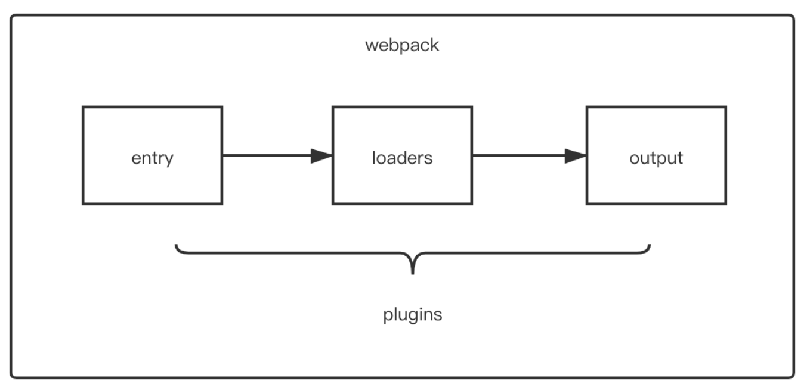

<!-- @format -->

# 模块化发展与打包工具

写在前面：乐，没怎么打包过来着

- [模块化发展与打包工具](#模块化发展与打包工具)
  - [什么是模块化](#什么是模块化)
  - [模块化发展历程与规范](#模块化发展历程与规范)
- [打包工具](#打包工具)
  - [webpack](#webpack)
    - [静态模块](#静态模块)
    - [webpack 的核心概念](#webpack-的核心概念)
    - [构建流程](#构建流程)
    - [编译生命周期钩子](#编译生命周期钩子)
    - [Loader（模块转换器）](#loader模块转换器)
      - [Loader 特性](#loader特性)
      - [配置 Loader 的方式](#配置loader的方式)
      - [常见 Loader](#常见loader)
    - [Plugin](#plugin)
      - [Plugin 特性](#plugin特性)
      - [常见的 Plugin](#常见的plugin)
  - [Vite](#vite)
    - [Vite 特点](#vite特点)
    - [Vite 原理](#vite原理)

<!--more-->

## 什么是模块化

模块化是一种编程方法，它将大型复杂的程序分解为互相独立的子程序，每个子程序被称为一个模块。每个模块都有特定的功能，并且可以独立完成这个功能。  
前端的模块化主要是为了解决命名冲突、文件依赖、复用性等问题。在前端开发中，模块化可以帮助我们更好地组织和管理代码，提高代码的可维护性和可复用性。  
具有以下几个优点：

1. 可维护性：模块化可以将复杂的程序分解为简单的模块，每个模块都有明确的功能。这样，当需要修改某个功能时，只需要修改对应的模块，而不需要理解整个程序。
2. 可复用性：模块化可以将常用的功能封装为模块，然后在需要的地方导入这个模块。这样，可以避免重复编写相同的代码。
3. 可测试性：模块化可以将程序分解为独立的模块，每个模块都可以独立测试。这样，可以确保每个模块的功能都是正确的，从而提高整个程序的质量。

## 模块化发展历程与规范

发展历程主要包括以下几个阶段：

1. **全局函数**：在早期的 JavaScript 中，所有的变量和函数都是全局的。这种方式容易导致命名冲突和代码难以维护。
2. **命名空间**：为了解决全局函数的问题，开发者开始使用命名空间来组织代码。但这种方式仍然无法完全解决命名冲突的问题，而且代码的依赖关系不明确。
3. **CommonJS**：Node.js 推出了 CommonJS 模块规范，每个文件就是一个模块，文件内部的所有变量和函数默认都是私有的，对其他文件不可见，通过 `require` 和 `module.exports` 来导入和导出模块。这种方式使得 JavaScript 的模块化成为可能，但它主要用于服务器端（由于同步加载），不适合浏览器环境。
4. **AMD 和 CMD**：为了解决 CommonJS 在浏览器环境中的问题，社区提出了 `AMD（Asynchronous Module Definition`和 `CMD（Common Module Definition）`规范。

   - AMD（Asynchronous Module Definition）  
      AMD 是 RequireJS 在提出的规范。它支持异步加载模块，即可以在需要的时候再加载模块。AMD 使用 define 函数来定义模块，require 函数来加载模块。**AMD 推崇依赖前置**，在定义模块的时候，需要先指明依赖的模块

     ```JS
     // 定义模块
     define(['dependency'], function(dependency) {
      // 模块代码
     });

     // 加载模块
     require(['module'], function(module) {
      // 使用模块
     });
     ```

   - CMD（Common Module Definition）  
      CMD 是 SeaJS 在提出的规范。CMD 也支持异步加载模块，**推崇依赖就近**，即只在需要的地方加载模块。CMD 使用 define 函数来定义模块，require 函数来加载模块

     ```JS
     // 定义模块
     define(function(require, exports, module) {
      // 加载依赖
      var dependency = require('dependency');

      // 模块代码
     });

     // 加载模块
     seajs.use('module', function(module) {
      // 使用模块
     });
     ```

5. ES6 模块  
   ES6 模块化是 JavaScript 的官方模块系统，它使用 import 和 export 关键字来导入和导出模块。有以下几个特点：
   1. 静态导入和导出：ES6 模块的导入和导出都是静态的，也就是说不能在运行时改变模块的导入和导出。这使得工具可以在编译时进行优化，如 tree shaking（摇树优化：描述移除 JavaScript 上下文中未引用或未使用代码的过程）
   2. 模块作用域：ES6 模块内部的变量和函数默认都是私有的，如果你想把它们暴露给其他模块，你需要使用 export 关键字。
   3. 支持默认导出和命名导出：ES6 模块支持默认导出和命名导出，这使得你可以导出任意值，如函数、对象、字符串、数字等。  
      然而，由于浏览器对 ES6 模块的支持程度不一，通常需要通过打包工具将 ES6 模块转换为能在浏览器中运行的代码。

# 打包工具

## webpack

`webpack`是一个用于现代`JavaScript`应用程序的**静态模块**打包工具。

## 静态模块

Webpack 的"静态模块"是指在编译时就能确定模块的依赖关系，以及输入和输出的模块。与动态加载（在运行时确定这些事情）形成对比。  
 在 Webpack 中，每个文件都被视为一个模块，这些模块通过 import 或 require 语句进行连接。Webpack 会从一个或多个入口文件开始，解析这些文件中的 import 或 require 语句，构建出一个依赖图（dependency graph）。这个依赖图包含了应用程序所需的每个模块，并且所有模块都被打包成一个（或多个）bundle。  
 
这种静态的模块结构允许 Webpack 在打包时进行大量优化，如代码分割、懒加载、移除未使用的代码（tree shaking）等。这些优化可以帮助提高应用程序的加载性能和运行性能。

## webpack 的核心概念

- entry（入口）：一个可执行模块或者库的入口。定义了打包后的入口文件。
- output（出口）：指示 webpack 如何去输出，以及在哪里输出。
- path: 打包文件存放的绝对路径
- publicPath: 网站运行时的访问路径
- filename: 打包后的文件名
- module（模块）：在 webpack 里，一切皆模块，一个模块对应一个文件。webpack 会从配置的 entry 中开始递归找出所有依赖的模块。
- chunk（代码块）：一个 chunk 由多个 模块 组合而成。可以将可执行的模块和他所依赖的模块组合成一个 chunk ，这就是打包。
- loader（模块转换器）：用于把一个模块原内容按照需求转换成新的内容。例如：es6 转换为 es5，scss 转换为 css 等。
- plugin（扩展）：扩展 webpack 功能的插件。在 webpack 构建的生命周期节点上加入扩展 hook，添加功能。

## 构建流程


1. 初始化参数
   Webpack 启动时，将从命令行（shell）传入的参数和 webpack.config.js 文件中的配置参数进行合并，初始化出一个 Compiler 对象
2. 编译  
   上一步得到的参数初始化 compiler 对象，注册所有配置的插件，插件监听 webpack 构建生命周期的事件节点，做出相应的反应，执行对象的 run 方法开始执行编译
3. 确定入口  
   根据配置的 entry 入口，开始解析文件构建的 AST 语法树，找出依赖，递归下去
4. 编译模块  
   根据文件类型和 loader 配置，调用所有配置的 loader 对文件进行转换，再找出该模块依赖的模块，再递归本步骤直到所有入口依赖的文件都经过了本步骤的处理。
5. 完成模块编译并输出
   递归完后，得到每个文件结果，包含了每个模块及她们之间的依赖关系，根据 entry 配置生成代码块 chunk
6. 输出完成  
   输出所有的 chunk 到系统文件

## 编译生命周期钩子

- entry-option ：初始化 option
- run：在编译器开始读取记录之前触发
- compile： 真正开始的编译，在创建 compilation 对象之前
- compilation ：生成好了 compilation 对象
- make： 从 entry 开始递归分析依赖，准备对每个模块进行 build
- after-compile： 编译 build 过程结束
- emit ：在将内存中 assets 内容写到磁盘文件夹之前
- after-emit ：在将内存中 assets 内容写到磁盘文件夹之后
- done： 完成所有的编译过程
- failed： 编译失败的时候

## Loader（模块转换器）

loader 用于对模块的"源代码"进行转换，在 import 或"加载"模块时预处理文件

### Loader 特性

- 转换文件  
  Loader 是用来对**模块源代码进行转换**。Webpack 本身只能处理 JavaScript，但是 loader 能够让 Webpack 处理那些非 JavaScript 文件（例如 CSS，LESS，TypeScript 等）。Loader 可以将这些文件转换为有效的模块，并且可以添加到依赖图中。
- 链式处理  
  Loader 可以链式调用。一组链式的 Loader 将**按照相反的顺序执行**。Loader 链中的第一个 Loader 返回值给下一个。在最后一个 Loader，返回 webpack 所预期的 JavaScript。
- 支持同步和异步  
  Loader 支持同步和异步转换。这意味着 Loader 可以进行一些耗时的操作，例如网络请求
- 模块热替换  
  如果模块在运行时进行更改，Loader 可以将更改的模块发送给运行时，而无需完全重新构建。

### 配置 Loader 的方式

- 配置方式（推荐）：在 webpack.config.js 文件中指定 loader

```JS
module.exports = {
module: {
  rules: [
      {
        test: /\.css$/,
        use: 'css-loader'
      }
    ]
  }
};
```

- 内联方式：在每个 import 语句中显式指定 loader

```JS
import Styles from 'style-loader!css-loader?modules!./styles.css';
```

- CLI 方式：在 shell 命令中指定它们

```sh
webpack --module-bind js=babel-loader
```

### 常见 Loader

- style-loader: 将 css 添加到 DOM 的内联样式标签 style 里

- css-loader :允许将 css 文件通过 require 的方式引入，并返回 css 代码
- less-loader: 处理 less。将 less 代码转换为 CSS 代码
- sass-loader: 处理 sass。将 sass 代码转换为 CSS 代码
- postcss-loader: 用 postcss 来处理 CSS
- file-loader: 分发文件到 output 目录并返回相对路径
- url-loader: 和 file-loader 类似，但是当文件小于设定的 limit 时可以返回一个 Data Url
- html-minify-loader: 压缩 HTML
- babel-loader :用 babel 来转换 ES6 文件到 ES

## Plugin

webpack 中的 plugin 赋予其各种灵活的功能，例如打包优化、资源管理、环境变量注入等，它们会运行在 webpack 的不同阶段（钩子 / 生命周期），贯穿了 webpack 整个编译周期


### Plugin 特性

其本质是一个具有`apply`方法`javascript`对象
`apply`方法会被 `webpack compiler`调用，并且在整个编译生命周期都可以访问 `compiler`对象  
`compiler`对象代表了 `webpack` 从启动到关闭的整个生命周期。你可以在 apply 方法内部监听 `compiler`上的各种事件，并在特定时机执行自定义的行为。

### 常见的 Plugin

- HtmlWebpackPlugin
  这个插件会创建一个 HTML 文件，其中包括使用 script 标签的所有 webpack 包。

  ```JS
  // webpack.config.js
  const HtmlWebpackPlugin = require('html-webpack-plugin');

  module.exports = {
    // ... 其他配置项
    plugins: [
      new HtmlWebpackPlugin({
        title: 'My App', // 生成的 HTML 文件的标题
        filename: 'index.html', // 输出的 HTML 文件名，默认为 'index.html'
        template: 'src/index.html', // 模板文件路径，插件会根据这个模板生成 HTML 文件
        inject: 'body', // 打包后的脚本插入到哪个标签中，可选值有 'head' 和 'body'
      }),
    ],
  };
  ```

  配置后，在 `html` 模板中，可以通过 `<%=htmlWebpackPlugin.options.XXX%>` 的方式获取配置的值

  ```HTML
  <!--./src/html/index.html-->
  <!DOCTYPE html>
  <html lang="en">
  <head>
      <meta charset="UTF-8">
      <meta name="viewport" content="width=device-width, initial-scale=1.0">
      <meta http-equiv="X-UA-Compatible" content="ie=edge">
      <title><%=htmlWebpackPlugin.options.title%></title>
  </head>
  <body>
      <h1>html-webpack-plugin</h1>
  </body>
  </html>
  ```

  - clean-webpack-plugin: 这个插件会在每次成功重建后，删除`webpack` 的 `output.path`目录中的所有文件。

  - mini-css-extract-plugin：这个插件会将 CSS 提取到单独的文件中。它为每个包含 CSS 的 JS 文件创建一个 CSS 文件。

  - DefinePlugin：允许在编译时创建配置的全局对象，是一个`webpack`内置的插件

  - copy-webpack-plugin：复制文件或目录到执行区域，如`vue`的打包过程中，如果我们将一些文件放到`public`的目录下，那么这个目录会被复制到`dist`文件夹中

## Vite

Vite ，是一种新型前端构建工具，能够显著提升前端开发体验

## Vite 特点

1. **快速冷启动**：Vite 利用原生 ES Modules (ESM) 实现了快速的冷启动，无需等待打包过程。
2. **即时热更新**：Vite 提供了即时的模块热更新，当你修改文件时，只有被修改的文件会被重新编译和更新，而不是整个应用。
3. **按需加载**：在浏览器中，只有实际需要的模块才会被加载和执行，这可以减少不必要的网络请求和计算。

## Vite 原理


在热模块 HMR 方面，当修改一个模块的时候，仅需让浏览器重新请求该模块即可，无须像 webpack 那样需要把该模块的相关依赖模块全部编译一次，效率更高
