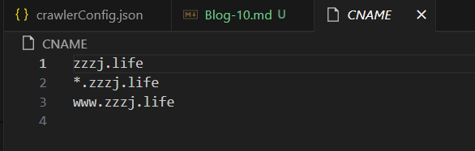
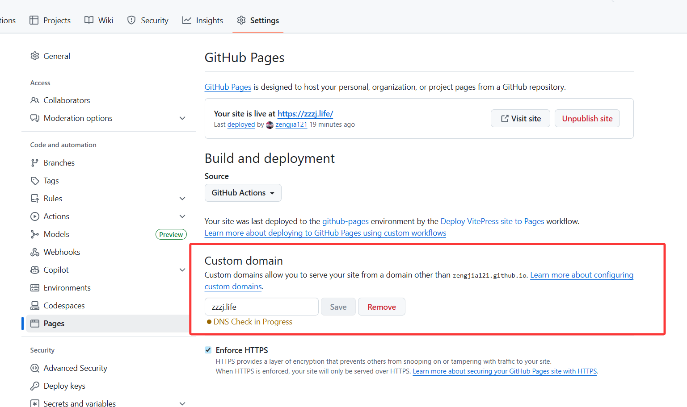

# 更换博客域名需要的修改
好久没写博客了，今天下定决心想把以前的域名买回来，结果发现已经卖出去了（哈哈
反正也开始了一个新阶段，干脆换个域名，结果没想到要修改的东西还挺多的，记录一下
## porkbun修改
首先就是在porkbun买的域名，然后需要修改该域名的绑定方式，具体就是修改porkbun的DNS，porkbun提供了github pages的便捷修改，还挺舒服的。

## github pages修改
修改完porkbun之后就是修改`github pages`，这里需要修改两部分

1. 项目里面的`CNAME`文件

2. `github pages`里面的设置

## 其他插件修改
其他插件像搜索和AI摘要这种，绑定的都是之前的域名，所以也需要统一的修改