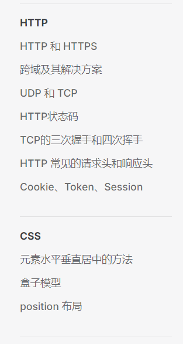

<!-- @format -->

# 侧边栏的设置

## 侧边栏参数

- 基础的侧边栏设置

```TS
module.exports = {
  themeConfig: {
    sidebar: {
      '/guide/': [
        {
          text: '指南',
          children: [
            { text: '介绍', link: '/guide/introduction' },
            { text: '开始', link: '/guide/getting-started' },
            // 更多页面...
          ],
        },
      ],
      // 更多路径...
    },
  },
};
```

如上所示，VitePress 自己的侧边栏是需要进行配置路径、名称、下属路径的，假如文档少还可以进行手动配置，但这显然很麻烦，例如修改文件 title 的时候还需要同步修改侧边栏，所以最好是读取存储博客的文件夹，自动配置相应的路径

## 文件夹读取与路径获取

使用`fs`和`path`来进行文件的读取和文件路径的获取

- 文件读取

```Ts
const folders = fs.readdirSync(dir, { withFileTypes: true })
```

- 路径获取

```TS
const postDir = path.resolve(__dirname, "../../posts");
```

## 获取 markdown 标题

根据文件路径读取 markdown 的内容，并使用正则表达式匹配文章的 title（用于文件名和 title 不一致的情况）

```TS
function getMarkdownTitle(filePath: string): string {
  const content = fs.readFileSync(filePath, "utf-8");
  const match = content.match(/title:\s*(.*)/);
  return match ? match[1] : path.basename(filePath, ".md");
}
```

## 自定义文件排序

传入一个数组，作为文件夹的顺序，查找子目录的名字在数组中的位置。

1. 如果两个子目录的名字都不在数组中，那么按照它们的名字进行字母排序
2. 如果两个子目录的名字都在数组中，那么按照在数组中的位置进行排序
3. 如果一个子目录的名字在数组中，另一个子目录的名字不在，在数组中的子目录排在前面。

```TS
const folders = fs
  .readdirSync(dir, { withFileTypes: true })
  .filter((dirent) => dirent.isDirectory() && dirent.name !== "images")
  .sort((a, b) => {
    const indexA = preferredOrder.indexOf(a.name);
    const indexB = preferredOrder.indexOf(b.name);

    if (indexA === -1 && indexB === -1) {
      return a.name.localeCompare(b.name);
    } else if (indexA !== -1 && indexB !== -1) {
      return indexA - indexB;
    } else {
      return indexA === -1 ? 1 : -1;
    }
  });
```

## 封装与引入

将上述读取 markdown 的代码封装为一个插件，这样只需将写好的文档分类，并传输不同的路径，就可以自动生成不同板块的侧边栏

- 代码部分

```TS
import { generateSidebar } from "../Plugin/generateSidebar";

export const sidebar: DefaultTheme.Config["sidebar"] = {
  "/posts/": generateSidebar(postDir, preferredOrder),
  "/algorithm/": generateSidebar(algorithmDir, preferredOrder),
  "/project/": generateSidebar(projectDir, preferredOrder),
};
```

- 实现效果



## 代码部分

- [GitHub 地址](https://github.com/zengjia121/vitepress-sidebar)

```TS
/** @format */
import fs from "fs";
import path from "path";
import { DefaultTheme } from "vitepress";

function getMarkdownTitle(filePath: string): string {
  const content = fs.readFileSync(filePath, "utf-8");
  const match = content.match(/title:\s*(.*)/);
  return match ? match[1] : path.basename(filePath, ".md");
}

export function generateSidebar(dir: string, preferredOrder: string[]): DefaultTheme.SidebarItem[] {
  const sidebar: DefaultTheme.SidebarItem[] = [];

  if (!fs.existsSync(dir)) {
    console.error(`Directory not found: ${dir}`);
    return sidebar;
  }
  const folders = fs
    .readdirSync(dir, { withFileTypes: true })
    .filter((dirent) => dirent.isDirectory() && dirent.name !== "images")
    .sort((a, b) => {
      const indexA = preferredOrder.indexOf(a.name);
      const indexB = preferredOrder.indexOf(b.name);

      if (indexA === -1 && indexB === -1) {
        return a.name.localeCompare(b.name);
      } else if (indexA !== -1 && indexB !== -1) {
        return indexA - indexB;
      } else {
        return indexA === -1 ? 1 : -1;
      }
    });

  folders.forEach((folder) => {
    const folderPath = path.join(dir, folder.name);
    const files = fs.readdirSync(folderPath).filter((file) => file.endsWith(".md"));

    const path2 = dir.split("/").slice(-1)[0];
    const items = files.map((file) => {
      const filePath = path.join(folderPath, file);
      const title = getMarkdownTitle(filePath);
      return { text: title, link: `/${path2}/${folder.name}/${file}` };
    });

    sidebar.push({
      text: folder.name,
      items: items,
    });
  });

  return sidebar;
}
```

<!-- @format -->
