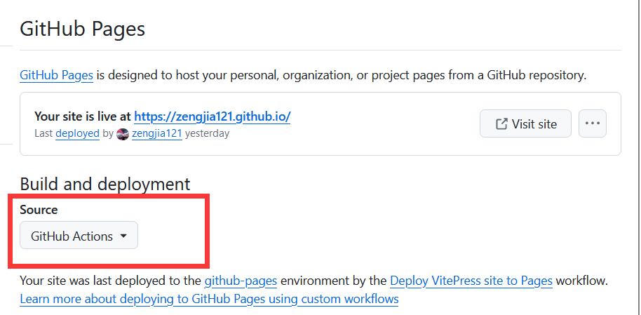
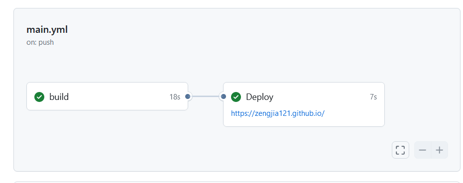

<!-- @format -->

# 博客搭建（四）：使用 GitHub Action 自动部署网站

- [博客搭建（四）：使用 GitHub Action 自动部署网站](#博客搭建四使用-github-action-自动部署网站)
  - [什么是`GitHub Action`](#什么是github-action)
  - [具体流程](#具体流程)
    - [新建`deploy.yml`文件](#新建deployyml文件)
    - [Github 仓库设置](#github-仓库设置)
  - [实现效果](#实现效果)

一开始想的是源代码和`dist`文件分开存放在两个仓库中，但这样又很麻烦（尤其是刚开始练习用`Git`指令（一上午删了三个仓库（乐  
然后，在网上冲浪的时候发现有基于`GitHub Action`实现网页自动部署的方法，这样就不用每次在本地进行`build`然后再上传`dist`文件了

## 什么是`GitHub Action`

`GitHub`提供的一个持续集成`（CI）`和持续部署`（CD）`工具。它可以让你在`GitHub`仓库中自动运行各种工作流程。

## 具体流程

### 新建`deploy.yml`文件

在项目的`.github\workflows\`中创建`deploy.yml`，再上传到远程仓库，就可以实现使用`GitHub Action`自动部署网站

- `deploy.yml`文件内容如下

```yaml
# 构建 VitePress 站点并将其部署到 GitHub Pages 的示例工作流程
#
name: Deploy VitePress site to Pages

# 在main分支有新push的时候触发
on:
  push:
    branches: [main]

  # 允许你从 Actions 选项卡手动运行此工作流程
  workflow_dispatch:

# 设置 GITHUB_TOKEN 的权限，以允许部署到 GitHub Pages
permissions:
  contents: read
  pages: write
  id-token: write

# 只允许同时进行一次部署，跳过正在运行和最新队列之间的运行队列
# 但是，不要取消正在进行的运行，因为我们希望允许这些生产部署完成
concurrency:
  group: pages
  cancel-in-progress: false

jobs:
  # 构建工作
  build:
    runs-on: ubuntu-latest
    steps:
      - name: Checkout
        uses: actions/checkout@v4
        with:
          fetch-depth: 0 # 如果未启用 lastUpdated，则不需要
      # - uses: pnpm/action-setup@v3 # 如果使用 pnpm，请取消注释
      # - uses: oven-sh/setup-bun@v1 # 如果使用 Bun，请取消注释
      - name: Setup Node
        uses: actions/setup-node@v4
        with:
          node-version: 20
          cache: npm # 或 pnpm / yarn
      - name: Setup Pages
        uses: actions/configure-pages@v4
      - name: Install dependencies
        run: npm ci # 或 pnpm install / yarn install / bun install
      - name: Build with VitePress
        run: npm run build # 或 pnpm docs:build / yarn docs:build / bun run docs:build
      - name: Upload artifact
        uses: actions/upload-pages-artifact@v3
        with:
          ## 设置构建产物的路径
          path: docs/.vitepress/dist
          ## 这里
  # 部署工作
  deploy:
    environment:
      name: github-pages
      url: ${{ steps.deployment.outputs.page_url }}
    needs: build
    runs-on: ubuntu-latest
    name: Deploy
    steps:
      - name: Deploy to GitHub Pages
        id: deployment
        uses: actions/deploy-pages@v4
```

### Github 仓库设置

要在仓库的`Setting → Pages → Build and deployment` 中把`Source`修改为`GitHub Action`


## 实现效果

这样就可以在 actions 中看到刚刚的配置是否在运行


  <!-- @format -->

:::tip 参考链接
<https://blog.csdn.net/qq_59008737/article/details/134854257>  
<https://blog.csdn.net/L1424791485/article/details/134943050>
:::
