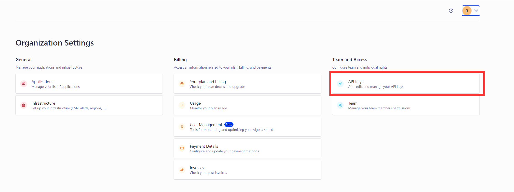

<!-- @format -->

# 博客搭建（五）：Algolia 的搜索栏配置

使用`Algolia` + `GitHub Action`自动爬取网站内容

- [博客搭建（五）：Algolia 的搜索栏配置](#博客搭建五algolia-的搜索栏配置)
  - [什么是 Algolia](#什么是-algolia)
  - [Algolia 注册](#algolia-注册)
  - [Algolia 爬虫设置](#algolia-爬虫设置)
  - [vitepress 配置](#vitepress-配置)
  - [GitHub Action 配置](#github-action-配置)

## 什么是 Algolia

`Algolia`是一个数据库实时搜索服务，能够提供毫秒级的数据库搜索服务，并且其服务能以 API 的形式方便地布局到网页、客户端、APP 等多种场景。

`VitePress`的官方文档就是使用的`Algolia`搜索，使用`Algolia`搜索最大的好处就是方便，它会自动爬取网站的页面内容并构建索引，你只用申请一个`Algolia`服务，在网站上添加一些代码，就像添加统计代码一样，然后就可以实现一个全文搜索功能。

## Algolia 注册

1. 在 [Algolia 官网](https://www.algolia.com/) 申请一个账号
2. 创建一个应用，在`Setting → API key`中可以看到自己的`Application ID`、`Admin API Key`、`Search API Key`
   

## Algolia 爬虫设置

在项目的根目录下创建`crawlerConfig.json`文件，里面是爬虫的基本配置，注意语言要配置成中文，这里是解析出当前网页的语言属性实现的

- `crawlerConfig.json`文件

  ```json{18-29}
  {
    "index_name": "...",
    "start_urls": ["..."],
    "rateLimit": 8,
    "maxDepth": 10,
    "selectors": {
      "lvl0": {
        "selector": "",
        "defaultValue": "Documentation"
      },
      "lvl1": ".content h1",
      "lvl2": ".content h2",
      "lvl3": ".content h3",
      "lvl4": ".content h4",
      "lvl5": ".content h5",
      "content": ".content p, .content li",
      "lang": {
        "selector": "/html/@lang",
        "type": "xpath",
        "global": true
      }
    },
    "selectors_exclude": ["aside", ".page-footer", ".next-and-prev-link", ".table-of-contents"],
    "custom_settings": {
      "attributesForFaceting": ["lang", "tags"]
    },
    "js_render": true
  }
  ```

## vitepress 配置

网站也需要配置`lang: "zh-CN"`，此外就是`vitepress`自己支持`Algolia`的相关配置

```ts
  search: {
    provider: "algolia",
    options: {
      appId: "...",
      apiKey: "...(这里是 Search API Key )",
      indexName: "...",
      placeholder: "请输入关键词",
    },
  },
```

## GitHub Action 配置

在项目的`.github\workflows\`中创建`algolia.yml`，`push`项目时会自动爬取网站内容

```yaml
# @format

name: algolia
on:
  push:
    branches:
      - main
jobs:
  algolia:
    runs-on: ubuntu-latest
    steps:
      - uses: actions/checkout@v2
      - name: Use Node.js 20
        uses: actions/setup-node@v2
        with:
          node-version: 20
      - name: Get the content of algolia.json as config
        id: algolia_config
        run: echo "config=$(cat crawlerConfig.json | jq -r tostring)" >> $GITHUB_OUTPUT
      - name: Push indices to Algolia
        uses: signcl/docsearch-scraper-action@master
        env:
          APPLICATION_ID: ${{ secrets.APP_ID }}
          API_KEY: ${{ secrets.API_KEY }}
          CONFIG: ${{ steps.algolia_config.outputs.config }}
```

<!-- @format -->
